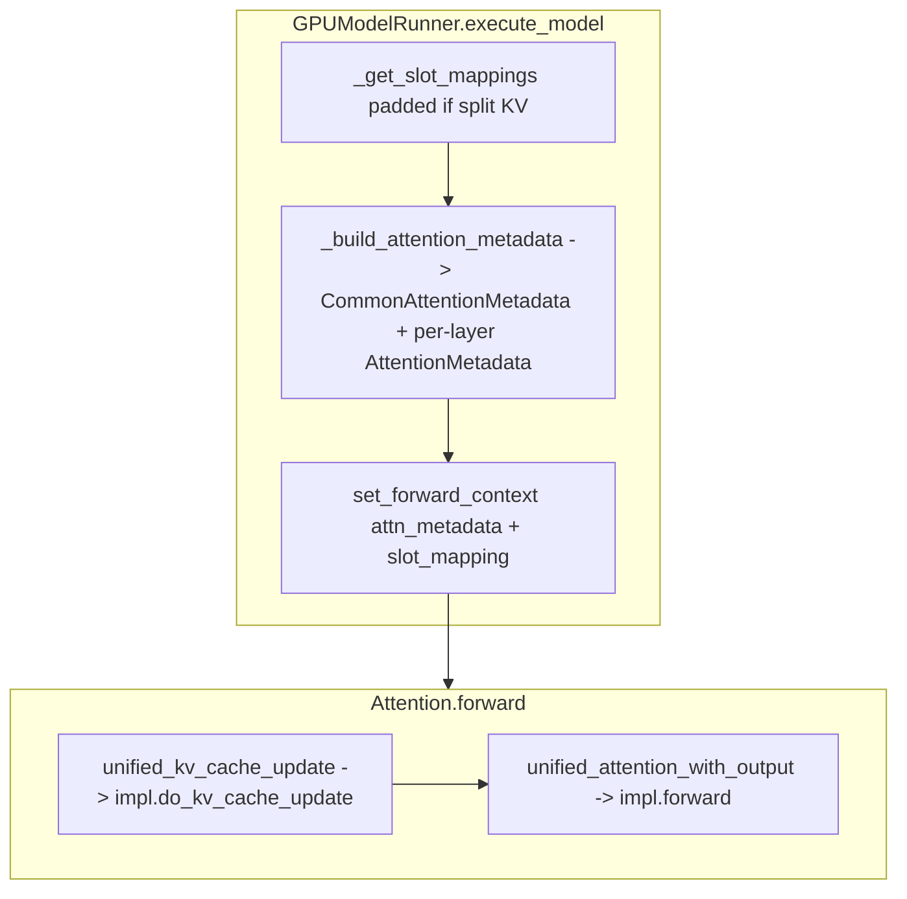

# vLLM V1 split KV execution: `forward_includes_kv_cache_update = False`

Technical reference for custom attention backends (e.g. Tile Lang) that require a **strict store phase** before the **attention/read phase**, matching the pattern used by FlashAttention and TurboQuant in vLLM V1.

**Sources (tree):** `vllm/model_executor/layers/attention/attention.py`, `vllm/forward_context.py`, `vllm/v1/worker/gpu_model_runner.py`, `vllm/v1/attention/backend.py`, `vllm/v1/attention/backends/turboquant_attn.py`, `vllm/v1/attention/backends/flash_attn.py`.

---

## 1. Backend contract: `forward_includes_kv_cache_update`

Attention backends inherit from `AttentionBackend` and set:

- **`forward_includes_kv_cache_update = False`** — KV writes are **not** fused inside `impl.forward`. The runner + `Attention.forward` drive a **two-phase** sequence: `unified_kv_cache_update` → `unified_attention_with_output` → `impl.forward` (read-only w.r.t. cache writes; the impl still reads `kv_cache`).

- **`forward_includes_kv_cache_update = True`** — the backend fuses or performs KV update inside `forward` (not covered here).

Reference (TurboQuant):

```85:86:vllm/vllm/v1/attention/backends/turboquant_attn.py
    accept_output_buffer: bool = True
    forward_includes_kv_cache_update: bool = False
```

FlashAttention uses the same flag:

```94:94:vllm/vllm/v1/attention/backends/flash_attn.py
    forward_includes_kv_cache_update: bool = False
```

---

## 2. Execution graph: `Attention.forward` (split KV path)

### 2.1 Preconditions

Inside `Attention.forward`, after optional KV-scale calculation and query quantization:

1. `query` is reshaped to **`(num_token_rows, num_heads, head_size)`**.
2. `key` / `value` (if present) are reshaped to **`(num_token_rows, num_kv_heads, head_size)`** and **`(..., head_size_v)`** respectively.

```511:516:vllm/vllm/model_executor/layers/attention/attention.py
        query = query.view(-1, self.num_heads, self.head_size)
        output = output.view(-1, self.num_heads, self.head_size_v)
        if key is not None:
            key = key.view(-1, self.num_kv_heads, self.head_size)
        if value is not None:
            value = value.view(-1, self.num_kv_heads, self.head_size_v)
```

Here **`num_token_rows`** is the flattened batch dimension for this forward (may include **padding** for CUDA graphs or when the runner pads to align with backends that split KV updates — see §5).

### 2.2 Ordering: store before read

When `use_direct_call` is true (typical on CUDA-like paths with opaque attention), the sequence is:

```518:536:vllm/vllm/model_executor/layers/attention/attention.py
        if self.use_direct_call:
            # Skip this if sharing KV cache with an earlier attention layer.
            if (
                not self.attn_backend.forward_includes_kv_cache_update
                and self.kv_sharing_target_layer_name is None
                and key is not None
                and value is not None
            ):
                kv_cache_dummy_dep = unified_kv_cache_update(
                    key, value, self.layer_name
                )
            unified_attention_with_output(
                query,
                key,
                value,
                output,
                self.layer_name,
                kv_cache_dummy_dep=kv_cache_dummy_dep,
            )
```

When the compiled custom-op path is used, the same ordering is preserved via `torch.ops.vllm.unified_kv_cache_update` then `torch.ops.vllm.unified_attention_with_output`:

```537:556:vllm/vllm/model_executor/layers/attention/attention.py
        else:
            # Skip this if sharing KV cache with an earlier attention layer.
            encoded = _encode_layer_name(self.layer_name)
            if (
                not self.attn_backend.forward_includes_kv_cache_update
                and self.kv_sharing_target_layer_name is None
                and key is not None
                and value is not None
            ):
                kv_cache_dummy_dep = torch.ops.vllm.unified_kv_cache_update(
                    key, value, encoded
                )
            torch.ops.vllm.unified_attention_with_output(
                query,
                key,
                value,
                output,
                encoded,
                kv_cache_dummy_dep=kv_cache_dummy_dep,
            )
```

**KV sharing:** If `kv_sharing_target_layer_name` is set, **both** the store phase and the dummy dependency are skipped for this layer; KV was already written by the target layer’s store path.

### 2.3 What `unified_kv_cache_update` does

It resolves the layer from `ForwardContext`, pulls **`kv_cache`** and **per-layer `slot_mapping`**, and calls **`impl.do_kv_cache_update`** if `slot_mapping` is not `None`:

```711:732:vllm/vllm/model_executor/layers/attention/attention.py
def unified_kv_cache_update(
    key: torch.Tensor,
    value: torch.Tensor,
    layer_name: LayerNameType,
) -> torch.Tensor:
    """
    Returns a dummy that is passed to unified_attention to signal a side effect and
    the data dependency between them to ensure torch.compile preserves ordering.
    """
    layer_name = _resolve_layer_name(layer_name)
    _, attn_layer, kv_cache, layer_slot_mapping = get_attention_context(layer_name)
    if layer_slot_mapping is not None:
        assert hasattr(attn_layer.impl, "do_kv_cache_update"), (
            f"{attn_layer.impl.__class__.__name__} does not support kv cache update"
        )
        attn_layer.impl.do_kv_cache_update(
            attn_layer,
            key,
            value,
            kv_cache,
            layer_slot_mapping,
        )

    return torch.empty(0, device=kv_cache.device, dtype=kv_cache.dtype)
```

The return value is a **zero-size tensor** on the **KV cache’s device/dtype**; it exists only to chain a data dependency.

### 2.4 What `unified_attention_with_output` does

It loads **`attn_metadata`** for the layer and invokes **`impl.forward`** with **`output`** preallocated:

```753:781:vllm/vllm/model_executor/layers/attention/attention.py
def unified_attention_with_output(
    query: torch.Tensor,
    key: torch.Tensor,
    value: torch.Tensor,
    output: torch.Tensor,
    layer_name: LayerNameType,
    output_scale: torch.Tensor | None = None,
    output_block_scale: torch.Tensor | None = None,
    kv_cache_dummy_dep: torch.Tensor | None = None,
) -> None:
    # kv_cache_dummy_dep is not used but accepting it creates a data dependency
    # that ensures torch.compile preserves ordering between KV cache update and
    # attention forward.
    del kv_cache_dummy_dep
    layer_name = _resolve_layer_name(layer_name)
    attn_metadata, self, kv_cache, _ = get_attention_context(layer_name)

    self.impl.forward(
        self,
        query,
        key,
        value,
        kv_cache,
        attn_metadata,
        output=output,
        output_scale=output_scale,
        output_block_scale=output_block_scale,
    )
```

**Read path metadata:** `attn_metadata` is whatever the **AttentionMetadataBuilder** produced for this layer (often a subclass carrying `block_table`, `seq_lens`, `query_start_loc`, etc.). It is **not** passed into `unified_kv_cache_update`; the store path only needs **`slot_mapping`** (+ tensors).

---

## 3. Store phase inputs: `do_kv_cache_update(attn_layer, key, value, kv_cache, slot_mapping)`

### 3.1 Tensor shapes (generic)

| Argument | Typical shape | Dtype / notes |
|----------|----------------|---------------|
| **`key`** | `(T, num_kv_heads, head_size)` | Activations dtype (`float16` / `bfloat16` / etc. as configured). `T` matches the **row count** of the current forward after reshape (may include padding). |
| **`value`** | `(T, num_kv_heads, head_size_v)` | Same activation dtype as `key` (often `head_size_v == head_size`). |
| **`kv_cache`** | **Backend-defined** | Bound to `attn_layer.kv_cache` by `bind_kv_cache`. See §3.2. |
| **`slot_mapping`** | `(T_slot,)` | **Per-token** physical slot index into the paged cache. **Int64** in `_get_slot_mappings` (see below). Length `T_slot` is chosen by the runner so it **aligns with K/V rows** when split KV update is enabled; padding positions are filled with **`-1`**. |

**FlashAttention reference** (`reshape_and_cache_flash`): comments state **`key`/`value` may be padded**; the **effective token count** is driven by **`slot_mapping`’s shape** (not necessarily equal to “logical” `num_actual_tokens` in metadata):

```843:864:vllm/vllm/v1/attention/backends/flash_attn.py
    def do_kv_cache_update(
        self,
        layer: torch.nn.Module,
        key: torch.Tensor,
        value: torch.Tensor,
        kv_cache: torch.Tensor,
        slot_mapping: torch.Tensor,
    ) -> None:
        if self.attn_type in (AttentionType.ENCODER_ONLY, AttentionType.ENCODER):
            # For encoder attention,
            # we use direct Q, K, V tensors without caching
            return

        key_cache, value_cache = kv_cache.unbind(0)

        # Reshape the input keys and values and store them in the cache.
        # Skip this if sharing KV cache with an earlier attention layer.
        # NOTE(woosuk): Here, key and value are padded while slot_mapping is
        # not padded. However, we don't need to do key[:num_actual_tokens]
        # and value[:num_actual_tokens] because the reshape_and_cache_flash
        # op uses the slot_mapping's shape to determine the number of
        # actual tokens.
        reshape_and_cache_flash(
```

(Upstream comment may predate “split KV + padded slot_mapping”; the **invariant** you should rely on is: **store kernels index by `slot_mapping` length and skip `slot < 0`**.)

### 3.2 `kv_cache` layout (two common patterns)

1. **Classic paged K/V (e.g. Flash):** `kv_cache` is typically **`(2, num_blocks, block_size, num_kv_heads, head_dim)`**; `do_kv_cache_update` does `key_cache, value_cache = kv_cache.unbind(0)` (see Flash snippet above).

2. **Fused / compressed slot (e.g. TurboQuant):** `kv_cache` is **`(num_blocks, block_size, num_kv_heads, slot_size)`** — no leading `2` dimension; `slot_size` packs quantized K+V (see `TurboQuantAttentionBackend.get_kv_cache_shape` in `turboquant_attn.py`).

**TurboQuant `do_kv_cache_update`** slices by `N = slot_mapping.shape[0]` and then stores:

```307:330:vllm/vllm/v1/attention/backends/turboquant_attn.py
    def do_kv_cache_update(
        self,
        layer: torch.nn.Module,
        key: torch.Tensor,
        value: torch.Tensor,
        kv_cache: torch.Tensor,
        slot_mapping: torch.Tensor,
    ) -> None:
        """Store compressed K/V into the combined TQ cache.

        Called as a separate custom op (unified_kv_cache_update) BEFORE
        the attention forward, matching FlashAttention's split pattern.
        slot_mapping is already sliced to num_actual_tokens by the caller.
        """
        N = slot_mapping.shape[0]
        if N <= 0:
            return

        device = key.device
        self._ensure_on_device(layer, device)

        k = key[:N].view(N, self.num_kv_heads, self.head_size)
        v = value[:N].view(N, self.num_kv_heads, self.head_size)
        self._store_kv(k, v, kv_cache, slot_mapping, layer)
```

The Triton store kernel **early-exits** when `slot < 0`, so padded tail rows with invalid slots are safe as long as the mapping was filled with `-1` (see `triton_turboquant_store.py`).

### 3.3 Dtype of `slot_mapping`

Built in `_get_slot_mappings` as **`int64`** on device:

```3720:3735:vllm/vllm/v1/worker/gpu_model_runner.py
                blk_table = self.input_batch.block_table[kv_cache_gid]
                slot_mapping = blk_table.slot_mapping.gpu[:num_tokens_padded]

            # Fill unused with -1. Needed for reshape_and_cache in full cuda
            # graph mode. `blk_table_tensor` -1 to match mamba PAD_SLOT_ID
            slot_mapping[num_tokens_unpadded:num_tokens_padded].fill_(-1)

            return slot_mapping
```

---

## 4. Runner: `ForwardContext`, `set_forward_context`, and metadata build

### 4.1 When slot mappings must be padded

If **any** non-encoder KV group uses a backend with **`forward_includes_kv_cache_update == False`**, the runner sets `has_separate_kv_update`. Then **`_get_slot_mappings`** is called with **padded** token counts so **`slot_mapping` length matches padded K/V tensor rows**:

```3907:3958:vllm/vllm/v1/worker/gpu_model_runner.py
            # True if any attention backend handles KV cache update separately
            # from forward() (i.e., forward_includes_kv_cache_update=False). When true,
            # slot_mappings must use padded dimensions to match the key/value tensors.
            has_separate_kv_update = not all(
                all(
                    g.backend.forward_includes_kv_cache_update
                    for g in self.attn_groups[id]
                )
                for id, spec in enumerate(self.kv_cache_config.kv_cache_groups)
                if not isinstance(spec.kv_cache_spec, EncoderOnlyAttentionSpec)
            )
            pad_attn = cudagraph_mode == CUDAGraphMode.FULL
...
            slot_mappings_by_group, slot_mappings = self._get_slot_mappings(
                num_tokens_padded=num_tokens_padded
                if pad_attn or has_separate_kv_update
                else num_tokens_unpadded,
                num_reqs_padded=(
                    num_reqs_padded if pad_attn or has_separate_kv_update else num_reqs
                ),
                num_tokens_unpadded=num_tokens_unpadded,
                ubatch_slices=ubatch_slices_padded,
            )
```

### 4.2 `set_forward_context` → `ForwardContext`

`set_forward_context` optionally builds **DP metadata**, then **`create_forward_context`**, which stores:

- **`no_compile_layers`**: `vllm_config.compilation_config.static_forward_context` (maps layer name → `Attention` module).
- **`attn_metadata`**: per-layer metadata dict (or microbatch list for DBO in some configurations).
- **`slot_mapping`**: `dict[layer_name, Tensor]` (or list of dicts for ubatching).

```129:147:vllm/vllm/forward_context.py
@dataclass
class ForwardContext:
    # copy from vllm_config.compilation_config.static_forward_context
    no_compile_layers: dict[str, Any]
    attn_metadata: dict[str, AttentionMetadata] | list[dict[str, AttentionMetadata]]
    slot_mapping: dict[str, torch.Tensor] | list[dict[str, torch.Tensor]]
    """
    Type Dict[str, AttentionMetadata] for v1, map from layer_name of each
    attention layer to its attention metadata
    Type List[Dict[str, AttentionMetadata]] for DBO. List of size two, one
    for each microbatch.
    Set dynamically for each forward pass
    """
```

The model forward runs **under**:

```4008:4018:vllm/vllm/v1/worker/gpu_model_runner.py
        with (
            set_forward_context(
                attn_metadata,
                self.vllm_config,
                num_tokens=num_tokens_padded,
                num_tokens_across_dp=num_tokens_across_dp,
                cudagraph_runtime_mode=cudagraph_mode,
                batch_descriptor=batch_desc,
                ubatch_slices=ubatch_slices_padded,
                slot_mapping=slot_mappings,
                skip_compiled=has_encoder_input,
            ),
```

### 4.3 `CommonAttentionMetadata` (shared batch descriptor)

Built in `_build_attention_metadata` as **`cm_base`** (then copied per KV-cache group). Fields most relevant to custom decode kernels:

```342:370:vllm/vllm/v1/attention/backend.py
@dataclass
class CommonAttentionMetadata:
    """
    Per-batch attention metadata, shared across layers and backends.
    AttentionMetadataBuilder instances use it to construct per-layer metadata.
...
    """

    query_start_loc: torch.Tensor
    query_start_loc_cpu: torch.Tensor
    """(batch_size + 1,), the start location of each request in query Tensor"""

    seq_lens: torch.Tensor
    """(batch_size,), the number of computed tokens for each request"""

    num_reqs: int
    """Number of requests"""
    # TODO(lucas): rename to num_tokens since it may be padded and this is misleading
    num_actual_tokens: int
    """Total number of tokens in batch"""
    max_query_len: int
    """Longest query in batch"""
    max_seq_len: int
    """Longest context length (may be an upper bound)"""

    block_table_tensor: torch.Tensor
    slot_mapping: torch.Tensor
```

**Important:** `num_actual_tokens` / `num_reqs` may reflect **padded** batch descriptors when the runner passes padded counts into `_build_attention_metadata` (see call site with `num_tokens_padded` / `num_reqs_padded` when `pad_attn` is true). Backend `impl.forward` implementations usually slice with **`attn_metadata.num_actual_tokens`** (as TurboQuant does) to ignore padding in **attention**, while the **store** path keys off **`slot_mapping` length** and **negative slots**.

Concrete `cm_base` construction:

```2169:2182:vllm/vllm/v1/worker/gpu_model_runner.py
        cm_base = CommonAttentionMetadata(
            query_start_loc=self.query_start_loc.gpu[: num_reqs_padded + 1],
            query_start_loc_cpu=self.query_start_loc.cpu[: num_reqs_padded + 1],
            seq_lens=self.seq_lens[:num_reqs_padded],
            _seq_lens_cpu=seq_lens_cpu,
            _num_computed_tokens_cpu=num_computed_tokens_cpu,
            num_reqs=num_reqs_padded,
            num_actual_tokens=num_tokens_padded,
            max_query_len=max_query_len,
            max_seq_len=max_seq_len,
            block_table_tensor=block_table_gid_0,
            slot_mapping=slot_mapping_gid_0,
            causal=True,
            is_prefilling=is_prefilling,
        )
```

Per-layer **`AttentionMetadata`** objects are produced by each group’s **`AttentionMetadataBuilder.build(...)`** (or CUDA-graph capture / block-table update variants).

---

## 5. Decode / attention read path: extracting `block_table`, `seq_lens`, `query_start_loc`

### 5.1 TurboQuant reference: `TurboQuantMetadataBuilder.build`

The builder **copies canonical fields** from `CommonAttentionMetadata` into **`TurboQuantMetadata`**:

```202:225:vllm/vllm/v1/attention/backends/turboquant_attn.py
    def build(self, common_prefix_len, common_attn_metadata, fast_build=False):
        """Build TurboQuantMetadata from common attention metadata."""
        cam = common_attn_metadata

        # With reorder_batch_threshold=1, the model runner guarantees
        # decodes come first in the batch. split_decodes_and_prefills
        # finds the boundary (operates on CPU tensors — no GPU sync).
        assert self.reorder_batch_threshold is not None
        num_decodes, num_prefills, num_decode_tokens, _ = split_decodes_and_prefills(
            cam, decode_threshold=self.reorder_batch_threshold
        )

        return TurboQuantMetadata(
            seq_lens=cam.seq_lens,
            slot_mapping=cam.slot_mapping,
            block_table=cam.block_table_tensor,
            query_start_loc=cam.query_start_loc,
            num_actual_tokens=cam.num_actual_tokens,
            max_query_len=cam.max_query_len,
            max_seq_len=cam.max_seq_len,
            is_prefill=(cam.max_query_len > 1),
            num_decodes=num_decodes,
            num_decode_tokens=num_decode_tokens,
        )
```

**Field semantics for Tile Lang / custom kernels:**

| Field | Shape (typical) | Role |
|-------|-------------------|------|
| **`block_table`** | `(num_reqs_padded, max_num_blocks)` **`int32`** | Paged block IDs per request; unused rows padded with **`NULL_BLOCK_ID`**. |
| **`seq_lens`** | `(num_reqs_padded,)` | **Total context length** (computed tokens) per request on device. |
| **`query_start_loc`** | `(num_reqs_padded + 1,)` | **Cumulative** start index of each request’s queries in the **flattened query tensor** (same convention as FlashAttention varlen `cu_seqlens_q`). |
| **`slot_mapping`** | `(num_tokens_padded,)` | Per **query token row**, the physical cache slot; used heavily in **store**; some decode kernels index by batch position vs slot — TurboQuant passes **`slot_mapping`** through metadata for mixed prefill/decode logic. |

### 5.2 Where decode uses `block_table` and `seq_lens` (not always `query_start_loc`)

TurboQuant **decode** calls `triton_turboquant_decode_attention` with **`block_table`** and **`seq_lens`**:

```792:810:vllm/vllm/v1/attention/backends/turboquant_attn.py
        result = triton_turboquant_decode_attention(
            query=query,
            kv_cache=kv_cache,
            block_table=attn_metadata.block_table,
            seq_lens=attn_metadata.seq_lens,
            Pi=Pi,
            centroids=centroids,
            scale=self.scale,
            mse_bits=self.tq_config.key_mse_bits,
            key_packed_size=self.tq_config.key_packed_size,
            value_quant_bits=self.tq_config.effective_value_quant_bits,
            key_fp8=self.tq_config.key_fp8,
            norm_correction=self.tq_config.norm_correction,
            PiT=PiT,
            mid_o_buf=mid_o_buf,
            output_buf=output_buf,
            lse_buf=lse_buf,
            buf_holder=layer,
            max_num_kv_splits=self.max_num_kv_splits,
        )
```

**`query_start_loc`** is still essential for:

- **Varlen prefill** (`flash_attn_varlen_func` uses `cu_seqlens_q` / `cu_seqlens_k` from `query_start_loc` in TQ’s prefill path).
- **Per-request slicing** in mixed batches (see `TurboQuantAttentionImpl.forward` branches around `num_decode_tokens`).

For a **Tile Lang** backend, mirror this split: **decode** kernels usually need **paged addressing** (`block_table`) + **per-request length** (`seq_lens`); **prefill / varlen** paths need **`query_start_loc`** (and often **`seq_lens`**) to partition the `(N, H, D)` tensors.

### 5.3 Helper: `CommonAttentionMetadata.naive_query_lens`

For deriving per-request query lengths without extra kernels:

```397:402:vllm/vllm/v1/attention/backend.py
    def batch_size(self) -> int:
        return self.seq_lens.shape[0]

    def naive_query_lens(self) -> torch.Tensor:
        """Naive because it assumes that query ends where the next query starts."""
        return self.query_start_loc[1:] - self.query_start_loc[:-1]
```

---

## 6. Checklist for a Tile Lang attention backend

1. Set **`forward_includes_kv_cache_update = False`** on your `AttentionBackend`.
2. Implement **`do_kv_cache_update`** to write your compressed layout using **`kv_cache`** + **`slot_mapping`**; handle **`slot_mapping[i] < 0`** as “no store” for padded rows.
3. Implement **`impl.forward`** to run **read/attention only**, assuming cache is valid after the store op. Slice **`query`/`output`** using your metadata’s **`num_actual_tokens`** (and your builder’s conventions) to ignore padding.
4. Provide an **`AttentionMetadataBuilder`** that populates your metadata from **`CommonAttentionMetadata`** (`block_table_tensor` → your `block_table`, `seq_lens`, `query_start_loc`, etc.).
5. Rely on **`set_forward_context`** to supply **`attn_metadata`** and **`slot_mapping`** to `get_attention_context` inside the unified ops.

---

## 7. Summary diagram (conceptual)



This matches the required ordering: **KV write (store)** completes before **attention (read)** for backends that split the phases.
