# The Memory Illusion: An Exhaustive Deep Dive into KV Cache Allocation in vLLM V1

> **Who this is for:** You are building a bit-packed TurboQuant/Tile Lang KV cache plugin for vLLM V1. You have never looked inside vLLM before and need end-to-end code understanding—not a summary—of how vLLM allocates, shapes, and exposes KV memory to your custom backend. Every claim in this document is tied to a specific file, function, and line in the vLLM source tree.

---

## Table of Contents

1. [The Operating System Analogy — Why vLLM Works the Way It Does](#1-the-operating-system-analogy)
2. [The Spec Hierarchy — Describing Memory Needs in Code](#2-the-spec-hierarchy)
3. [The Allocator Math — Page Sizes, Block Counts, and the Budget System](#3-the-allocator-math)
4. [The KVCacheTensor Lifecycle — From int8 Blob to Shaped View](#4-the-kvachetensor-lifecycle)
5. [The Plugin Hack — Forcing vLLM to See Your Custom Layout](#5-the-plugin-hack)
6. [Metadata Placement — Inside the Block vs. Global Buffers](#6-metadata-placement)
7. [How Quantization Configs and KV Scales Load from Checkpoints](#7-quantization-configs-and-kv-scales)
8. [The Full Plugin Integration Checklist](#8-the-full-plugin-integration-checklist)
9. [Debugging and Validation Tips](#9-debugging-and-validation-tips)
10. [Complete Source File Reference Map](#10-source-file-reference-map)

---

## 1. The Operating System Analogy

Before we look at a single line of code, we need to build a correct mental model of what vLLM actually is. Most people treat it as "a fast inference server." That is technically true but misses the engineering insight that explains every design decision you will encounter.

**vLLM is an operating system for LLMs.**

Here is what that means concretely:

A real OS like Linux doesn't allocate RAM for each process one instruction at a time. It pre-allocates memory in fixed-size *pages*, maintains a page table that maps virtual addresses to physical pages, and uses a scheduler to decide which process gets which pages when. The key insight is that **physical memory and logical addresses are decoupled**. A process thinks it has a big contiguous array; the OS secretly scatters the actual bytes across physical DRAM in non-contiguous pages.

vLLM does **exactly** this for LLM KV caches:

| OS Concept | vLLM Equivalent |
|---|---|
| Process | A request (sequence) being generated |
| Virtual address space | The logical "sequence KV cache" the model sees |
| Physical page | A `block` of `block_size` tokens in GPU VRAM |
| Page table | `block_table`: a `[num_reqs, max_blocks_per_seq]` int32 tensor mapping seq position → physical block index |
| OS page size | `page_size_bytes` from `KVCacheSpec` |
| `malloc()` | The block allocator in `v1/core/kv_cache_manager.py` |
| Physical DRAM | A pre-allocated `torch.int8` blob on GPU |

This architecture solves a real problem. If you allocate KV cache tensors dynamically during inference (e.g., `torch.empty(seq_len, heads, head_dim)` per request), you get:

1. **Memory fragmentation** — after many requests of varying lengths, VRAM gets filled with holes.
2. **Unpredictable OOM** — you can't know ahead of time if a new request will fit.
3. **CUDA graph incompatibility** — CUDA graphs require static memory addresses; dynamic allocation breaks this.

vLLM solves all three by doing one single large allocation at startup, then **reinterpreting** that memory as a pool of fixed-size blocks. The model never sees the physical layout; it sees a neat, logical tensor shaped exactly as `get_kv_cache_shape` specifies.

**This reinterpretation—allocating as a flat `int8` blob, then `.view()`-ing it into your custom shape—is what we mean by "The Memory Illusion."**

---

## 2. The Spec Hierarchy

Before any memory can be allocated, vLLM needs to know how many bytes each "page" (one block of tokens) costs per layer. This information lives in a class hierarchy rooted at `KVCacheSpec` in `vllm/v1/kv_cache_interface.py`.

### 2.1 `KVCacheSpec` — The Abstract Root

```python
# vllm/v1/kv_cache_interface.py
@dataclass(frozen=True)
class KVCacheSpec:
    block_size: int  # number of tokens in one block (page)

    @property
    def page_size_bytes(self) -> int:
        raise NotImplementedError

    def max_memory_usage_bytes(self, vllm_config: VllmConfig) -> int:
        raise NotImplementedError
```

Every layer in the model that participates in the KV cache must provide a concrete `KVCacheSpec` subclass. The two key questions it must answer are:

- **`page_size_bytes`**: How many bytes does one block of `block_size` tokens cost, for this layer?
- **`max_memory_usage_bytes`**: In the worst case (maximum sequence length), how much total memory does this layer's KV cache need?

`max_memory_usage_bytes` is used during the **memory profiling run** before allocation (more on this in §3.1). `page_size_bytes` is the primary budget number used to calculate `num_blocks`.

### 2.2 `AttentionSpec` — Standard Transformer Attention

`AttentionSpec` is the first concrete subclass that represents standard multi-head or grouped-query attention. It adds the attention-specific fields:

```python
# vllm/v1/kv_cache_interface.py
@dataclass(frozen=True, kw_only=True)
class AttentionSpec(KVCacheSpec):
    num_kv_heads: int           # number of KV heads (after tensor parallelism split)
    head_size: int              # dimension per head
    dtype: torch.dtype          # storage dtype (e.g., bfloat16, float16)
    kv_quant_mode: KVQuantMode = KVQuantMode.NONE
    page_size_padded: int | None = None

    @property
    def real_page_size_bytes(self) -> int:
        # K tensor + V tensor, both with block_size tokens, num_kv_heads heads,
        # head_size floats each, stored in dtype
        return (
            2
            * self.block_size
            * self.num_kv_heads
            * self.head_size
            * get_dtype_size(self.dtype)
        )

    @property
    def page_size_bytes(self) -> int:
        real_page_size = self.real_page_size_bytes
        # If we're in per-token-head quant mode (e.g. int8_per_token_head),
        # we need extra space for the per-token, per-head scale factors.
        # 2 (K and V) × block_size tokens × num_kv_heads × 4 bytes (float32 scale)
        if self.kv_quant_mode.is_per_token_head:
            real_page_size += (
                2 * self.block_size * self.num_kv_heads
                * get_dtype_size(torch.float32)
            )
        if self.page_size_padded is not None:
            assert self.page_size_padded >= real_page_size
            return self.page_size_padded
        return real_page_size
```

Notice the two-layer design:

- **`real_page_size_bytes`** is the "pure" data cost: K + V, at your dtype.
- **`page_size_bytes`** builds on top of that, adding any extra bytes needed for scale metadata or alignment padding.

This separation is important for subclasses: you often only need to override `real_page_size_bytes`, and the metadata-aware padding logic in `page_size_bytes` automatically applies.

### 2.3 `FullAttentionSpec` — Full Context Attention

`FullAttentionSpec` extends `AttentionSpec` to handle cases where K and V might have **different head dimensions** (like some MLA variants) and adds sliding window / chunked attention metadata. It also introduces `head_size_v`:

```python
@dataclass(frozen=True, kw_only=True)
class FullAttentionSpec(AttentionSpec):
    head_size_v: int = None  # V head dim; defaults to head_size if None

    @property
    def real_page_size_bytes(self) -> int:
        return (
            self.block_size
            * self.num_kv_heads
            * (self.head_size + self.head_size_v)  # asymmetric K/V dims
            * get_dtype_size(self.dtype)
        )
```

### 2.4 `TQFullAttentionSpec` — The TurboQuant Override

This is the critical spec for our plugin. It inherits from `FullAttentionSpec` but **overrides `real_page_size_bytes`** to express a completely different byte budget:

```python
# vllm/v1/kv_cache_interface.py
@dataclass(frozen=True, kw_only=True)
class TQFullAttentionSpec(FullAttentionSpec):
    """
    FullAttentionSpec with TQ-aware page size.
    Overrides real_page_size_bytes to use TQ slot bytes instead of
    the raw head_size * dtype formula.
    """
    tq_slot_size: int = 0

    @property
    def real_page_size_bytes(self) -> int:
        if self.tq_slot_size > 0:
            # One "slot" packs both K and V (and possibly scales/zeros)
            # for one token, one head. No "2 *" for K and V because
            # the packing is handled internally within the slot.
            return self.block_size * self.num_kv_heads * self.tq_slot_size
        return super().real_page_size_bytes
```

The `tq_slot_size` is the number of **bytes** required per token per KV head in TurboQuant's packed format. This comes from `TurboQuantConfig.slot_size_aligned` and encodes:

- Packed 3-bit (or other) quantized key bits
- Packed 3-bit (or other) quantized value bits
- Per-slot scale and zero-point (packed as two `float16` = 4 bytes)
- Any alignment padding to meet memory alignment requirements

The key insight: **there is no `2 *` multiplier here**. Standard attention needs separate K and V tensors (hence `2 * block_size * heads * head_dim`). TurboQuant's slot format interleaves K and V data (plus scales) into a single packed slot per token per head.

### 2.5 `KVQuantMode` — Quantization Mode Enum

```python
class KVQuantMode(IntEnum):
    NONE = 0
    FP8_PER_TENSOR = 1         # per-tensor K/V scales; no extra page bytes
    INT8_PER_TOKEN_HEAD = 2    # per-token-per-head int8; scales added to page_size_bytes
    FP8_PER_TOKEN_HEAD = 3     # per-token-per-head fp8; scales added to page_size_bytes

    @property
    def is_per_token_head(self) -> bool:
        return self >= 2
```

When `is_per_token_head` is True, `AttentionSpec.page_size_bytes` automatically adds room for float32 K and V scale tensors inside the page budget. This is how you inject metadata into the allocation without any special handling — the scheduler and allocator see a larger `page_size_bytes` and carve out more physical memory per block.

---

## 3. The Allocator Math

Now that we understand the spec hierarchy, let's trace the exact math that converts "I have X bytes of free GPU memory and a spec that says Y bytes per page" into `num_blocks`.

### 3.1 The Memory Profiling Run

Before allocating the KV cache, vLLM needs to know how much GPU memory is actually available. It can't just read `torch.cuda.get_device_properties(0).total_memory` because the model weights, activations, and framework overhead have already consumed some of that memory.

**The profile run** (`GPUWorker.determine_available_memory` in `vllm/v1/worker/gpu_worker.py`) works like this:

1. Load the model into GPU memory.
2. Run a **dummy forward pass** (`model_runner.profile_run()`) with the maximum batch size and sequence length (but without a real KV cache).
3. Measure peak GPU memory consumption via `torch.accelerator.memory_stats(device)["allocated_bytes.all.peak"]`.
4. Optionally profile CUDA graph memory overhead (`profile_cudagraph_memory()`).
5. Compute `non_kv_cache_memory = non_torch_increase + torch_peak_increase + weights_memory`.
6. Subtract from `free_gpu_memory` (measured after the dummy run), then apply `gpu_memory_utilization`.
7. The result is `available_memory` in bytes, passed into KV cache config generation.

There is also a fast path: if `CacheConfig.kv_cache_memory_bytes` is explicitly set, the profile run still fires (to compile the model), but `available_memory` is returned directly as that fixed value — skipping the utilization-based calculation entirely.

**Critical:** The TurboQuant global buffers (`_tq_signs`, `_tq_centroids`, decode workspace buffers) must be **registered as model buffers before this profile run**. If you allocate them afterward, you will OOM because the KV cache allocator already claimed that memory. See §6 for the exact hooks.

### 3.2 `KVCacheGroup` Formation

After the profile run, vLLM needs to organize all attention layers into groups. Layers in the same group share a block table (they use the same pool of physical blocks). The grouping logic lives in `get_kv_cache_groups()` in `vllm/v1/core/kv_cache_utils.py`.

For a standard transformer (all layers identical except layer index):
- All layers get merged into a single group.
- The group's `kv_cache_spec` is the merged spec from all layers (they must all be identical).

For hybrid models (Mamba + Attention):
- Attention layers go into one group.
- Mamba state layers go into a separate group.
- Each group gets its own block pool.

### 3.3 `get_kv_cache_config_from_groups` — The Core Allocator Math

This is where `num_blocks` is computed. File: `vllm/v1/core/kv_cache_utils.py`, line 1081.

```python
def get_kv_cache_config_from_groups(
    vllm_config: VllmConfig,
    kv_cache_groups: list[KVCacheGroupSpec],
    available_memory: int,
) -> KVCacheConfig:
    # ... (attention-free model edge case omitted)

    # General case:
    group_size = max(len(group.layer_names) for group in kv_cache_groups)

    page_size = get_uniform_page_size([g.kv_cache_spec for g in kv_cache_groups])
    # All groups must agree on a single page_size_bytes; otherwise an assert fires.

    num_blocks = get_num_blocks(vllm_config, group_size, available_memory, page_size)

    # Build KVCacheTensor entries:
    kv_cache_tensors = []
    for i in range(group_size):
        shared_by = []
        for j in range(len(kv_cache_groups)):
            if i < len(kv_cache_groups[j].layer_names):
                shared_by.append(kv_cache_groups[j].layer_names[i])
        kv_cache_tensors.append(
            KVCacheTensor(size=page_size * num_blocks, shared_by=shared_by)
        )

    return KVCacheConfig(
        num_blocks=num_blocks,
        kv_cache_tensors=kv_cache_tensors,
        kv_cache_groups=kv_cache_groups,
    )
```

#### What is `group_size` and why does it drive everything?

`group_size = max(len(group.layer_names) for group in kv_cache_groups)`

This is **the number of physical `KVCacheTensor` blobs that will be allocated**. The allocator will create exactly `group_size` raw `int8` tensors on GPU. Here is the key rule: **one blob is shared by exactly one layer from each group** at the same positional index.

The `i,j` double loop is building this "one from each group at position i" structure. Think of it as a **transpose**:

```
Input (groups × layers):             Output (positions × groups):

groups[j].layer_names[i]    →    KVCacheTensor[i].shared_by = [groups[0][i], groups[1][i], ...]

group 0:  [A0, A1, A2]           tensor[0]: shared_by = [A0, B0, C0]
group 1:  [B0, B1, B2]    →      tensor[1]: shared_by = [A1, B1, C1]
group 2:  [C0, C1, C2]           tensor[2]: shared_by = [A2, B2, C2]
```

So `i` walks down the **position** within each group, and `j` walks across the **groups** to collect one layer from each. The `if i < len(kv_cache_groups[j].layer_names)` guard handles groups of unequal length (padding edge case).

#### Worked Example 1 — Standard Llama-3-8B (uniform, 32 layers)

Input: 1 group, 32 layers.

```
kv_cache_groups = [
    KVCacheGroupSpec(
        layer_names=["model.layers.0.attn", "model.layers.1.attn", ..., "model.layers.31.attn"],
        kv_cache_spec=FullAttentionSpec(block_size=16, num_kv_heads=8, ...)
    )
]

group_size = max(32) = 32
num_blocks = available_memory // page_size // 32
```

The `i,j` loop with 1 group (`j` only ever equals 0):
```
tensor[0]:  shared_by = ["model.layers.0.attn"]
tensor[1]:  shared_by = ["model.layers.1.attn"]
...
tensor[31]: shared_by = ["model.layers.31.attn"]
```

**Result:** 32 separate physical int8 blobs, one per layer. Each is dedicated — no physical sharing. The `shared_by` list has one entry.

#### Worked Example 2 — Hybrid model (10 full-attention + 20 sliding-window layers)

After `_get_kv_cache_groups_uniform_page_size`, the layers are organized into 3 groups of 10:

```
kv_cache_groups = [
    KVCacheGroupSpec(layer_names=["full.0", "full.1", ..., "full.9"],   kv_cache_spec=FullAttentionSpec)
    KVCacheGroupSpec(layer_names=["sw.0",   "sw.2",  ..., "sw.18"],    kv_cache_spec=SlidingWindowSpec)
    KVCacheGroupSpec(layer_names=["sw.1",   "sw.3",  ..., "sw.19"],    kv_cache_spec=SlidingWindowSpec)
]

group_size = max(10, 10, 10) = 10
num_blocks = available_memory // page_size // 10
```

The `i,j` loop now collects one layer from each of the 3 groups:
```
tensor[0]: shared_by = ["full.0", "sw.0",  "sw.1"]
tensor[1]: shared_by = ["full.1", "sw.2",  "sw.3"]
tensor[2]: shared_by = ["full.2", "sw.4",  "sw.5"]
...
tensor[9]: shared_by = ["full.9", "sw.18", "sw.19"]
```

**Result:** 10 physical blobs, each shared by 3 layers (one from each group). Layers from different groups can share a blob safely because **each group has its own independent block table** — `full.0`, `sw.0`, and `sw.1` will never use the same block index at the same time.

The total memory consumed = `10 tensors × page_size × num_blocks`, with `num_blocks` divided by `group_size=10` in `get_num_blocks` so the total stays within `available_memory`.

#### What the final `KVCacheConfig` looks like

```
KVCacheConfig(
    num_blocks=N,                     # same for all groups
    kv_cache_tensors=[                # group_size entries, each a raw byte budget
        KVCacheTensor(size=page_size*N, shared_by=["full.0", "sw.0", "sw.1"]),
        KVCacheTensor(size=page_size*N, shared_by=["full.1", "sw.2", "sw.3"]),
        ...
    ],
    kv_cache_groups=[                 # original grouping, kept for spec/backend lookup
        KVCacheGroupSpec(layer_names=[...], kv_cache_spec=FullAttentionSpec),
        KVCacheGroupSpec(layer_names=[...], kv_cache_spec=SlidingWindowSpec),
        KVCacheGroupSpec(layer_names=[...], kv_cache_spec=SlidingWindowSpec),
    ]
)
```

`kv_cache_tensors` drives **allocation** (how many blobs to `torch.zeros`, and which layers get a reference to each).  
`kv_cache_groups` drives **reshaping** (which backend and spec to use when calling `get_kv_cache_shape`).

### 3.4 `get_num_blocks` — The Exact Formula

```python
# vllm/v1/core/kv_cache_utils.py, line 839
def get_num_blocks(
    vllm_config: VllmConfig,
    num_layers: int,      # = group_size from above
    available_memory: int,
    page_size: int,
) -> int:
    num_blocks = int(available_memory // page_size // num_layers)
    num_blocks = max(num_blocks, 0)
    num_blocks = may_override_num_blocks(vllm_config, num_blocks)
    return num_blocks
```

The formula: `num_blocks = available_memory // page_size // num_layers`

**Why divide by `num_layers`?** Because each block is physically replicated across all layers — one block index corresponds to `num_layers` different physical tensors (one per layer). So if you have 32 transformer layers and `group_size=32`, a single "logical block" consumes `32 × page_size_bytes` bytes of physical GPU memory. The formula ensures you don't overcommit.

`may_override_num_blocks` checks `CacheConfig.num_gpu_blocks_override`. If set, that value wins regardless of the formula. This is useful for testing: set `num_gpu_blocks_override=500` to force exactly 500 blocks regardless of how much memory you have.

### 3.5 `KVCacheTensor` — The Memory Booking Entry

`KVCacheTensor` is a simple dataclass that records what needs to be allocated:

```python
@dataclass
class KVCacheTensor:
    size: int           # total bytes to allocate for this tensor
    shared_by: list[str]  # list of layer names that share this physical tensor
```

The `size` is `page_size_bytes * num_blocks`. Note: for a standard 32-layer model, all 32 layers share **the same physical `KVCacheTensor`** (they're in one group). Each layer has a different "logical" view into different blocks of it, tracked by the block allocator, but the physical bytes are shared.

### 3.6 The Allocator Math — Comparison Table

This is the most important section for understanding the TurboQuant difference. Let's compute exact numbers for a concrete example:

**Model parameters:** Llama-3-8B, 32 layers, 8 KV heads, head_size=128, block_size=16 tokens.

| Quantity | Standard `FullAttentionSpec` | `TQFullAttentionSpec` |
|---|---|---|
| **`real_page_size_bytes` formula** | `block_size × num_kv_heads × (head_size_k + head_size_v) × dtype_size` | `block_size × num_kv_heads × tq_slot_size` |
| **With `bfloat16` (2 bytes), tq_slot_size=64** | `16 × 8 × (128+128) × 2 = 65,536 bytes` | `16 × 8 × 64 = 8,192 bytes` |
| **Compression ratio** | 1× (baseline) | **8× reduction** |
| **`page_size_bytes`** (no quant mode) | 65,536 bytes | 8,192 bytes |
| **`page_size_bytes`** (with `INT8_PER_TOKEN_HEAD`) | `65,536 + 2×16×8×4 = 66,560 bytes` | N/A — TQ uses a different metadata strategy |
| **`num_blocks`** with 16 GB available memory, 32 layers | `16×10⁹ // 65,536 // 32 ≈ 7,629` blocks | `16×10⁹ // 8,192 // 32 ≈ 61,035` blocks |
| **KV cache capacity** (tokens = `num_blocks × block_size`) | `7,629 × 16 ≈ 122,064` tokens | `61,035 × 16 ≈ 976,560` tokens |
| **`KVCacheTensor.size`** (per slot, all layers share it) | `65,536 × 7,629 ≈ 500 MB` | `8,192 × 61,035 ≈ 500 MB` |
| **Logical tensor shape** (`get_kv_cache_shape`) | `(2, num_blocks, block_size, num_kv_heads, head_size)` | `(num_blocks, block_size, num_kv_heads, tq_slot_size)` |
| **Note on K/V encoding** | Leading `2` separates K and V | No `2`; K+V interleaved in slot |

The key insight from this table: **both approaches consume approximately the same total GPU memory** (the available memory drives `num_blocks`, so the product `num_blocks × page_size_bytes` ≈ `available_memory` in both cases). The difference is that TurboQuant's smaller per-block cost means you get **8× more blocks** from the same VRAM, which means you can fit **8× longer context** or **8× more concurrent requests** before the KV cache fills up.

---

## 4. The KVCacheTensor Lifecycle

Now let's trace the full journey from "I have a `KVCacheConfig`" to "the model's `Attention` module has a bound, shaped tensor it can write to." This is the heart of the memory illusion.

```mermaid
flowchart TD
    A["<b>GPU Memory Profiling</b><br/>profile_run: dummy forward pass<br/>torch.cuda.max_memory_allocated()"]
    B["<b>Available Memory Calculation</b><br/>available_memory = total_memory × utilization − weights − activations"]
    C["<b>Spec Collection</b><br/>For each Attention layer:<br/>Attention.get_kv_cache_spec(vllm_config)<br/>Returns TQFullAttentionSpec or FullAttentionSpec"]
    D["<b>Group Formation</b><br/>get_kv_cache_groups()<br/>Groups layers with identical specs + shared block table"]
    E["<b>KVCacheConfig Generation</b><br/>get_kv_cache_config_from_groups()<br/>page_size = get_uniform_page_size()<br/>num_blocks = available_memory // page_size // group_size<br/>→ KVCacheTensor(size=page_size × num_blocks, shared_by=[...])"]
    F["<b>Worker Initialization</b><br/>Worker.initialize_from_config(kv_cache_config)<br/>cache_config.num_gpu_blocks = num_blocks"]
    G["<b>Backend Selection</b><br/>GPUModelRunner.initialize_attn_backend()<br/>Selects TurboQuantAttentionBackend or FlashAttentionBackend<br/>kv_cache_dtype.startswith('turboquant_') → TURBOQUANT"]
    H["<b>Kernel Block Size Preparation</b><br/>prepare_kernel_block_sizes()<br/>May subdivide scheduler block_size → kernel_block_size<br/>kernel_num_blocks = num_blocks × (block_size // kernel_block_size)"]
    I["<b>Raw Allocation</b><br/>_allocate_kv_cache_tensors()<br/>For each KVCacheTensor:<br/>torch.zeros(size, dtype=torch.int8, device='cuda')<br/>All layers in shared_by → same tensor reference"]
    J["<b>dtype Reinterpretation</b><br/>raw_tensor.view(kv_cache_spec.dtype)<br/>int8 blob → bfloat16/float16 view<br/>No copy — same physical bytes"]
    K["<b>Shape Query</b><br/>attn_backend.get_kv_cache_shape(<br/>  kernel_num_blocks, kernel_block_size,<br/>  num_kv_heads, head_size,<br/>  cache_dtype_str)<br/>TQ returns: (num_blocks, block_size, num_kv_heads, tq_slot_size)<br/>Flash returns: (2, num_blocks, block_size, num_kv_heads, head_size)"]
    L["<b>Stride Order Query</b><br/>attn_backend.get_kv_cache_stride_order()<br/>Flash: returns (1,0,2,3,4) — num_blocks before the '2'<br/>TQ: not implemented → identity order (0,1,2,3)"]
    M["<b>Physical Shape Permutation</b><br/>kv_cache_shape = tuple(shape[i] for i in stride_order)<br/>Then view the reordered physical shape:<br/>typed_tensor.view(physical_shape).permute(*inv_order)"]
    N["<b>Shaped Tensor (final view)</b><br/>Logical shape matches get_kv_cache_shape exactly<br/>e.g. (61035, 16, 8, 64) for TurboQuant<br/>Physical storage is contiguous int8 blob"]
    O["<b>Cache Binding</b><br/>bind_kv_cache(kv_caches, forward_context, runner_kv_caches)<br/>forward_context[layer_name].kv_cache = tensor<br/>runner.kv_caches[layer_idx] = tensor"]
    P["<b>Attention.forward Execution</b><br/>impl.do_kv_cache_update(layer, key, value, kv_cache, slot_mapping)<br/>→ triton_turboquant_store: quantize + write to slot<br/>impl.forward(..., kv_cache, attn_metadata, output)<br/>→ triton_turboquant_decode: read + paged attention"]

    A --> B
    B --> C
    C --> D
    D --> E
    E --> F
    F --> G
    G --> H
    H --> I
    I --> J
    J --> K
    K --> L
    L --> M
    M --> N
    N --> O
    O --> P
```



### 4.1 Phase 1 — Raw Allocation: `_allocate_kv_cache_tensors`

File: `vllm/v1/worker/gpu_model_runner.py`, line 6462.

```python
def _allocate_kv_cache_tensors(
    self, kv_cache_config: KVCacheConfig
) -> dict[str, torch.Tensor]:
    kv_cache_raw_tensors: dict[str, torch.Tensor] = {}
    for kv_cache_tensor in kv_cache_config.kv_cache_tensors:
        tensor = torch.zeros(
            kv_cache_tensor.size,   # flat 1D size in int8 elements
            dtype=torch.int8,       # opaque byte storage
            device=self.device      # GPU
        )
        # ALL layers in shared_by get the SAME tensor object.
        # They will later be distinguished by the block allocator's
        # block_table (different requests use different block indices).
        for layer_name in kv_cache_tensor.shared_by:
            kv_cache_raw_tensors[layer_name] = tensor

    return kv_cache_raw_tensors
```

**What is this tensor?** A flat 1D array of `int8` values. If `size = 8,192 * 61,035 = 499,998,720`, you just allocated a ~500MB chunk of zeros on GPU as a single contiguous 1D int8 tensor.

**Why int8?** Because `int8` has no dtype-specific alignment requirements or semantic meaning in PyTorch. It is literally an array of bytes. By using `int8`, vLLM ensures that:
1. The tensor is byte-addressable — you can `.view()` it to any dtype later.
2. There are no implicit quantization or type conversion semantics.
3. The allocator doesn't need to know what the backend will store here.

**Why `torch.zeros`?** Zero-initializing the KV cache ensures that if a block is ever used before being properly written (e.g., during attention with padded sequences), you don't compute garbage from uninitialized memory. This is a correctness guarantee, not a performance choice.

### 4.2 Phase 2 — The View Chain: `_reshape_kv_cache_tensors`

File: `vllm/v1/worker/gpu_model_runner.py`, line 6503.

This is the most complex part. Let's walk through it step by step, then look at the actual code.

#### A note on "kernel" in this context

"Kernel" here means a **GPU compute kernel** — the Triton or CUDA function (e.g. `triton_turboquant_store`, FlashAttention's CUDA kernel) that actually runs on the GPU across thousands of parallel threads to read and write the KV cache. It has nothing to do with the Linux kernel.

GPU kernels are compiled for specific tile/block sizes. A FlashAttention kernel compiled for tiles of 16 tokens cannot trivially be handed a block of 32 tokens at runtime. This is a hardware-level constraint.

**`kernel_block_size`** is the block size the GPU kernel was compiled for.  
**`block_size`** (in `CacheConfig`) is the block size the scheduler and block allocator use.

These can differ. If `block_size=32` but the kernel only supports `kernel_block_size=16`, each scheduler block is **virtually split** into 2 kernel-visible blocks with no data movement:

```
Scheduler view            Kernel view
─────────────────         ──────────────────────
block[0] 32 tokens   →   kblock[0] tokens 0–15
                          kblock[1] tokens 16–31
block[1] 32 tokens   →   kblock[2] tokens 0–15
                          kblock[3] tokens 16–31
```

`prepare_kernel_block_sizes()` (in `vllm/v1/worker/utils.py`) negotiates this: it calls `backend.get_supported_kernel_block_sizes()` for every backend in a group, then finds the largest value that (a) divides the scheduler `block_size` evenly and (b) is accepted by all backends. The result is `kernel_block_size`, and `kernel_num_blocks = num_blocks × (block_size // kernel_block_size)`.

For TurboQuant, `get_supported_kernel_block_sizes()` is not overridden so it accepts any block size (`MultipleOf(1)`), meaning `kernel_block_size = block_size` and the split factor is always 1 — no virtual subdivision happens.

```python
def _reshape_kv_cache_tensors(
    self,
    kv_cache_config: KVCacheConfig,
    kv_cache_raw_tensors: dict[str, torch.Tensor],
    kernel_block_sizes: list[int],   # one entry per KV cache group
) -> dict[str, torch.Tensor]:
    kv_caches: dict[str, torch.Tensor] = {}

    for group in self._kv_cache_spec_attn_group_iterator():
        kv_cache_spec = group.kv_cache_spec
        attn_backend = group.backend
        # kernel_block_size: what the GPU kernel was compiled for.
        # May be smaller than kv_cache_spec.block_size (the scheduler's page size).
        kernel_block_size = kernel_block_sizes[group.kv_cache_group_id]

        for layer_name in group.layer_names:
            raw_tensor = kv_cache_raw_tensors[layer_name]

            # Step 1: Verify the raw tensor is the right total size.
            # raw_tensor.numel() is in int8 elements = bytes.
            # page_size_bytes is the byte budget per scheduler block.
            # So this division gives how many scheduler blocks fit.
            assert raw_tensor.numel() % kv_cache_spec.page_size_bytes == 0
            num_blocks = raw_tensor.numel() // kv_cache_spec.page_size_bytes

            # Step 2: Virtual block subdivision.
            # If scheduler block_size=32 and kernel_block_size=16:
            #   num_blocks_per_kv_block = 32 // 16 = 2
            #   kernel_num_blocks = num_blocks * 2
            # Each scheduler block is now presented to the kernel as 2 smaller blocks.
            # No memory moves — just arithmetic on the index space.
            num_blocks_per_kv_block = kv_cache_spec.block_size // kernel_block_size
            kernel_num_blocks = num_blocks * num_blocks_per_kv_block

            # Step 3: Ask the backend for the logical tensor shape.
            # The backend returns the N-dimensional shape it wants to see.
            # For TurboQuant: (kernel_num_blocks, kernel_block_size, num_kv_heads, tq_slot_size)
            # For FlashAttention: (2, kernel_num_blocks, kernel_block_size, num_kv_heads, head_size)
            kv_cache_shape = attn_backend.get_kv_cache_shape(
                kernel_num_blocks,
                kernel_block_size,
                kv_cache_spec.num_kv_heads,
                kv_cache_spec.head_size,
                cache_dtype_str=self.cache_config.cache_dtype,
            )

            dtype = kv_cache_spec.dtype
            # For TurboQuant: dtype = torch.int8 (slot bytes have no float type)
            # For FlashAttention: dtype = torch.float16 / bfloat16

            # Step 4: Get stride order.
            # Some backends want a different physical memory layout than their
            # logical shape implies. get_kv_cache_stride_order() returns a
            # permutation that says "lay out dimension X contiguously first".
            # If not implemented, identity order is used (logical = physical).
            try:
                kv_cache_stride_order = attn_backend.get_kv_cache_stride_order()
            except (AttributeError, NotImplementedError):
                kv_cache_stride_order = tuple(range(len(kv_cache_shape)))  # identity

            # Step 5: Reorder shape dims to match physical memory layout.
            # kv_cache_shape[stride_order[0]] is the outermost (most contiguous) dim.
            kv_cache_shape_physical = tuple(
                kv_cache_shape[i] for i in kv_cache_stride_order
            )

            # Step 6: Compute the inverse permutation so .permute() restores
            # the logical dim order after we did .view(physical_shape).
            inv_order = [
                kv_cache_stride_order.index(i)
                for i in range(len(kv_cache_stride_order))
            ]

            # Step 7: THE VIEW CHAIN — no data copies, only reinterpretation.
            #
            # raw_tensor          : (N_bytes,) int8  — the raw byte blob
            # .view(dtype)        : (N_bytes // dtype_size,) dtype
            #                       For TQ: int8 → int8 (no-op, dtype_size=1)
            #                       For FA: int8 → bfloat16 (halves element count)
            # .view(physical_shape): N-D tensor, contiguous in physical order
            # .permute(*inv_order) : restores logical dim order from get_kv_cache_shape
            #                        For TQ: identity permute (no-op)
            #                        For FA: swaps the '2' and 'num_blocks' dims
            kv_caches[layer_name] = (
                raw_tensor
                .view(dtype)
                .view(kv_cache_shape_physical)
                .permute(*inv_order)
            )
```

#### Breaking Down the View Chain

**Step `raw_tensor.view(dtype)`:**

The raw tensor is `(N,)` int8. After `.view(bfloat16)` (assuming `dtype=bfloat16`, 2 bytes), you get `(N//2,)` bfloat16. No data is copied — the same physical bytes are reinterpreted under a new scalar type. This is legal because `int8` has no alignment constraints that would prevent reinterpretation.

**Step `.view(kv_cache_shape_physical)`:**

This reshapes the 1D typed tensor into a multi-dimensional tensor. The critical requirement: `prod(kv_cache_shape_physical) == N // dtype_size`. If this doesn't hold, PyTorch raises a `RuntimeError`. This is where your `get_kv_cache_shape` must return a shape whose total element count exactly equals `page_size_bytes // get_dtype_size(dtype) * num_blocks`.

**Step `.permute(*inv_order)`:**

If the backend requested a non-default stride order (e.g., FlashAttention wants `(num_blocks, ...)` contiguous but the logical shape has `2` as dim 0), permute reorders the logical dimensions without copying data. The result is a non-contiguous tensor whose logical shape matches what `get_kv_cache_shape` returned, but whose physical memory layout is ordered differently.

For **TurboQuant**, `get_kv_cache_stride_order` is not implemented, so `inv_order = [0, 1, 2, 3]` (identity). The `.permute(*[0,1,2,3])` is a no-op. The tensor you get is directly shaped `(num_blocks, block_size, num_kv_heads, tq_slot_size)` and contiguous.

For **FlashAttention**, the logical shape returned by `get_kv_cache_shape` is `(2, num_blocks, block_size, num_kv_heads, head_size)` but FlashAttention's CUDA kernels want `key_cache` and `value_cache` as separate contiguous tensors shaped `(num_blocks, block_size, num_kv_heads, head_size)`. The stride order ensures the physical layout keeps `num_blocks` as the outer-most contiguous dimension, so `.unbind(0)` gives you contiguous tensors.

### 4.3 Phase 3 — Binding: `bind_kv_cache`

File: `vllm/v1/worker/utils.py`.

This phase answers: **how does a shaped tensor produced in `_reshape_kv_cache_tensors` actually reach the GPU kernel that runs during inference?**

The answer requires understanding one piece of vLLM's architecture first.

#### The problem: `torch.compile` and global state

vLLM compiles the model's forward pass with `torch.compile` for performance. Compiled graphs are static — the same CUDA instructions execute every step. This means you **cannot** pass new tensors as arguments into the compiled graph each step (that would require recompilation).

But the `kv_cache` tensor doesn't change between steps either — it is allocated once and lives on GPU for the entire server lifetime. The challenge is: how does a deeply nested `Attention` module (layer 17, say) *find* its specific `kv_cache` tensor without it being passed as a Python argument through 17 layers of `torch.compile`-d code?

#### The solution: `static_forward_context`

vLLM keeps a process-global dictionary called `static_forward_context` (`vllm_config.compilation_config.static_forward_context`). It maps each attention layer's **string name** to its **`Attention` module object**:

```python
static_forward_context = {
    "model.layers.0.self_attn.attn":  <Attention object>,
    "model.layers.1.self_attn.attn":  <Attention object>,
    ...
    "model.layers.31.self_attn.attn": <Attention object>,
}
```

This dictionary is populated during model construction — every `Attention.__init__` registers itself here. It is **static** in the sense that the same objects live here for the entire server lifetime.

`bind_kv_cache` uses this dictionary to **stamp each `Attention` object with its shaped tensor**. After binding, every `Attention` module carries its own `kv_cache` as an attribute:

```
model.layers.0.self_attn.attn.kv_cache  → tensor (61035, 16, 8, 102) int8
model.layers.1.self_attn.attn.kv_cache  → tensor (61035, 16, 8, 102) int8
...
```

During the compiled forward pass, each `Attention` module reads `self.kv_cache` — it's just reading an attribute on an object that is already in memory. No argument passing through the compiled graph, no dynamic dispatch.

#### The actual code

```python
# vllm/v1/worker/utils.py
def bind_kv_cache(
    kv_caches: dict[str, torch.Tensor],   # layer_name → shaped tensor from _reshape_kv_cache_tensors
    forward_context: dict[str, Attention], # layer_name → Attention module object (static_forward_context)
    runner_kv_caches: list[torch.Tensor],  # flat list for runner bookkeeping (append-only)
    num_attn_module: int = 1,
) -> None:
    # ── Part 1: Build runner_kv_caches list ────────────────────────────────
    # The runner keeps a flat list of kv_cache tensors indexed by layer ORDER
    # (not by name). This is used by speculative decoding and other runner-level
    # bookkeeping, not by the attention kernels directly.
    index2name = defaultdict(list)
    for layer_name in kv_caches:
        # extract_layer_index turns "model.layers.17.self_attn.attn" → 17
        index2name[extract_layer_index(layer_name)].append(layer_name)

    for layer_index in sorted(index2name.keys()):
        for layer_name in index2name[layer_index]:
            runner_kv_caches.append(kv_caches[layer_name])
    # After this: runner_kv_caches[0] = layer 0's tensor, [1] = layer 1's, etc.

    # ── Part 2: Stamp each Attention object with its tensor ─────────────────
    for layer_name, kv_cache in kv_caches.items():
        forward_context[layer_name].kv_cache = kv_cache
    # After this: every Attention module has .kv_cache pointing to its shaped tensor.
```

#### What happens during inference

Every single forward pass, the flow inside a compiled `Attention.forward` is:

```python
# Inside Attention.forward (simplified), running inside torch.compile:
# 'self' is already the Attention object from static_forward_context.
# 'self.kv_cache' is the tensor we bound above. No argument needed.

kv_cache = self.kv_cache  # reads the tensor we bound — zero overhead

# For TurboQuant (forward_includes_kv_cache_update = False):
# Step 1: write new K/V to the cache
self.impl.do_kv_cache_update(self, key, value, kv_cache, slot_mapping)

# Step 2: run paged attention over the now-updated cache
self.impl.forward(self, query, key, value, kv_cache, attn_metadata, output)
```

The `kv_cache` tensor is **the same physical GPU memory** every step. The store kernel writes new token data into it each step, and the attention kernel reads from it. The tensor itself never moves or gets reallocated.

#### Why two registrations (runner list AND per-object attribute)?

- **`forward_context[layer_name].kv_cache`** is used by the **attention kernel path** — the compiled forward pass reads `self.kv_cache` directly during inference.
- **`runner_kv_caches` list** is used by the **model runner** for bookkeeping: speculative decoding, KV transfer connectors, and other infrastructure that needs to iterate over all KV cache tensors by layer index without knowing layer names.

---

## 5. The Plugin Hack

This section explains precisely how a custom `AttentionBackend` uses `get_kv_cache_shape` to force vLLM to interpret the `int8` blob as your custom packed layout.

### 5.1 The Contract Between `real_page_size_bytes` and `get_kv_cache_shape`

This is the **invariant** you must maintain. If you break it, `_reshape_kv_cache_tensors` will raise a `RuntimeError` when calling `.view(kv_cache_shape)`:

```
assert prod(get_kv_cache_shape(...)) == KVCacheTensor.size // dtype_size
```

In other words:

```
prod(get_kv_cache_shape(num_blocks, block_size, num_kv_heads, head_size))
  == page_size_bytes * num_blocks / get_dtype_size(spec.dtype)
```

For TurboQuant, this works out as:

```
get_kv_cache_shape returns: (num_blocks, block_size, num_kv_heads, tq_slot_size)
prod = num_blocks × block_size × num_kv_heads × tq_slot_size

page_size_bytes = block_size × num_kv_heads × tq_slot_size  (from TQFullAttentionSpec)
page_size_bytes * num_blocks = num_blocks × block_size × num_kv_heads × tq_slot_size

dtype = torch.int8 (because tq_slot_size is measured in bytes, dtype_size = 1)
```

The trick: **use `torch.int8` as the spec `dtype`**. This means `get_dtype_size(spec.dtype) = 1`, and `raw_tensor.view(torch.int8)` is a no-op. The `tq_slot_size` is already in bytes, so the shape element count equals the byte count exactly.

### 5.2 Standard `FlashAttentionBackend.get_kv_cache_shape`

Let's look at what the default looks like to understand the contrast:

```python
# vllm/v1/attention/backends/flash_attn.py (simplified)
@staticmethod
def get_kv_cache_shape(
    num_blocks: int,
    block_size: int,
    num_kv_heads: int,
    head_size: int,
    cache_dtype_str: str = "auto",
) -> tuple[int, ...]:
    # 2 = K and V as separate "channels"
    return (2, num_blocks, block_size, num_kv_heads, head_size)
```

And the stride order:

```python
@staticmethod
def get_kv_cache_stride_order() -> tuple[int, ...]:
    # Logical: (2, num_blocks, block_size, num_kv_heads, head_size)
    #           0      1          2            3           4
    # Physical: (num_blocks, 2, block_size, num_kv_heads, head_size)
    #                1       0      2           3           4
    # So stride order = (1, 0, 2, 3, 4)
    # meaning: physical dim 0 = logical dim 1, physical dim 1 = logical dim 0, etc.
    return (1, 0, 2, 3, 4)
```

The physical layout puts `num_blocks` first in memory. When you do `.unbind(0)` on the logical tensor (which gives you `key_cache` and `value_cache`), each is a view into the same allocation but with a stride that "skips" the V data to reach the next block's K data. FlashAttention's CUDA kernels can handle this striding.

### 5.3 `TurboQuantAttentionBackend.get_kv_cache_shape` — The Full Implementation

File: `vllm/v1/attention/backends/turboquant_attn.py`.

```python
@staticmethod
def get_kv_cache_shape(
    num_blocks: int,
    block_size: int,
    num_kv_heads: int,
    head_size: int,
    cache_dtype_str: str = "auto",
) -> tuple[int, ...]:
    # Extract tq_config from the current vllm config context
    # (cache_dtype_str is e.g. "turboquant_3bit" and encodes the slot size)
    from vllm import get_current_vllm_config
    tq_config = get_current_vllm_config().quant_config.tq_config
    # Returns the slot size in bytes (already aligned)
    return (num_blocks, block_size, num_kv_heads, tq_config.slot_size_aligned)
```

Notice:
- **No leading `2`** — K and V are packed together in `slot_size_aligned` bytes per (token, head).
- **No override of `get_kv_cache_stride_order`** — the default identity is used, meaning the tensor is contiguous in the natural `(num_blocks, block_size, num_kv_heads, slot_size)` order.
- **The dtype is effectively `int8`** — because `tq_slot_size` is measured in bytes, `TQFullAttentionSpec` should use `dtype=torch.int8` (size 1 byte) so the element count equals the byte count.

### 5.4 Implementing Your Own `get_kv_cache_shape` for Tile Lang

Here is the recipe for a Tile Lang bit-packed backend:

**Step 1: Define your slot size.**

Your TileLang kernel packs K + V data for one token, one head into a fixed byte array. Let's say you use 3-bit quantization for both K and V on a 128-dim head:
- K data: `ceil(128 × 3 / 8) = 48` bytes
- V data: `ceil(128 × 3 / 8) = 48` bytes
- Scales: 2 × float16 = 4 bytes (K scale + V scale)
- Zero-points: 2 × float16 = 4 bytes (optional)
- Total: 48 + 48 + 4 + 4 = 104 bytes per (token, head)
- Aligned to 128-byte boundary: `tq_slot_size = 128`

**Step 2: Create your `KVCacheSpec`.**

```python
# your_plugin/kv_spec.py
from vllm.v1.kv_cache_interface import FullAttentionSpec
from dataclasses import dataclass, replace
import torch

@dataclass(frozen=True, kw_only=True)
class TileLangAttentionSpec(FullAttentionSpec):
    tile_slot_size: int = 0  # bytes per (token, head) in packed format

    @property
    def real_page_size_bytes(self) -> int:
        if self.tile_slot_size > 0:
            # No "2 *" because K+V are packed together in the slot
            return self.block_size * self.num_kv_heads * self.tile_slot_size
        return super().real_page_size_bytes

    @classmethod
    def merge(cls, specs):
        merged = super().merge(specs)
        assert all(s.tile_slot_size == specs[0].tile_slot_size for s in specs)
        return replace(merged, tile_slot_size=specs[0].tile_slot_size)
```

**Step 3: Wire the spec in `Attention.get_kv_cache_spec`.**

The `Attention` layer calls `get_kv_cache_spec()` to produce the spec. You need to return your custom spec when your quantization is active. This is done via the `QuantizationConfig.get_kv_cache_spec` hook or by patching the attention layer:

```python
# In your QuantizationConfig subclass:
def get_kv_cache_spec(
    self,
    layer: "Attention",
    vllm_config: "VllmConfig",
) -> "KVCacheSpec":
    from vllm.v1.kv_cache_interface import FullAttentionSpec
    # Get what the standard attention would request:
    base_spec = FullAttentionSpec(
        block_size=vllm_config.cache_config.block_size,
        num_kv_heads=layer.num_kv_heads,
        head_size=layer.head_size,
        dtype=torch.int8,  # int8 because slot_size is in bytes
    )
    return TileLangAttentionSpec(
        block_size=base_spec.block_size,
        num_kv_heads=base_spec.num_kv_heads,
        head_size=base_spec.head_size,
        dtype=torch.int8,
        tile_slot_size=self.tile_config.slot_size_aligned,
    )
```

**Step 4: Implement `get_kv_cache_shape` in your backend.**

```python
# your_plugin/backend.py
class TileLangAttentionBackend(AttentionBackend):

    @staticmethod
    def get_kv_cache_shape(
        num_blocks: int,
        block_size: int,
        num_kv_heads: int,
        head_size: int,
        cache_dtype_str: str = "auto",
    ) -> tuple[int, ...]:
        from vllm import get_current_vllm_config
        config = get_current_vllm_config()
        slot_size = config.quant_config.tile_config.slot_size_aligned
        # Shape: (num_blocks, block_size, num_kv_heads, slot_size)
        # prod = num_blocks × block_size × num_kv_heads × slot_size
        #      = num_blocks × real_page_size_bytes / 1 (dtype=int8, size=1)
        #      = KVCacheTensor.size (in bytes = in int8 elements)
        return (num_blocks, block_size, num_kv_heads, slot_size)

    # Do NOT override get_kv_cache_stride_order — use identity.
    # Your physical and logical layouts are the same.
```

**Step 5: Verify the invariant holds.**

```python
# Sanity check: these must be equal
assert (
    tile_slot_size * block_size * num_kv_heads  # = real_page_size_bytes
    == page_size_bytes                           # (if no per-token-head mode)
)
# Therefore:
# prod(get_kv_cache_shape(num_blocks, ...))
#   = num_blocks × block_size × num_kv_heads × tile_slot_size
#   = num_blocks × page_size_bytes
#   = KVCacheTensor.size
```

### 5.5 What the Store Kernel Sees

When your `AttentionImpl.do_kv_cache_update` is called, it receives:

- `key`: `[num_tokens, num_kv_heads, head_size]` float16/bfloat16 — **post-RoPE**
- `value`: `[num_tokens, num_kv_heads, head_size]` float16/bfloat16 — **no RoPE**
- `kv_cache`: `[num_blocks, block_size, num_kv_heads, tile_slot_size]` int8
- `slot_mapping`: `[num_tokens]` int64 — global slot index for each token

The global slot index encodes: `slot_idx = block_idx * block_size + position_within_block`. To write token `t` to the cache:

```python
block_idx = slot_mapping[t] // block_size
block_offset = slot_mapping[t] % block_size
# Write to: kv_cache[block_idx, block_offset, :, :]
```

Your Tile Lang kernel must quantize `key[t]` and `value[t]` and pack the result into `kv_cache[block_idx, block_offset, head, :]` in your custom bit-packed format.

---

## 6. Metadata Placement

One of the most important architectural decisions when building a quantized KV cache plugin is: **where does metadata live?** You have two fundamentally different options, each with its own trade-offs.

### 6.1 Option A — Inside the Page (`page_size_bytes` Budget)

Metadata that is placed inside the page is physically interleaved with the KV data in the `int8` blob. It is automatically managed by the block allocator — it gets "allocated," "freed," and "transferred" (for KV prefix caching) together with the KV data.

**Examples:**
- TurboQuant's per-slot packed value scale and zero-point (2× float16 = 4 bytes, included in `tq_slot_size`)
- Per-token K/V scale factors in `INT8_PER_TOKEN_HEAD` mode
- Per-block min/max quantization ranges

**How it works in TurboQuant:** The `tq_slot_size` already includes the scale and zero-point bytes. When the store kernel writes a token, it writes the quantized bits AND the scales into the same `kv_cache[block_idx, block_offset, head, :]` slice. When the decode kernel reads the cache, it reads both the quantized bits and the scales from the same slot, with zero additional memory transactions.

```
kv_cache[block_idx, token_pos, head, 0:48]    = quantized K bits (3-bit packed)
kv_cache[block_idx, token_pos, head, 48:96]   = quantized V bits (3-bit packed)
kv_cache[block_idx, token_pos, head, 96:100]  = K scale (float16) + V scale (float16)
kv_cache[block_idx, token_pos, head, 100:104] = K zero (float16) + V zero (float16)
kv_cache[block_idx, token_pos, head, 104:128] = padding (alignment)
```

**Pros:**
- Zero extra kernel parameters — the scale is co-located with the data.
- Cache-efficient — reading the data always brings the scale into L2/L1.
- Automatically handled by the block allocator for prefix caching.

**Cons:**
- Must be included in `real_page_size_bytes` — this affects `num_blocks` calculation.
- Cannot easily change the metadata format without changing `tq_slot_size` and therefore the memory budget.

### 6.2 Option B — Global Buffers (Outside the Block Pool)

Some metadata is truly global — it doesn't change per token or per block. Examples:
- Quantization codebook centroids (for vector quantization schemes)
- Rotation matrices or signs (for QuIP#, AQLM-style rotation quantization)
- Intermediate decode workspace buffers (for multi-step attention kernels)
- Output scratch tensors

These should **not** be inside `page_size_bytes`. Instead, they are registered as PyTorch module buffers on the `Attention` layer using `Attention._init_turboquant_buffers`.

```python
# vllm/model_executor/layers/attention/attention.py
def _init_turboquant_buffers(
    self,
    cache_dtype: str,
    head_size: int,
    prefix: str,
) -> None:
    # These are registered as nn.Module buffers,
    # so torch.cuda.max_memory_allocated() INCLUDES them during the profile run.
    # This guarantees the KV cache allocator accounts for them.
    self.register_buffer("_tq_signs", ...)
    self.register_buffer("_tq_centroids", ...)
    self.register_buffer("_tq_config", ...)
    # Pre-allocated decode workspace to avoid runtime alloc:
    self.register_buffer("_tq_mid_o_buf", ...)   # intermediate output
    self.register_buffer("_tq_output_buf", ...)  # final output
    self.register_buffer("_tq_lse_buf", ...)     # log-sum-exp
```

**The timing critical insight:** These buffers must exist and be allocated **before the memory profiling run**. The profile run measures peak GPU memory, which includes these buffers. When `available_memory` is computed as `total − peak_usage`, the global buffers are already accounted for, so the KV block allocator gets an accurate "free" memory figure.

If you allocate global buffers **after** the profile run (e.g., lazily on first forward pass), you will silently steal memory from the KV cache that the allocator has already committed. This leads to subtle OOM errors during inference, not during startup.

### 6.3 Decision Matrix

| Type of Metadata | Granularity | Lifetime | Placement | Mechanism |
|---|---|---|---|---|
| Packed K/V quantized bits | Per token, per head | Block lifetime | Inside `tq_slot_size` | `real_page_size_bytes` |
| Per-slot scales/zeros | Per token, per head | Block lifetime | Inside `tq_slot_size` | `real_page_size_bytes` |
| Per-token-head dynamic scales | Per token, per head | Block lifetime | Inside `page_size_bytes` (extra bytes) | `kv_quant_mode.is_per_token_head` |
| Per-block quantization ranges | Per block | Block lifetime | Use `page_size_padded` for alignment | `page_size_padded` |
| Global codebook / centroids | Model-global | Model lifetime | `register_buffer` on `Attention` | `_init_turboquant_buffers` |
| Rotation signs / matrices | Model-global | Model lifetime | `register_buffer` on `Attention` | `_init_turboquant_buffers` |
| Decode workspace (scratch) | Per decode step | Per-batch lifetime | `register_buffer` on `Attention` | Pre-allocated in `_init_turboquant_buffers` |
| Prefill output buffer | Per prefill step | Per-batch lifetime | `register_buffer` on `Attention` | Pre-allocated in `_init_turboquant_buffers` |

### 6.4 Visual Layout

```
GPU Memory Layout (conceptual):
─────────────────────────────────────────────────────────────────────────────

[Model Weights]                        (allocated during model loading)
  ├── Embedding layers
  ├── Linear projections per layer
  └── Output head

[Attention Global Buffers]             (allocated during model.__init__)
  ├── layer.attn._tq_signs             ← register_buffer
  ├── layer.attn._tq_centroids         ← register_buffer
  ├── layer.attn._tq_mid_o_buf         ← register_buffer (decode workspace)
  └── layer.attn._tq_output_buf        ← register_buffer (output scratch)

──── profile_run() measures everything above ────────────────────────────────
──── available_memory = total - measured_peak_usage ─────────────────────────

[KV Cache Block Pool]                  (allocated after profile run)
  ├── KVCacheTensor[slot_0]  (shared by layer_0 and layer_32)
  │     ├── Block 0: [token_0..token_15, all heads, slot_size bytes each]
  │     │     └── Per-slot: packed K bits | packed V bits | scales | zeros
  │     ├── Block 1: [...]
  │     └── Block N-1: [...]
  └── KVCacheTensor[slot_1]  (shared by layer_1 and layer_33)
        └── ...

─────────────────────────────────────────────────────────────────────────────
```

---

## 7. Quantization Configs and KV Scales

Beyond the memory allocation, your plugin needs to tell vLLM how to load checkpoint-derived metadata (like global scale factors or codebook tensors). This section covers the full metadata injection pipeline.

### 7.1 Registering Your Quantization Config

vLLM has a registry for quantization methods. To add yours:

```python
# your_plugin/quant_config.py
from vllm.model_executor.layers.quantization import register_quantization_config
from vllm.model_executor.layers.quantization.base_config import QuantizationConfig

@register_quantization_config("tilelang_3bit")
class TileLang3BitConfig(QuantizationConfig):

    def get_name(self) -> str:
        return "tilelang_3bit"

    def get_supported_act_dtypes(self):
        return [torch.bfloat16, torch.float16]

    def get_quant_method(self, layer, prefix: str):
        from vllm.model_executor.layers.attention import Attention
        if isinstance(layer, Attention):
            return TileLangKVCacheMethod(self)
        return None

    def get_cache_scale(self, name: str) -> str | None:
        # Map checkpoint tensor names to Attention parameter names.
        # Example: "model.layers.0.self_attn.k_proj.output_scale"
        #       → "model.layers.0.self_attn.attn.k_scale"
        if name.endswith(".k_proj.output_scale"):
            return name.replace(".k_proj.output_scale", ".attn.k_scale")
        if name.endswith(".v_proj.output_scale"):
            return name.replace(".v_proj.output_scale", ".attn.v_scale")
        return None
```

The `@register_quantization_config` decorator:
1. Adds `"tilelang_3bit"` to `QUANTIZATION_METHODS`.
2. Registers the class in `_CUSTOMIZED_METHOD_TO_QUANT_CONFIG`.
3. On CUDA, appends the name to `current_platform.supported_quantization`.

**When to call this:** The decorator runs at import time. You must import your plugin module before constructing the `LLM` object or engine. The cleanest way is via the vLLM plugin system:

```toml
# pyproject.toml
[project.entry-points."vllm.general_plugins"]
tilelang_kv_plugin = "your_package.vllm_plugin:register_all"
```

```python
# your_package/vllm_plugin.py
def register_all() -> None:
    import your_package.quant_config  # triggers @register_quantization_config
    from vllm.v1.attention.backends.registry import register_backend, AttentionBackendEnum
    register_backend(AttentionBackendEnum.CUSTOM, "your_package.backend.TileLangBackend")
```

This `register_all` function runs in **every process** (engine, worker, model registry subprocess) exactly once per process, guaranteeing correct registration regardless of parallelism.

### 7.2 `BaseKVCacheMethod` — The KV Scale Loading Protocol

Your `TileLangKVCacheMethod` should subclass `BaseKVCacheMethod` from `vllm/model_executor/layers/quantization/kv_cache.py`. This base class handles the standard scale loading protocol:

```python
# vllm/model_executor/layers/quantization/kv_cache.py (simplified)
class BaseKVCacheMethod(QuantizeMethodBase):

    def create_weights(self, layer: nn.Module):
        # Creates temporary nn.Parameters that receive checkpoint values.
        # These are DIFFERENT from the _k_scale buffers used at runtime!
        layer.q_scale = nn.Parameter(torch.tensor(-1.0), requires_grad=False)
        layer.k_scale = nn.Parameter(torch.tensor(-1.0), requires_grad=False)
        layer.v_scale = nn.Parameter(torch.tensor(-1.0), requires_grad=False)
        layer.prob_scale = nn.Parameter(torch.tensor(-1.0), requires_grad=False)

    def process_weights_after_loading(self, layer: nn.Module) -> None:
        # After all checkpoint weights are loaded:
        # 1. Validate the loaded values
        # 2. Copy to the runtime buffers (_k_scale, _v_scale, etc.)
        # 3. Set float mirrors (_k_scale_float, etc.)
        # 4. Delete the temporary Parameters
        layer._k_scale.copy_(k_scale_value)
        layer._v_scale.copy_(v_scale_value)
        layer._k_scale_float = k_scale_value.item()
        layer._v_scale_float = v_scale_value.item()
        del layer.k_scale
        del layer.v_scale
        del layer.q_scale
        del layer.prob_scale
```

**Two-phase design explained:**

- **Phase 1 (load-time):** `layer.k_scale` and `layer.v_scale` are `nn.Parameter` objects. When the model loader encounters a checkpoint tensor matching your `get_cache_scale` mapping, it calls `weight_loader(layer.k_scale, tensor_value)`. The checkpoint value is now stored in `layer.k_scale`.

- **Phase 2 (post-load):** `process_weights_after_loading` runs on the full module tree. It reads `layer.k_scale`, validates it, copies it to `layer._k_scale` (a registered buffer, which persists through serialization and device moves), and deletes the temporary parameter. Your kernels should always read `layer._k_scale`, never `layer.k_scale`.

### 7.3 The Load Ordering Guarantee

```
BaseModelLoader.load_model(...)
    ├── model.__init__(...)            ← set_default_quant_scales, register_buffer _k_scale
    ├── load_weights(...)              ← checkpoint tensors → layer.k_scale (Parameter)
    └── process_weights_after_loading(model, ...)
        ├── Phase 1: for each module with quant_method:
        │       quant_method.process_weights_after_loading(module)
        │       → copies to _k_scale, deletes k_scale
        └── Phase 2: for each Attention module:
                module.process_weights_after_loading(act_dtype)
                → impl.process_weights_after_loading(act_dtype)
                → if no quant scales loaded: set_default_quant_scales
```

By the time your first `forward()` call runs, `layer._k_scale` and `layer._k_scale_float` are guaranteed to be set to the checkpoint-derived values (or 1.0 defaults if no checkpoint scales exist).

### 7.4 What Arrives at `Attention.forward` — The QKV State

Understanding what tensors look like when they enter your attention kernel is critical for correctness.

For a Llama-style model:

```python
# vllm/model_executor/models/llama.py (LlamaAttention.forward)
def forward(self, positions: Tensor, hidden_states: Tensor) -> Tensor:
    # 1. QKV projection (fused matmul)
    qkv, _ = self.qkv_proj(hidden_states)  # [num_tokens, q_size + kv_size + kv_size]

    # 2. Split Q, K, V
    q, k, v = qkv.split([self.q_size, self.kv_size, self.kv_size], dim=-1)
    # q: [num_tokens, num_heads × head_dim]
    # k: [num_tokens, num_kv_heads × head_dim]
    # v: [num_tokens, num_kv_heads × head_dim]

    # 3. Apply RoPE to Q and K (NOT V)
    q, k = self.rotary_emb(positions, q, k)
    # After rotary_emb:
    # q: [num_tokens, num_heads × head_dim] — positionally encoded
    # k: [num_tokens, num_kv_heads × head_dim] — positionally encoded
    # v: [num_tokens, num_kv_heads × head_dim] — UNCHANGED (no rotation)

    # 4. Enter Attention.forward (and then your impl)
    attn_output = self.attn(q, k, v)
```

Inside `Attention.forward`, tensors are reshaped:

```python
# vllm/model_executor/layers/attention/attention.py (Attention.forward)
query = query.view(-1, self.num_heads, self.head_size)      # [T, H_q, D]
key   = key.view(-1, self.num_kv_heads, self.head_size)     # [T, H_kv, D]
value = value.view(-1, self.num_kv_heads, self.head_size_v) # [T, H_kv, D_v]
```

So when your `do_kv_cache_update(layer, key, value, kv_cache, slot_mapping)` is called:

| Tensor | Shape | Dtype | Notes |
|---|---|---|---|
| `key` | `[num_tokens, num_kv_heads, head_size]` | bfloat16/float16 | Post-RoPE, full precision |
| `value` | `[num_tokens, num_kv_heads, head_size_v]` | bfloat16/float16 | No RoPE, full precision |
| `kv_cache` | `(num_blocks, block_size, num_kv_heads, tile_slot_size)` | int8 | Your packed format |
| `slot_mapping` | `[num_tokens]` | int64 | Global slot index per token |

Your store kernel must quantize `key` and `value` and scatter them into the correct positions in `kv_cache` as determined by `slot_mapping`.

---

## 8. The Full Plugin Integration Checklist

Building a complete out-of-tree Tile Lang KV cache plugin requires touching exactly these pieces. Nothing more, nothing less.

### Step 1: Define Your Memory Contract

```python
# your_plugin/kv_spec.py
@dataclass(frozen=True, kw_only=True)
class TileLangAttentionSpec(FullAttentionSpec):
    tile_slot_size: int = 0  # bytes per (token, head)

    @property
    def real_page_size_bytes(self) -> int:
        if self.tile_slot_size > 0:
            return self.block_size * self.num_kv_heads * self.tile_slot_size
        return super().real_page_size_bytes
```

Make sure `dtype=torch.int8` in this spec so the element count of the shaped view equals the byte count.

### Step 2: Wire the Spec from the Attention Layer

Override `Attention.get_kv_cache_spec` (or implement it in your `QuantizationConfig`) to return `TileLangAttentionSpec` when your quant method is active. The standard path is via the `QuantizationConfig`:

```python
class TileLang3BitConfig(QuantizationConfig):
    def get_kv_cache_spec(self, layer, vllm_config) -> KVCacheSpec:
        from vllm.v1.kv_cache_interface import FullAttentionSpec
        return TileLangAttentionSpec(
            block_size=vllm_config.cache_config.block_size,
            num_kv_heads=layer.num_kv_heads,
            head_size=layer.head_size,
            dtype=torch.int8,
            tile_slot_size=self.tile_config.slot_size_aligned,
        )
```

### Step 3: Implement the Backend

```python
# your_plugin/backend.py
class TileLangAttentionBackend(AttentionBackend):

    @staticmethod
    def get_name() -> str:
        return "TILELANG"

    @staticmethod
    def get_impl_cls():
        return TileLangAttentionImpl

    @staticmethod
    def get_builder_cls():
        return TileLangMetadataBuilder

    @staticmethod
    def get_kv_cache_shape(num_blocks, block_size, num_kv_heads, head_size,
                           cache_dtype_str="auto") -> tuple[int, ...]:
        slot_size = get_current_vllm_config().quant_config.tile_config.slot_size_aligned
        return (num_blocks, block_size, num_kv_heads, slot_size)
        # No get_kv_cache_stride_order override — identity is correct

    forward_includes_kv_cache_update = False  # separate store + attention calls
```

### Step 4: Implement the Store Kernel Interface

```python
class TileLangAttentionImpl(AttentionImpl):

    def do_kv_cache_update(
        self,
        layer: "Attention",
        key: torch.Tensor,          # [num_tokens, num_kv_heads, head_size]
        value: torch.Tensor,        # [num_tokens, num_kv_heads, head_size]
        kv_cache: torch.Tensor,     # [num_blocks, block_size, num_kv_heads, slot_size]
        slot_mapping: torch.Tensor, # [num_tokens] int64
    ) -> None:
        N = slot_mapping.shape[0]  # actual (non-padded) tokens
        tilelang_store_kernel(
            key[:N], value[:N], kv_cache, slot_mapping[:N],
            layer._tq_signs,      # global buffers from _init_turboquant_buffers
            layer._tq_centroids,
        )

    def forward(
        self,
        layer: "Attention",
        query: torch.Tensor,
        key: torch.Tensor,
        value: torch.Tensor,
        kv_cache: torch.Tensor,
        attn_metadata,
        output: torch.Tensor,
        **kwargs,
    ) -> torch.Tensor:
        # Paged attention kernel
        tilelang_paged_attention(
            query, kv_cache,
            attn_metadata.block_table,
            attn_metadata.seq_lens,
            output,
            layer._tq_centroids,
            layer._tq_mid_o_buf,
        )
        return output
```

### Step 5: Pre-allocate Global Buffers

In the `Attention.__init__` hook (or via a post-init method), register your global buffers so they appear in the profile run:

```python
# Implement this in your Attention subclass or via monkey-patching
def _init_tilelang_buffers(self, config: TileLang3BitConfig, prefix: str):
    max_num_tokens = ...  # from vllm_config
    self.register_buffer(
        "_tl_centroids",
        torch.zeros(config.num_centroids, config.head_size, dtype=torch.float16)
    )
    self.register_buffer(
        "_tl_mid_o_buf",
        torch.zeros(max_num_tokens, self.num_heads, self.head_size)
    )
```

**Call this before the first forward pass.** The cleanest place is in `Attention.__init__` when `quant_config` is a `TileLang3BitConfig`.

### Step 6: Implement the `BaseKVCacheMethod`

```python
class TileLangKVCacheMethod(BaseKVCacheMethod):

    def process_weights_after_loading(self, layer: nn.Module) -> None:
        # Custom override — don't call super() without understanding what it does.
        # The base class has many FP8-specific branches that may not apply.
        if hasattr(layer, "k_scale") and layer.k_scale.item() > 0:
            layer._k_scale.copy_(layer.k_scale)
            layer._k_scale_float = layer.k_scale.item()
        else:
            layer._k_scale.copy_(torch.tensor(1.0))
            layer._k_scale_float = 1.0
        # Same for v_scale
        # Load centroids from checkpoint into _tl_centroids:
        if hasattr(layer, "centroids"):
            layer._tl_centroids.copy_(layer.centroids)
            del layer.centroids
        # Clean up temp Parameters
        for attr in ["k_scale", "v_scale", "q_scale", "prob_scale"]:
            if hasattr(layer, attr):
                delattr(layer, attr)
```

### Step 7: Register via Plugin Entry Point

```python
# your_package/vllm_plugin.py
def register_all() -> None:
    # 1. Quantization config (triggers @register_quantization_config)
    import your_package.quant_config

    # 2. Attention backend
    from vllm.v1.attention.backends.registry import (
        register_backend, AttentionBackendEnum
    )
    register_backend(
        AttentionBackendEnum.CUSTOM,
        "your_package.backend.TileLangAttentionBackend"
    )
```

### Step 8: Configure and Run

```python
from vllm import LLM

llm = LLM(
    model="meta-llama/Llama-3-8B",
    quantization="tilelang_3bit",       # triggers your QuantizationConfig
    kv_cache_dtype="tilelang_3bit",     # triggers your spec + backend selection
    attention_backend="CUSTOM",         # selects your registered backend
    gpu_memory_utilization=0.9,
)
```

---

## 9. Debugging and Validation Tips

When something goes wrong with custom KV cache allocation, the errors can be cryptic. Here are the key failure modes and how to diagnose them.

### 9.1 "RuntimeError: view size is not compatible with input tensor's size and stride"

**Cause:** Your `get_kv_cache_shape` returns a shape whose element count does not match the raw tensor's element count after the dtype view.

**Debug:**

```python
# Manually verify the invariant:
page_size_bytes = spec.page_size_bytes
num_blocks_actual = raw_tensor.numel() // page_size_bytes

dtype_size = torch.tensor([], dtype=spec.dtype).element_size()
expected_elements = raw_tensor.numel() // dtype_size

actual_shape = backend.get_kv_cache_shape(num_blocks_actual, block_size, num_kv_heads, head_size)
actual_elements = 1
for d in actual_shape:
    actual_elements *= d

print(f"Expected: {expected_elements}, Actual shape product: {actual_elements}")
# These must match
```

### 9.2 OOM During Inference (But Not During Startup)

**Cause:** Global buffers (centroids, workspace tensors) were allocated after the profile run. The allocator already committed all free memory to the KV block pool, leaving no room for these buffers.

**Fix:** Register all global buffers as `nn.Module` buffers (`self.register_buffer(...)`) during `__init__`, before the profile run.

### 9.3 `AssertionError: Some layers are not correctly initialized`

**Cause:** Your `KVCacheTensor.shared_by` doesn't include all the expected layer names, or your spec's layer grouping is inconsistent.

**Debug:** Add a print statement before the assert in `_allocate_kv_cache_tensors` to see which layers are missing:

```python
expected = set(kv_cache_raw_tensors.keys())
actual = layer_names
print("Missing from raw tensors:", expected - actual)
print("Missing from config:", actual - expected)
```

### 9.4 `AssertionError: All layers in the same KV cache group must be the same`

**Cause:** `TileLangAttentionSpec.merge()` is failing because different layers returned different spec values (e.g., different `tile_slot_size`).

**Fix:** Ensure all attention layers in your model use the same `tile_slot_size`. If layers have different head sizes, the `tq_slot_size` may differ — in that case, use `UniformTypeKVCacheSpecs` or put layers with different specs in different groups.

### 9.5 Silent Garbage Output (Wrong Attention Results)

**Cause:** Your `get_kv_cache_shape` element count matches, but the logical interpretation doesn't match your store kernel's write pattern.

**Debug:** Add a validation step after the first forward pass:

```python
# In your store kernel, write a sentinel value to the first slot
# Then verify it appears at the expected position in kv_cache
kv_cache[0, 0, 0, 0] = 99  # write via Python for testing
assert kv_cache[0, 0, 0, 0].item() == 99  # should pass
# Also verify that slot_mapping correctly indexes into kv_cache
token_idx = 0
block_idx = slot_mapping[token_idx] // block_size
block_off = slot_mapping[token_idx] % block_size
# Your store should have written to kv_cache[block_idx, block_off, :, :]
```

### 9.6 Kernel Block Size Mismatch

**Cause:** Your backend's `get_supported_kernel_block_sizes()` doesn't include the scheduler's `block_size`, and `prepare_kernel_block_sizes` is silently subdividing your blocks.

**Fix:** Override `get_supported_kernel_block_sizes()` to return `[MultipleOf(1)]` if your kernel supports any block size, or the exact sizes it supports if constrained:

```python
@staticmethod
def get_supported_kernel_block_sizes() -> list:
    from vllm.v1.worker.utils import MultipleOf
    return [MultipleOf(16)]  # your kernel requires block_size % 16 == 0
```

---

## 10. Source File Reference Map

Every file mentioned in this document, with the specific role each plays:

| Concern | File | Key Functions/Classes |
|---|---|---|
| KV cache spec hierarchy | `vllm/v1/kv_cache_interface.py` | `KVCacheSpec`, `AttentionSpec`, `FullAttentionSpec`, `TQFullAttentionSpec`, `KVQuantMode` |
| Block count math | `vllm/v1/core/kv_cache_utils.py` | `get_num_blocks`, `get_uniform_page_size`, `get_kv_cache_config_from_groups`, `KVCacheTensor`, `KVCacheConfig` |
| Raw allocation + reshape | `vllm/v1/worker/gpu_model_runner.py` | `_allocate_kv_cache_tensors`, `_reshape_kv_cache_tensors`, `initialize_kv_cache_tensors`, `initialize_kv_cache` |
| Cache config | `vllm/config/cache.py` | `CacheConfig`, `num_gpu_blocks_override`, `kv_cache_memory_bytes`, `cache_dtype` |
| Worker initialization | `vllm/v1/worker/gpu_worker.py` | `Worker.initialize_from_config`, `determine_num_available_blocks` |
| KV binding | `vllm/v1/worker/utils.py` | `bind_kv_cache`, `prepare_kernel_block_sizes` |
| Backend interface | `vllm/v1/attention/backend.py` | `AttentionBackend`, `AttentionImpl`, `AttentionMetadataBuilder`, `get_kv_cache_shape`, `get_kv_cache_stride_order` |
| Backend registry | `vllm/v1/attention/backends/registry.py` | `AttentionBackendEnum`, `register_backend`, `_ATTN_OVERRIDES` |
| Backend selector | `vllm/v1/attention/selector.py` | `get_attn_backend`, `_cached_get_attn_backend`, `AttentionSelectorConfig` |
| FlashAttention backend | `vllm/v1/attention/backends/flash_attn.py` | `FlashAttentionBackend.get_kv_cache_shape`, `get_kv_cache_stride_order`, `do_kv_cache_update` |
| TurboQuant backend | `vllm/v1/attention/backends/turboquant_attn.py` | `TurboQuantAttentionBackend.get_kv_cache_shape`, `TurboQuantAttentionImpl.do_kv_cache_update` |
| TurboQuant store kernel | `vllm/v1/attention/ops/triton_turboquant_store.py` | `triton_turboquant_store` |
| TurboQuant decode kernel | `vllm/v1/attention/ops/triton_turboquant_decode.py` | `triton_turboquant_decode` |
| Attention layer | `vllm/model_executor/layers/attention/attention.py` | `Attention.__init__`, `Attention.forward`, `_init_turboquant_buffers`, `_init_kv_cache_quant`, `set_default_quant_scales`, `get_kv_cache_spec` |
| KV quant method base | `vllm/model_executor/layers/quantization/kv_cache.py` | `BaseKVCacheMethod`, `create_weights`, `process_weights_after_loading` |
| FP8 KV example | `vllm/model_executor/layers/quantization/fp8.py` | `Fp8Config`, `Fp8KVCacheMethod`, `get_cache_scale` |
| Quant registration | `vllm/model_executor/layers/quantization/__init__.py` | `register_quantization_config`, `get_quantization_config`, `QUANTIZATION_METHODS` |
| Weight loading | `vllm/model_executor/model_loader/weight_utils.py` | `get_quant_config`, `maybe_remap_kv_scale_name` |
| Post-load processing | `vllm/model_executor/model_loader/utils.py` | `process_weights_after_loading` |
| Plugin system | `vllm/plugins/__init__.py` | `load_general_plugins`, `load_plugins_by_group`, `VLLM_PLUGINS` |
| CUDA platform | `vllm/platforms/cuda.py` | `get_attn_backend_cls`, `get_valid_backends`, TurboQuant shortcut |
| TQ slot math | `vllm/model_executor/layers/quantization/turboquant/config.py` | `TurboQuantConfig`, `slot_size_aligned`, `value_packed_size` |
| Llama model (QKV + RoPE) | `vllm/model_executor/models/llama.py` | `LlamaAttention.forward`, `load_weights`, `get_cache_scale` |

---

## Conclusion: The Full Mental Model

Here is the complete mental model you need to hold in your head when building a Tile Lang KV plugin for vLLM:

1. **vLLM pre-allocates one giant `int8` blob** per "slot" (group position). All transformer layers at the same depth share a pointer into this blob.

2. **`page_size_bytes` is the contract** between the scheduler (which knows how many tokens fit in memory) and your backend (which knows how those tokens should be physically laid out). If you change `page_size_bytes`, you directly change how many blocks vLLM can allocate.

3. **`get_kv_cache_shape` is the illusion**. You tell vLLM: "look at those bytes as a tensor with this shape." vLLM does a `.view()` — no copy, no conversion. The bytes are the same. The interpretation is yours.

4. **The invariant**: `prod(get_kv_cache_shape(num_blocks, ...)) == KVCacheTensor.size / dtype_size`. Break this and you get a crash. Satisfy it and you own those bytes.

5. **Per-token metadata belongs in `tq_slot_size`**. Global metadata belongs in `register_buffer`. The dividing line is whether the metadata has the same lifetime as a block (evicted/loaded with the block) or the same lifetime as the model.

6. **`_init_turboquant_buffers` must run before the profile run**. If your global buffers appear after the profile run, the KV allocator already claimed their memory. You will OOM silently.

7. **The store kernel runs first** (`do_kv_cache_update`), then the attention kernel (`forward`). Your `forward_includes_kv_cache_update = False` flag tells vLLM to call them separately and in the correct order.

Everything else is plumbing.
