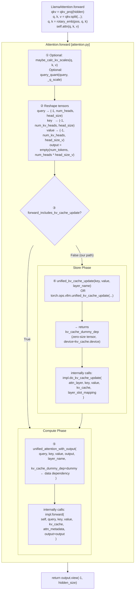

# Split Execution: The Read-Write Barrier

> **Who this is for:** You want to write a **custom Store kernel** (write new keys/values into the cache) and a **custom Decode kernel** (read the cache during attention) inside **vLLM**—the inference engine that serves LLMs with features like **continuous batching** and a **paged KV cache**. Ideally you have read Part 1 of this series (how KV blocks are allocated). You need to know which tensors hit your code, their shapes, where they come from, and what mistakes crash the GPU. Every claim below is tied to a specific file and line in the vLLM tree.

---

## How to read this document

### Assumptions (what we expect you to know)

- **Comfortable with:** Python, basic PyTorch (`Tensor` shapes, `view`), and the idea that an LLM forward pass processes a **batch** of user requests.
- **Not required:** Prior vLLM internals, CUDA, or Triton—until you implement kernels; this doc still explains the *data contract* in words first.
- **If you skip Part 1:** Read the [Terminology](#terminology-plain-english) table below; it replaces the background on “pages/blocks/slots.”

### Terminology: plain English

| Term | Plain meaning |
|---|---|
| **vLLM** | An open-source **inference engine** (not “a model”). It schedules requests, runs the model, and manages GPU memory for Key/Value cache. |
| **V1** | vLLM’s **current** internal API layout (paths like `vllm/v1/...`); this document targets V1. |
| **Runner** (`GPUModelRunner` in `gpu_model_runner.py`) | The **orchestrator** for one GPU worker: builds batches, sets sizes for this forward pass, and places tensors in **`ForwardContext`** so layers can find them. |
| **ForwardContext** | A **per-forward-pass stash** (thread-local) of `slot_mapping`, `attn_metadata`, etc. Your backend does not get these as Python args to every layer; it **pulls** them from context inside helper ops like `unified_kv_cache_update`. |
| **Backend / `AttentionImpl`** | Your **plugin class** that vLLM calls: `do_kv_cache_update` (store) and `forward` (read/compute). “Backend” is the recipe; the runner wires it. |
| **attn_metadata** | A small **struct of tensors/ints** your `forward` uses (lengths, block table, etc.). Built once per step; not the same as `ForwardContext` (metadata is *about* the batch, context also holds slot mappings for the store path). |
| **Continuous batching** | Many user requests are **interleaved** in one batch; the “batch dimension” is a **flat list of token rows**, not one rectangle per user. |
| **KV cache** | Per-layer GPU buffers holding past **Key** and **Value** tensors so you do not recompute the whole prompt every token. |
| **Paged / blocks** | Memory is cut into **fixed-size chunks (blocks)**; a long sequence is **non-contiguous** in GPU memory, like virtual memory pages. |
| **Physical slot (slot index)** | A single **address** in the big flat cache: which block and which position inside that block. `slot_mapping[i]` answers “**where** should token row *i* write its K/V?” |
| **`slot_mapping`** | A 1D tensor, **one integer per token row** in the current forward pass: that row’s **physical cache slot**, or a sentinel like **`-1`** = “**skip** this row (no write).” |
| **Batch descriptor / `num_tokens_padded`** | vLLM often uses a **token-row count** that may be **rounded up** (graphs, batch slots). The code **names** that count `num_tokens_padded` and the true live-token count `num_tokens_unpadded`—even when the two are **equal** for a given step. |
| **Split store** | K/V are **not** written inside `impl.forward`. The engine calls **`do_kv_cache_update` first**, then `impl.forward` (two steps). The runner then sets **`has_separate_kv_update`**. |
| **`forward_includes_kv_cache_update`** | Backend flag: `False` = “use split store; call `do_kv_cache_update` before my forward.” `True` = “I update KV inside my `forward`” (single fused path; uncommon here). |
| **CUDA graph** | A **recorded** chain of GPU launches replayed with low CPU overhead. Often **fixed tensor sizes**; that is one reason for **extra dummy rows** in a batch. |
| **`query_start_loc`** | **Cumulative start indices** of each request’s query rows in the flat `(T, …)` tensors—like `cu_seqlens` in FlashAttention. |
| **Block table** | For **each request**, which **physical block IDs** store its K/V. Used when **reading** the cache in attention; **`slot_mapping`** is the “where to **write** this new row” companion for the store pass. |
| **Context parallelism (CP)** | Optional **sharding of long sequences** across devices; a slot may be marked invalid on a rank that does not own that K/V slice. You still only need **`slot < 0` means skip**. |
| **`PAD_SLOT_ID` / `-1`** | **Not a valid physical slot**—kernels must not treat the index as a write target. |
| **`reshape_and_cache_flash`** | The built-in op that **copies** `key`/`value` rows into the paged cache using `slot_mapping` (name says “flash” for historical reasons; you call it from Python, implementation is CUDA/Triton). |
| **Row (token row)** | One index along the **first** dimension of `key` / `value` after reshape, shape `(T, num_kv_heads, head_dim)`. **Not** a line of source code—**`key[i, :, :]`** for a fixed `i`. See the box **below** for “dummy row.” |

#### What is a row? What is a dummy row?

**Row:** vLLM stacks **all** new query tokens (from every user request in this batch) into one tensor. After reshape, the **Key** tensor looks like `key.shape == (T, num_kv_heads, head_dim)`. The integer **`T`** is the **number of rows**. **Row *i*** means: “the *i*-th new token in that flat list”—the **`i`-th slice `key[i, ...]`**. Same idea for `value` and for `query`. So “row” = **one batch position in the first dimension of these 3D tensors**—a single new token’s activations, not a matrix row in linear algebra.

**Dummy row:** Sometimes **`T` is larger than** the number of **real** new tokens the scheduler put in this step. The extra “seats” are still **rows** in the tensor (same shape), but they do **not** correspond to a real user token. The GPU might still have **garbage** or **stale** numbers there. They exist because the server reserved a **fixed size** (e.g. a recorded CUDA graph that always uses `T=8`, or a max-batch slot). We call those positions **dummy** (or **padding**) **rows**—**not** “another kind of example,” just **filler** so the tensor shape stays constant. The runner sets **`slot_mapping[i] = -1`** for those indices so your store **does not** write them into the KV cache. Real rows get a normal physical slot (non-negative).

**Tiny picture:** 5 real new tokens, but the framework fixed **`T = 8`**. You get **5 real rows** (indices 0–4) and **3 dummy rows** (indices 5–7). This document’s “Example A (numbers)” is **exactly that situation**; it is the same story told with `key.shape[0] == 8` and a **`-1`** tail in `slot_mapping`—**not** a different topic.

**Why the doc keeps saying “padded”:** Source code uses the variable name `num_tokens_padded` for that **T** (the batch **height** the runner used this step). That **T** can **equal** the number of real tokens, or be **bigger** (dummy rows at the end). Either way, **`slot_mapping` has length `T`**, and **`-1`** marks dummy rows (or other “do not write” cases from masks).

---

## Table of Contents

0. [How to read this document](#how-to-read-this-document)
1. [Why the Split Exists — The Physical Constraint](#1-why-the-split-exists)
2. [The Backend Contract — `forward_includes_kv_cache_update`](#2-the-backend-contract)
3. [The Execution Graph — Exact Call Order Inside `Attention.forward`](#3-the-execution-graph)
4. [Pre-flight: The Reshape Before Everything Else](#4-pre-flight-the-reshape-before-everything-else)
5. [The Store Phase — `do_kv_cache_update` in Depth](#5-the-store-phase)
6. [Sentinel -1 entries: continuous batching vs. padding and other masks](#6-sentinel--1-entries-continuous-batching-vs-padding-and-other-masks)
7. [The Context System — How Tensors Get Routed to Your Backend](#7-the-context-system)
8. [The Dummy Tensor Trick — `torch.compile` and Ordering](#8-the-dummy-tensor-trick)
9. [The Read/Compute Phase — `impl.forward` in Depth](#9-the-readcompute-phase)
10. [KV Sharing — The Skip Condition](#10-kv-sharing-the-skip-condition)
11. [Decode vs. Prefill — How Kernels Differ](#11-decode-vs-prefill)
12. [Custom Kernel Reference Checklist](#12-custom-kernel-reference-checklist)
13. [Complete Source File Reference Map](#13-source-file-reference-map)

---

## 1. Why the Split Exists

### 1.1 The Naive Approach and Why It Fails

When you first think about writing a custom attention backend, the most natural design is a single kernel that does everything: receive the new Q, K, V projections; write the new K and V into the cache; then compute attention using both the freshly-written tokens and all historical tokens.

This monolithic design sounds efficient. It is actually a correctness trap for high-performance hardware.

Here is the problem in concrete terms. Suppose you have a batch with two requests:
- Request A has 512 tokens of context (all already in cache) and 1 new decode token.
- Request B has 256 tokens of context (all in cache) and 1 new decode token.

In a naive combined kernel, at the exact moment you are writing Request A's new K/V to its page, another warp in the same kernel might be reading historical K/V for Request B's attention computation. Because both requests share the same `kv_cache` buffer (the pre-allocated `torch.int8` blob described in Part 1 §4), you have a **read-write race condition** that produces undefined behavior on GPU.

Modern hardware-accelerated attention kernels (FlashAttention, FlashInfer, custom Tile Lang kernels) avoid this entirely by making a single structural assumption: **all Keys and Values in the cache are fully committed and stable before the attention computation kernel launches**. This assumption allows those kernels to be written without any synchronization primitives around cache reads, which is a major source of their performance.

The split execution model enforces this assumption at the framework level. The **Store Phase** runs to completion for the entire batch before the **Read/Compute Phase** starts. By the time your attention kernel executes, every physical cache slot it will touch has already been written.

### 1.2 CUDA Graph Compatibility

There is a second reason beyond correctness: CUDA Graphs.

A CUDA Graph is a mechanism where the driver records a sequence of GPU operations as a static computational graph, then replays that entire graph in a single CPU call. This eliminates the per-kernel CPU launch overhead, which is critical for decode-heavy workloads where each forward pass is very cheap and the CPU overhead would otherwise dominate.

CUDA Graphs require **completely static memory addresses**. Every buffer address must be identical between the capture and the replay. In `vllm/v1/worker/gpu_model_runner.py`, the runner determines whether to operate in `CUDAGraphMode.FULL` or `CUDAGraphMode.NONE` at the start of each `execute_model` call — once that decision is made, the sequence of kernel launches is fixed. The two-phase split, with explicit separate functions `unified_kv_cache_update` → `unified_attention_with_output`, is exactly the boundary the CUDA Graph machinery can snapshot and replay reproducibly.

---

## 2. The Backend Contract

### 2.1 The Flag That Changes Everything

Every attention backend in vLLM V1 declares a single boolean class variable. You can see this in the TurboQuant backend at `vllm/v1/attention/backends/turboquant_attn.py`:

```python
# vllm/v1/attention/backends/turboquant_attn.py, lines 86-87
    accept_output_buffer: bool = True
    forward_includes_kv_cache_update: bool = False
```

And the same flag in the FlashAttention backend at `vllm/v1/attention/backends/flash_attn.py`:

```python
# vllm/v1/attention/backends/flash_attn.py, line 94
    forward_includes_kv_cache_update: bool = False
```

This flag is the master switch that controls the entire two-phase pipeline:

| Value | Meaning | Who uses it |
|---|---|---|
| `False` | The backend does **NOT** write K/V inside `impl.forward`. The framework will call `impl.do_kv_cache_update` separately before calling `impl.forward`. | FlashAttention, TurboQuant, and any custom backend with a separate store kernel |
| `True` | The backend handles its own K/V writes inside `impl.forward`. The framework will skip the explicit store phase. | Backends that fuse the store into their attention pass (uncommon) |

When you set `forward_includes_kv_cache_update = False`, you are making a contract with the framework: "My `impl.forward` function is a **read-only** consumer of the KV cache. I will not write to it. You must call my `do_kv_cache_update` first."

In exchange for this contract, the framework guarantees:
1. `do_kv_cache_update` will always run first.
2. The `slot_mapping` vector is long enough to pair **one entry with every row** of `key`/`value` for this step (see [Terminology](#terminology-plain-english) and §6 for when the tail is `-1`).
3. `attn_metadata` for your `forward` includes the usual batch info: where each request’s rows sit (`query_start_loc`), how long each sequence is (`seq_lens`), and the **block table** for paged reads (`block_table_tensor`).

**What `slot_mapping` is actually doing (read this before the jargon):** For each **row** of new K/V (one row = one token this step must store), you need to know **which place in GPU memory** to write. That place is a **physical slot**—a single number that encodes block + offset inside the block. The runner computes that list for you as `slot_mapping`. So the **main job** of `slot_mapping` is **addressing**, not “padding.” **Extra rows:** Sometimes the batch has **dummy rows** (to match a fixed batch size). For those rows there is no real write; the runner puts **`-1`** so your kernel skips them. Other features (speculative decoding, multi-GPU layout) can also use **`-1`**. Rule: **never write when `slot_mapping[i] < 0`.** Implementation detail: slots are computed in `BlockTable.compute_slot_mapping` (`vllm/v1/worker/block_table.py`). §6 walks through runner code that **overwrites** the tail with `-1` when the batch row count is larger than the number of real tokens.

### 2.2 What You Must Implement

When `forward_includes_kv_cache_update = False`, you are obligated to implement two separate methods on your `AttentionImpl` subclass (the abstract base is defined in `vllm/v1/attention/backend.py`):

**`do_kv_cache_update(self, layer, key, value, kv_cache, slot_mapping)`**: Your **store** entry point. PyTorch gives you `key`/`value` as 3D tensors (`[num_rows, num_kv_heads, head_dim]`). For each row index `i`, if `slot_mapping[i] >= 0`, write that row’s K/V into `kv_cache` at that physical slot; if `slot_mapping[i] < 0`, **do nothing** for that row.

**`impl.forward(self, layer, query, key, value, kv_cache, attn_metadata, output, ...)`**: This is your Read/Compute kernel dispatcher. By the time this runs, the cache is fully up to date. Its job is to compute attention and write results into the pre-allocated `output` tensor.

The enforcement of `do_kv_cache_update`'s existence is an `assert` inside `unified_kv_cache_update` in `vllm/model_executor/layers/attention/attention.py` — if you declare the flag `False` but forget to implement `do_kv_cache_update`, the framework raises `AssertionError` on the first forward pass.

---

## 3. The Execution Graph

### 3.1 The Full Call Chain Inside `Attention.forward`

Here is the exact execution order. Every box below maps to a real function call. All of this happens inside `vllm/model_executor/layers/attention/attention.py`.



### 3.2 The Two Execution Paths Inside `Attention.forward`

The `Attention.forward` method has two branches for how it dispatches work. The `use_direct_call` flag (set on the `Attention` module at construction time in `vllm/model_executor/layers/attention/attention.py`) determines which path runs.

**The `use_direct_call = True` path** (standard CUDA-like paths, typical for non-graph inference):

```python
# vllm/model_executor/layers/attention/attention.py, lines 518-536
        if self.use_direct_call:
            # Skip this if sharing KV cache with an earlier attention layer.
            if (
                not self.attn_backend.forward_includes_kv_cache_update
                and self.kv_sharing_target_layer_name is None
                and key is not None
                and value is not None
            ):
                kv_cache_dummy_dep = unified_kv_cache_update(
                    key, value, self.layer_name
                )
            unified_attention_with_output(
                query,
                key,
                value,
                output,
                self.layer_name,
                kv_cache_dummy_dep=kv_cache_dummy_dep,
            )
```

**The `use_direct_call = False` path** (compiled custom-op path, used when `torch.compile` is active):

```python
# vllm/model_executor/layers/attention/attention.py, lines 537-556
        else:
            # Skip this if sharing KV cache with an earlier attention layer.
            encoded = _encode_layer_name(self.layer_name)
            if (
                not self.attn_backend.forward_includes_kv_cache_update
                and self.kv_sharing_target_layer_name is None
                and key is not None
                and value is not None
            ):
                kv_cache_dummy_dep = torch.ops.vllm.unified_kv_cache_update(
                    key, value, encoded
                )
            torch.ops.vllm.unified_attention_with_output(
                query,
                key,
                value,
                output,
                encoded,
                kv_cache_dummy_dep=kv_cache_dummy_dep,
            )
```

Both paths do the same logical work. The `torch.ops.vllm.*` variants are custom PyTorch operators that are visible to `torch.compile`'s graph tracer, allowing the compiler to see the data dependency chain. The `layer_name` is encoded as an integer in the compiled path via `_encode_layer_name` (also in `vllm/model_executor/layers/attention/attention.py`) because `torch.compile` cannot trace through string-keyed dictionaries efficiently.

**Three conditions must all be true for the Store Phase to execute:**
1. `not self.attn_backend.forward_includes_kv_cache_update` — the backend declared the split.
2. `self.kv_sharing_target_layer_name is None` — this layer is not borrowing another layer's KV cache (more on this in §10).
3. `key is not None and value is not None` — there are actually new tokens to write (encoder-only layers may have no new K/V).

---

## 4. Pre-flight: The Reshape Before Everything Else

Before either phase runs, `Attention.forward` reshapes the incoming tensors. This happens **before** the `use_direct_call` branch, at `vllm/model_executor/layers/attention/attention.py`:

```python
# vllm/model_executor/layers/attention/attention.py, lines 511-516
        query = query.view(-1, self.num_heads, self.head_size)
        output = output.view(-1, self.num_heads, self.head_size_v)
        if key is not None:
            key = key.view(-1, self.num_kv_heads, self.head_size)
        if value is not None:
            value = value.view(-1, self.num_kv_heads, self.head_size_v)
```

### 4.1 The `-1` Dimension

The `-1` in `.view(-1, self.num_heads, self.head_size)` means "infer this dimension from the total number of elements." In practice this flattens the batch dimension. Whether the input came in as `[num_tokens, hidden_dim]` (2D) or `[num_tokens, num_heads, head_dim]` (3D), after this view call everything is uniformly `(T, num_kv_heads, head_size)`.

**`T` (number of token rows)** is a critical concept. In a forward pass with CUDA graph padding, `T` is **not** the number of logical requests multiplied by their query lengths. It is the padded batch size that the CUDA graph was captured at. Extra rows in K/V/`output` are **graph (or batch-descriptor) padding**; the corresponding tail of `slot_mapping` is then filled with `-1` in `_get_slot_mapping` (§6.1). When `num_tokens_unpadded == num_tokens_padded`, there is no such tail — every row can still be a real continuous-batching slot index. **Do not equate “slot mapping” with “padding only”:** most entries are real physical slots; §6 is about the sentinel tail and other masked indices. The `output` tensor is also pre-allocated here at line 506 of `vllm/model_executor/layers/attention/attention.py` before the reshape — this is the buffer your `impl.forward` will write into.

### 4.2 Variable Definitions

Throughout this document, these variables appear repeatedly:

| Variable | What it means |
|---|---|
| `T` or `num_token_rows` | The total number of rows in the `key`/`value` tensor after reshape. Includes padding. |
| `num_kv_heads` | The number of Key/Value heads. For GQA (Grouped Query Attention) models like Llama 3, this is less than `num_heads`. |
| `head_size` | The per-head dimension for Q and K. Also called `head_dim`. |
| `head_size_v` | The per-head dimension for V. Usually equal to `head_size`. |
| `num_actual_tokens` | The number of *real* (non-padded) tokens. Stored in `attn_metadata.num_actual_tokens` (field defined in `vllm/v1/attention/backend.py`). |
| `num_tokens_unpadded` | Same concept, used in `_get_slot_mappings` at the runner level (`vllm/v1/worker/gpu_model_runner.py`). |
| `num_tokens_padded` | The padded token count the CUDA graph slot was captured at. |

---

## 5. The Store Phase

### 5.1 What `unified_kv_cache_update` Does

`unified_kv_cache_update` is the shim between `Attention.forward` and your backend's `do_kv_cache_update`. Here is its full implementation from `vllm/model_executor/layers/attention/attention.py`:

```python
# vllm/model_executor/layers/attention/attention.py, lines 711-734
def unified_kv_cache_update(
    key: torch.Tensor,
    value: torch.Tensor,
    layer_name: LayerNameType,
) -> torch.Tensor:
    """
    Returns a dummy that is passed to unified_attention to signal a side effect and
    the data dependency between them to ensure torch.compile preserves ordering.
    """
    layer_name = _resolve_layer_name(layer_name)
    _, attn_layer, kv_cache, layer_slot_mapping = get_attention_context(layer_name)
    if layer_slot_mapping is not None:
        assert hasattr(attn_layer.impl, "do_kv_cache_update"), (
            f"{attn_layer.impl.__class__.__name__} does not support kv cache update"
        )
        attn_layer.impl.do_kv_cache_update(
            attn_layer,
            key,
            value,
            kv_cache,
            layer_slot_mapping,
        )

    return torch.empty(0, device=kv_cache.device, dtype=kv_cache.dtype)
```

Walk through this line by line:

1. `get_attention_context(layer_name)` — pulls `kv_cache` and `layer_slot_mapping` from the thread-local `ForwardContext` (defined in `vllm/forward_context.py`). This is how your backend receives the physical cache tensor and the slot assignments without them being passed as Python function arguments through every transformer layer (more in §7).

2. `if layer_slot_mapping is not None` — if the runner determined there are actual new tokens to store (encoder-only layers may have `None` slot mappings), call `do_kv_cache_update`.

3. `return torch.empty(0, ...)` — returns a zero-element tensor. This is the dummy dependency tensor. The size is 0 — it holds no data. Its only purpose is to carry a data flow edge in the computation graph (see §8).

### 5.2 Your Store Function Signature

Your `do_kv_cache_update` receives exactly these five arguments:

```python
# vllm/v1/attention/backend.py  (abstract contract)
# vllm/v1/attention/backends/turboquant_attn.py  (concrete reference implementation)
def do_kv_cache_update(
    self,
    layer: torch.nn.Module,     # The Attention module instance (carries _k_scale, _v_scale, etc.)
    key: torch.Tensor,           # New key activations, ALREADY RESHAPED
    value: torch.Tensor,         # New value activations, ALREADY RESHAPED
    kv_cache: torch.Tensor,      # The physical cache buffer (your custom layout)
    slot_mapping: torch.Tensor,  # Per-row physical slot (continuous batching); -1 where no write
) -> None:
```

### 5.3 Exact Tensor Shapes for the Store Phase

Every argument has a precise shape. If your kernel violates these shapes, you get a silent wrong result or a CUDA illegal memory access crash.

| Argument | Shape | Dtype | Notes |
|---|---|---|---|
| `key` | `(T, num_kv_heads, head_size)` | Model activation dtype (`float16` or `bfloat16`) | `T` = `num_tokens_padded` when `has_separate_kv_update` is active. Includes padding rows. |
| `value` | `(T, num_kv_heads, head_size_v)` | Same as `key` | Usually `head_size_v == head_size`. Padding rows may contain garbage values. |
| `kv_cache` | Backend-specific shape | Backend-specific dtype | See §5.4 for the two common layouts. |
| `slot_mapping` | `(T_slot,)` | `int64` | One entry per token row in batch order (`query_start_loc`). Non-negative values are linear physical slots into the paged cache (same convention as `reshape_and_cache_flash`). `-1` marks rows that must not store (graph padding tail and other cases — §6). |

**Critical:** When `has_separate_kv_update = True` (always if your backend sets `forward_includes_kv_cache_update = False`), the runner in `vllm/v1/worker/gpu_model_runner.py` sizes `slot_mapping` to match the K/V row dimension: often `num_tokens_padded`, aligned with padded activations. Indices `[0, num_tokens_unpadded)` hold the real **continuous-batching** slot ids computed from the block table; `[num_tokens_unpadded, num_tokens_padded)` is the **padding tail** filled with `-1` when those counts differ.

The FlashAttention backend (`vllm/v1/attention/backends/flash_attn.py`) documents this explicitly:

```python
# vllm/v1/attention/backends/flash_attn.py, lines 843-864
    def do_kv_cache_update(
        self,
        layer: torch.nn.Module,
        key: torch.Tensor,
        value: torch.Tensor,
        kv_cache: torch.Tensor,
        slot_mapping: torch.Tensor,
    ) -> None:
        if self.attn_type in (AttentionType.ENCODER_ONLY, AttentionType.ENCODER):
            # For encoder attention,
            # we use direct Q, K, V tensors without caching
            return

        key_cache, value_cache = kv_cache.unbind(0)

        # Reshape the input keys and values and store them in the cache.
        # Skip this if sharing KV cache with an earlier attention layer.
        # NOTE(woosuk): Here, key and value are padded while slot_mapping is
        # not padded. However, we don't need to do key[:num_actual_tokens]
        # and value[:num_actual_tokens] because the reshape_and_cache_flash
        # op uses the slot_mapping's shape to determine the number of
        # actual tokens.
        reshape_and_cache_flash(
```

**Upstream NOTE vs. runner behavior:** The comment in `flash_attn.py` says key/value are padded while `slot_mapping` is “not padded.” In current V1, when `has_separate_kv_update` applies, `_get_slot_mappings` still **lengthens** `slot_mapping` to the padded token count and overwrites the unused tail with `-1`, so its **shape** matches padded K/V. The intent of the NOTE is that `reshape_and_cache_flash` uses **`slot_mapping.shape[0]`** as the loop bound (it does not require a separate “unpadded length” argument); padded rows must carry `slot == -1` so the kernel skips them.

### 5.4 The `kv_cache` Layout: Two Common Patterns

The physical layout of `kv_cache` is entirely determined by your backend's `get_kv_cache_shape` static method (abstract on `AttentionBackend` in `vllm/v1/attention/backend.py`). There is no universal format. Here are the two most important patterns:

**Pattern 1 — FlashAttention (Classic Paged Layout)** — `vllm/v1/attention/backends/flash_attn.py`:

`kv_cache` shape: `(2, num_blocks, block_size, num_kv_heads, head_dim)` (NHD case; HND is supported inside the op)

The leading `2` dimension is a key/value separator. `do_kv_cache_update` only **unpacks** and dispatches; there is no hand-written `key_cache[...] = key[...]` in this file:

```python
# vllm/v1/attention/backends/flash_attn.py, do_kv_cache_update (representative)
key_cache, value_cache = kv_cache.unbind(0)
reshape_and_cache_flash(
    key, value, key_cache, value_cache, slot_mapping,
    self.kv_cache_dtype, layer._k_scale, layer._v_scale,
)
```

`reshape_and_cache_flash` is bound in `vllm/csrc/torch_bindings.cpp` to the CUDA implementation in `vllm/csrc/cache_kernels.cu` (when building with CUDA). The **slot → cache address** work happens inside that kernel, not in Python. Conceptually, for a linear physical slot `slot_idx` and fixed `block_size`, the kernel does:

```cpp
// vllm/csrc/cache_kernels.cu — reshape_and_cache_flash_kernel (excerpt)
const int64_t slot_idx = slot_mapping[token_idx];
if (slot_idx < 0) { return; }
const int64_t block_idx   = slot_idx / block_size;
const int64_t block_offset = slot_idx % block_size;
// Then key_dst = key_cache + block_idx * block_stride + block_offset * page_stride, …
// (NHD vs HND changes strides; it is not a single 2D [block, offset] index.)
```

The same `slot_idx // block_size` and `slot_idx % block_size` structure appears in the Triton path used by other backends, e.g. `reshape_and_cache_kernel_flash` in `vllm/v1/attention/ops/triton_reshape_and_cache_flash.py` (lines 44–51 load `slot_mapping`, guard `slot_idx < 0`, then decompose the slot). Use those files as the ground truth, not a one-line Python assignment.

**Pattern 2 — TurboQuant (Fused Compressed Slot)** — `vllm/v1/attention/backends/turboquant_attn.py`:

`kv_cache` shape: `(num_blocks, block_size, num_kv_heads, slot_size)`

There is no leading `2` dimension. The K and V data are packed together into a single `slot_size`-width fused slot. The exact packing is determined by the quantization scheme (e.g., 3-bit K packed alongside 4-bit V into a `uint8` tile). Your store kernel is responsible for quantizing and packing the incoming `float16` activations into this format before writing.

### 5.5 TurboQuant's Store Implementation — A Reference

The TurboQuant store kernel in `vllm/v1/attention/backends/turboquant_attn.py` demonstrates a pattern that stays consistent with **`slot_mapping.shape[0]`** as the row count bound (same idea as FlashAttention’s `reshape_and_cache_flash`):

```python
# vllm/v1/attention/backends/turboquant_attn.py, lines 344-367 (approx.)
    def do_kv_cache_update(
        self,
        layer: torch.nn.Module,
        key: torch.Tensor,
        value: torch.Tensor,
        kv_cache: torch.Tensor,
        slot_mapping: torch.Tensor,
    ) -> None:
        """Store compressed K/V into the combined TQ cache.

        Called as a separate custom op (unified_kv_cache_update) BEFORE
        the attention forward, matching FlashAttention's split pattern.
        slot_mapping is already sliced to num_actual_tokens by the caller.
        """
        N = slot_mapping.shape[0]
        if N <= 0:
            return

        device = key.device
        self._ensure_on_device(layer, device)

        k = key[:N].view(N, self.num_kv_heads, self.head_size)
        v = value[:N].view(N, self.num_kv_heads, self.head_size)
        self._store_kv(k, v, kv_cache, slot_mapping, layer)
```

Key patterns to notice:
- **`N = slot_mapping.shape[0]`**: Aligns K/V rows with the `slot_mapping` vector passed through `ForwardContext`. `unified_kv_cache_update` does **not** slice `slot_mapping` in Python — it passes the tensor installed by the runner. When the separate-KV-update path uses padded counts, `N` is the **padded** length; rows with `slot_mapping[i] == -1` are not real tokens.
- **`key[:N]` / `value[:N]`**: Drops any **extra** tail on the activations if they are longer than `slot_mapping` (unusual); it does **not** by itself remove graph-padding rows when `N` already equals the padded size. Correctness for padded batches relies on **`slot >= 0`** in the store kernel.
- **The Triton store kernel** inside `_store_kv` checks `slot >= 0` before any write, so padding tails and other masked indices are skipped.

**Docstring caveat:** The inline comment *“slot_mapping is already sliced to num_actual_tokens by the caller”* in `turboquant_attn.py` is misleading for the `unified_kv_cache_update` path: the caller passes the context tensor as built in `gpu_model_runner.py`, which may be **full padded length** with a `-1` tail. Trust the runner + guard, not that sentence alone.

---

## 6. Sentinel -1 entries: continuous batching vs. padding and other masks

**Reminder:** Most `slot_mapping` entries are **real cache addresses**. This section is only about entries marked **invalid** (usually **`-1`**). If any term is new, see [Terminology: plain English](#terminology-plain-english) and §2.1.

### 6.1 Where the `-1` Values Come From

When any backend in the system has `forward_includes_kv_cache_update = False`, the runner in `vllm/v1/worker/gpu_model_runner.py` sets an internal flag called `has_separate_kv_update`. This flag triggers a specific padding policy in `_get_slot_mappings`.

#### Why `slot_mapping` must match the `key`/`value` height (and when the tail is `-1`)

**Plain summary:** The store kernel walks **one row at a time**: row `i` of `key` must use **`slot_mapping[i]`**. If `key` has 8 rows, `slot_mapping` must have 8 numbers. The extra numbers are not “phantom padding” for fun—they exist because the **framework sometimes allocates 8 rows even when only 5 tokens are real** (fixed batch shape). For the **fake** rows, the runner does not invent fake cache locations; it uses **`-1`** so the kernel does not write. If the framework used a **shorter** `slot_mapping` than `key` while `key` stayed “tall,” row 6 of `key` would have **no** slot to read, which is undefined.

**Example A (numbers) — more tensor rows than real tokens:** Same story as [What is a row? What is a dummy row?](#what-is-a-row-what-is-a-dummy-row) above: **5** real tokens, **`T = 8`** → **3 dummy rows** (indices 5–7). Then `key.shape[0] == 8`, but only rows **0–4** are real. `slot_mapping` has length **8**; entries **5, 6, 7** are **`-1`**. The built-in `reshape_and_cache_flash` still launches one thread per `key` row; threads that load **`-1`** return without writing. (Reused GPU buffers are why the runner **overwrites** the tail: otherwise row 5 might still hold **yesterday’s** valid slot id—see `vllm/v1/worker/gpu/block_table.py` comments on **stale** slot ids.)

**Example B (API design) — no separate “real count” passed into the op:** The CUDA store kernel indexes **`slot_mapping[token_idx]`** for `token_idx` in `0 .. key.size(0)-1` (`vllm/csrc/cache_kernels.cu`). There is no extra argument like `num_real_tokens=5`. So **“skip this row”** is expressed only as **`slot_mapping[i] < 0`**.

**Example C (policy) — split-store always uses the same “batch height” the runner used for the model:** The runner chooses the length of `slot_mapping` with `if (full_cuda_graph) or (any split-store backend): use num_tokens_padded; else: use num_tokens_unpadded` (see snippet below). **“Split store”** means you registered a backend with **`forward_includes_kv_cache_update = False`**, so the first branch is used **even if** you are not in full graph mode. That way **`slot_mapping` always matches the same row count** as the `key` tensor coming out of the attention layer. If **padded == unpadded** for that step, the “tail” slice is **empty**—**no** `-1`s from that line—but the **name** in code is still the padded-style path.

#### When are `key`/`value` and `slot_mapping` *not* the same length?

**Usually they are the same length—that is the intended invariant.** For `do_kv_cache_update`, vLLM wires the store so **`key.shape[0] == value.shape[0] == slot_mapping.shape[0]`** in normal operation. The hidden activations fed into attention are sized to the same **batch token height** the runner used when it built `slot_mapping` and `ForwardContext`.

**What “padding” means (and what it does *not* mean):**  
- **Does *not* mean:** `slot_mapping` is **longer** than `key` so the two tensors can be “patched together.”  
- **Does mean:** `key`, `value`, and `slot_mapping` are all **length T**, but for some row indices the K/V row is a **dummy row** (batch slot with no real new token). For those rows, **`slot_mapping[i] == -1`** so the store kernel skips the write. So padding is **same height, sentinel values in the tail** (or other positions for masks), not a **mismatched** height.

**When is that `-1` tail *needed*?** When **`num_tokens_padded > num_tokens_unpadded`**: the batch still has **`T = num_tokens_padded` rows** in the model tensors, but only **`num_tokens_unpadded`** rows correspond to real scheduled tokens. Both `key` and `slot_mapping` have length **`T`**; only the **values** in `slot_mapping`’s last `T - num_tokens_unpadded` entries are forced to **`-1`**.

**If lengths actually differ (abnormal):**  
- **`key` longer than `slot_mapping`:** Not the designed steady state. Some backends (e.g. TurboQuant) set `N = slot_mapping.shape[0]` and take **`key[:N]`** as a **defensive** trim if `key` were ever oversized—**not** the usual path.  
- **`key` shorter than `slot_mapping`:** Would leave slot indices **without** a K/V row—**inconsistent**; treat as a bug or an unsupported corner case.  
- **Spec decode / masks / CP:** Can put **`-1`** in **non-tail** positions; lengths should still **match** `key` for the store pass so every row has a slot entry (valid or `-1`).

**Where the policy is decided in code:**

```python
# vllm/v1/worker/gpu_model_runner.py, lines 3907-3958
            # True if any attention backend handles KV cache update separately
            # from forward() (i.e., forward_includes_kv_cache_update=False). When true,
            # slot_mappings must use padded dimensions to match the key/value tensors.
            has_separate_kv_update = not all(
                all(
                    g.backend.forward_includes_kv_cache_update
                    for g in self.attn_groups[id]
                )
                for id, spec in enumerate(self.kv_cache_config.kv_cache_groups)
                if not isinstance(spec.kv_cache_spec, EncoderOnlyAttentionSpec)
            )
            pad_attn = cudagraph_mode == CUDAGraphMode.FULL
...
            slot_mappings_by_group, slot_mappings = self._get_slot_mappings(
                num_tokens_padded=num_tokens_padded
                if pad_attn or has_separate_kv_update
                else num_tokens_unpadded,
```

The internal `_get_slot_mapping` function (also in `vllm/v1/worker/gpu_model_runner.py`) is where the actual `-1` filling happens:

```python
# vllm/v1/worker/gpu_model_runner.py, lines 3718-3737
        def _get_slot_mapping(kv_cache_gid: int):
            assert num_reqs_padded is not None and num_tokens_padded is not None
            kv_cache_spec = self.kv_cache_config.kv_cache_groups[
                kv_cache_gid
            ].kv_cache_spec
            if isinstance(kv_cache_spec, EncoderOnlyAttentionSpec):
                slot_mapping = torch.zeros(
                    (num_tokens_padded,),
                    dtype=torch.int64,
                    device=self.device,
                )
            else:
                blk_table = self.input_batch.block_table[kv_cache_gid]
                slot_mapping = blk_table.slot_mapping.gpu[:num_tokens_padded]

            # Fill unused with -1. Needed for reshape_and_cache in full cuda
            # graph mode. `blk_table_tensor` -1 to match mamba PAD_SLOT_ID
            slot_mapping[num_tokens_unpadded:num_tokens_padded].fill_(-1)

            return slot_mapping
```

**Step by step:**
1. The runner takes a slice of the pre-allocated `slot_mapping` GPU buffer up to `num_tokens_padded` length.
2. It then fills the range `[num_tokens_unpadded : num_tokens_padded]` with `-1`.

This means: indices `[0, num_tokens_unpadded)` are the real per-token physical slots for this step (plus any entries the block-table kernel already marked with `PAD_SLOT_ID` for non-local context-parallel shards). Indices `[num_tokens_unpadded, num_tokens_padded)` are the **CUDA-graph / batch-descriptor padding tail**, forced to `-1` so stores do not interpret them as tokens.

**Other sources of `PAD_SLOT_ID` / `-1` (non-exhaustive):** The Triton slot-mapping kernel also fills unused slots between the live token count and `max_num_batched_tokens` for graph stability (`vllm/v1/worker/block_table.py`, program id `num_reqs`). Speculative-decoding paths mask rejected or invalid positions (`compute_new_slot_mapping` in `vllm/v1/spec_decode/utils.py`). Your store kernel should treat **any** `slot < 0` as “do not write,” not only “graph padding.”

### 6.2 The `slot_mapping` Dtype

Looking at the `torch.zeros` call above in `vllm/v1/worker/gpu_model_runner.py:3734`, the slot mapping is **always `int64`** (also called `torch.long`). This is important for your Triton kernel — the `tl.load` for the slot index should use `tl.int64` dtype. An accidental cast to `int32` can produce negative integer overflow on large physical slot addresses.

### 6.3 The Mandatory Guard in Your Store Kernel

Your store kernel **must** check for negative slots before any write. Attempting to index `kv_cache[-1]` in Python or `kv_cache + (-1) * stride` in Triton will access memory before the start of the tensor, causing a GPU illegal memory access (SIGBUS equivalent), which crashes the entire vLLM worker process.

```python
# Conceptual guard pattern — matches TurboQuant's Triton store kernel
# Verify: vllm/v1/attention/backends/turboquant_attn.py, _store_kv → triton_turboquant_store.py
# The -1 sentinel is set by: vllm/v1/worker/gpu_model_runner.py:3735
def store_kernel_pseudocode(token_idx, key, kv_cache, slot_mapping):
    slot = slot_mapping[token_idx]
    
    if slot < 0:
        # No valid physical slot: graph padding tail, CP non-local shard, masked
        # speculative token, etc. (runner tail: gpu_model_runner.py:3735).
        return
    
    block_idx = slot // block_size
    offset    = slot % block_size
    
    # Safe to write
    kv_cache[block_idx, offset] = quantize_and_pack(key[token_idx])
```

In a Triton kernel, this guard is expressed as a mask:

```python
# Triton kernel guard — matches the pattern in the TurboQuant store kernel
# Verify: vllm/v1/attention/backends/turboquant_attn.py → _store_kv → triton_turboquant_store.py
# slot_mapping dtype is int64 per: vllm/v1/worker/gpu_model_runner.py:3734
slot = tl.load(slot_mapping_ptr + token_idx)
mask = slot >= 0

# All subsequent stores are masked by this condition
block_idx = slot // BLOCK_SIZE
offset    = slot % BLOCK_SIZE
tl.store(cache_ptr + block_idx * stride_b + offset * stride_o, data, mask=mask)
```

### 6.4 The `num_tokens_padded` and `num_tokens_unpadded` Relationship

| Term | Value | Meaning |
|---|---|---|
| `num_tokens_unpadded` | e.g. 5 | Actual tokens in this batch (real data) |
| `num_tokens_padded` | e.g. 8 | Next CUDA graph capture size boundary |
| Valid slot range | `[0, 5)` | Real physical cache slots |
| Padding slot range | `[5, 8)` | All `-1`, must be skipped |

The CUDA graph capture sizes are typically powers of 2 or multiples of 8/16. So a batch of 5 tokens might be padded to 8. Your store kernel receives 8 rows in `key` and `value`, with 8 entries in `slot_mapping`, but only the first 5 have valid slots. The last 3 have slot value `-1`.

---

## 7. The Context System

### 7.1 The Problem: Passing State Through 32 Transformer Layers

A typical LLM has 32 or more transformer layers. Every layer has its own `Attention` module with its own `kv_cache`, `slot_mapping`, and `attn_metadata`. If these were passed as Python function arguments, every transformer layer's `forward` signature would need to accept dozens of extra tensors. That is unmaintainable.

vLLM solves this with a **thread-local context manager** called `ForwardContext`, defined in `vllm/forward_context.py`.

### 7.2 The `ForwardContext` Dataclass

```python
# vllm/forward_context.py, lines 129-147
@dataclass
class ForwardContext:
    # copy from vllm_config.compilation_config.static_forward_context
    no_compile_layers: dict[str, Any]
    attn_metadata: dict[str, AttentionMetadata] | list[dict[str, AttentionMetadata]]
    slot_mapping: dict[str, torch.Tensor] | list[dict[str, torch.Tensor]]
    """
    Type Dict[str, AttentionMetadata] for v1, map from layer_name of each
    attention layer to its attention metadata
    Type List[Dict[str, AttentionMetadata]] for DBO. List of size two, one
    for each microbatch.
    Set dynamically for each forward pass
    """
```

The three critical fields:
- **`no_compile_layers`**: Maps `layer_name → Attention module`. This is how `unified_kv_cache_update` retrieves `attn_layer.impl` (your backend instance) without it being passed as a parameter.
- **`attn_metadata`**: Maps `layer_name → AttentionMetadata`. This is how your `impl.forward` gets the decode/prefill metadata without extra parameters.
- **`slot_mapping`**: Maps `layer_name → slot_mapping tensor`. This is how your `do_kv_cache_update` gets the physical slot assignments.

### 7.3 How the Context Is Set

Before every forward pass, the runner installs the context via `set_forward_context` in `vllm/v1/worker/gpu_model_runner.py`:

```python
# vllm/v1/worker/gpu_model_runner.py, lines 4008-4018
        with (
            set_forward_context(
                attn_metadata,
                self.vllm_config,
                num_tokens=num_tokens_padded,
                num_tokens_across_dp=num_tokens_across_dp,
                cudagraph_runtime_mode=cudagraph_mode,
                batch_descriptor=batch_desc,
                ubatch_slices=ubatch_slices_padded,
                slot_mapping=slot_mappings,
                skip_compiled=has_encoder_input,
            ),
```

`set_forward_context` is a Python context manager (a `with` block) implemented in `vllm/forward_context.py`. Everything that runs inside the `with` block — the entire model forward pass — has access to `ForwardContext` via a module-level variable. When the `with` block exits, the context is torn down.

### 7.4 How Your Backend Reads the Context

Inside `unified_kv_cache_update` and `unified_attention_with_output` (both in `vllm/model_executor/layers/attention/attention.py`), the context is accessed via `get_attention_context(layer_name)` (also from `vllm/forward_context.py`):

```python
# vllm/model_executor/layers/attention/attention.py — inside unified_kv_cache_update
_, attn_layer, kv_cache, layer_slot_mapping = get_attention_context(layer_name)
```

This returns a tuple of:
- `attn_metadata` for this layer (used by the compute phase)
- `attn_layer` — the `Attention` module (carries `_k_scale`, `_v_scale`, your impl instance)
- `kv_cache` — the physical KV buffer for this layer
- `layer_slot_mapping` — the slot mapping tensor for this layer (may be `None` for encoder attention)

---

## 8. The Dummy Tensor Trick

### 8.1 The `torch.compile` Ordering Problem

`torch.compile` is an aggressive compiler. When it traces through your model, it builds a computational graph and may reorder operations if it believes two operations are independent (i.e., there is no data flow edge between them).

The Store Phase and the Compute Phase are logically sequential (store must happen before read), but from a data flow perspective they appear independent: `unified_kv_cache_update` takes `key`/`value` as inputs and produces a side effect (writing to `kv_cache`). `unified_attention_with_output` takes `query`/`key`/`value`/`output` as inputs. Neither function explicitly passes data to the other.

If `torch.compile` sees two independent operations, it might decide to execute them in the wrong order, or even fuse them into a single kernel that runs in parallel.

### 8.2 The Solution: A Fake Data Dependency

The solution is `kv_cache_dummy_dep`. The store function in `vllm/model_executor/layers/attention/attention.py` returns a zero-size tensor:

```python
# vllm/model_executor/layers/attention/attention.py — end of unified_kv_cache_update
return torch.empty(0, device=kv_cache.device, dtype=kv_cache.dtype)
```

This tensor is passed as an argument to the compute function:

```python
# vllm/model_executor/layers/attention/attention.py — Attention.forward
unified_attention_with_output(
    ...,
    kv_cache_dummy_dep=kv_cache_dummy_dep,  # ← the dummy
)
```

The compute function accepts but immediately discards it, as seen in `vllm/model_executor/layers/attention/attention.py`:

```python
# vllm/model_executor/layers/attention/attention.py, lines 754-767 (excerpt; full function through line 781)
def unified_attention_with_output(
    query: torch.Tensor,
    key: torch.Tensor,
    value: torch.Tensor,
    output: torch.Tensor,
    layer_name: LayerNameType,
    output_scale: torch.Tensor | None = None,
    output_block_scale: torch.Tensor | None = None,
    kv_cache_dummy_dep: torch.Tensor | None = None,
) -> None:
    # kv_cache_dummy_dep is not used but accepting it creates a data dependency
    # that ensures torch.compile preserves ordering between KV cache update and
    # attention forward.
    del kv_cache_dummy_dep
```

From `torch.compile`'s perspective, the compute function's output depends on `kv_cache_dummy_dep`, which is produced by the store function. This creates a data flow edge. The compiler is now **required** to run the store function before the compute function. This is the fundamental principle: **where you cannot use control flow to enforce ordering, use data flow**.

### 8.3 What "zero-size tensor" Means

`torch.empty(0, ...)` creates a 1D tensor with 0 elements. It does not allocate any GPU memory. Its only cost is the Python object overhead of the tensor metadata. It is the cheapest possible tensor that still participates in `torch.compile`'s graph analysis.

---

## 9. The Read/Compute Phase

### 9.1 What `unified_attention_with_output` Does

The full implementation in `vllm/model_executor/layers/attention/attention.py`:

```python
# vllm/model_executor/layers/attention/attention.py, lines 754-781
def unified_attention_with_output(
    query: torch.Tensor,
    key: torch.Tensor,
    value: torch.Tensor,
    output: torch.Tensor,
    layer_name: LayerNameType,
    output_scale: torch.Tensor | None = None,
    output_block_scale: torch.Tensor | None = None,
    kv_cache_dummy_dep: torch.Tensor | None = None,
) -> None:
    # kv_cache_dummy_dep is not used but accepting it creates a data dependency
    # that ensures torch.compile preserves ordering between KV cache update and
    # attention forward.
    del kv_cache_dummy_dep
    layer_name = _resolve_layer_name(layer_name)
    attn_metadata, self, kv_cache, _ = get_attention_context(layer_name)

    self.impl.forward(
        self,
        query,
        key,
        value,
        kv_cache,
        attn_metadata,
        output=output,
        output_scale=output_scale,
        output_block_scale=output_block_scale,
    )
```

The `output` tensor is pre-allocated in `Attention.forward` at line 506 of `vllm/model_executor/layers/attention/attention.py` before either phase runs:
```python
# vllm/model_executor/layers/attention/attention.py:506
output = torch.empty(output_shape, dtype=output_dtype, device=query.device)
```

Your `impl.forward` writes attention results into this pre-allocated buffer directly (in-place), then `Attention.forward` returns it reshaped as `output.view(-1, hidden_size)`.

### 9.2 The `attn_metadata` Object

`attn_metadata` is a **backend-specific dataclass** built by your `AttentionMetadataBuilder.build(...)`. The abstract base `AttentionMetadataBuilder` is defined in `vllm/v1/attention/backend.py`. The framework calls your builder once per forward pass, before the model runs, and stores the result in `ForwardContext` (in `vllm/forward_context.py`).

The builder receives a `CommonAttentionMetadata` object (the shared batch descriptor produced by the runner in `vllm/v1/worker/gpu_model_runner.py`) and extracts whatever your backend needs from it. Let's look at the full `CommonAttentionMetadata` definition in `vllm/v1/attention/backend.py`:

```python
# vllm/v1/attention/backend.py, lines 342-402
@dataclass
class CommonAttentionMetadata:
    """
    Per-batch attention metadata, shared across layers and backends.
    AttentionMetadataBuilder instances use it to construct per-layer metadata.

    For many of the tensors we keep both GPU and CPU versions.
    """

    query_start_loc: torch.Tensor
    query_start_loc_cpu: torch.Tensor
    """(batch_size + 1,), the start location of each request in query Tensor"""

    seq_lens: torch.Tensor
    """(batch_size,), the number of computed tokens for each request"""

    num_reqs: int
    """Number of requests"""
    # TODO(lucas): rename to num_tokens since it may be padded and this is misleading
    num_actual_tokens: int
    """Total number of tokens in batch"""
    max_query_len: int
    """Longest query in batch"""
    max_seq_len: int
    """Longest context length (may be an upper bound)"""

    block_table_tensor: torch.Tensor
    slot_mapping: torch.Tensor
```

### 9.3 The Full `CommonAttentionMetadata` Field Reference

Every field in `CommonAttentionMetadata` (`vllm/v1/attention/backend.py:342`) has a specific shape, dtype, and meaning. This table is your decode/prefill kernel's source of truth:

| Field | Shape | Dtype | What It Means for Your Kernel |
|---|---|---|---|
| `query_start_loc` | `(num_reqs_padded + 1,)` | `int32` on GPU | Cumulative start index of each request's query tokens in the flattened `query` tensor. Same convention as FlashAttention's `cu_seqlens_q`. Entry `i` is the row offset of request `i`'s first query token. Entry `num_reqs` is the total number of query tokens. Used by **prefill** kernels to partition the `(T, H, D)` query tensor into per-request chunks. |
| `query_start_loc_cpu` | `(num_reqs_padded + 1,)` | `int32` on CPU | Same as above but on host memory. Use this for Python-side logic (kernel dispatch decisions) without triggering a device sync. |
| `seq_lens` | `(num_reqs_padded,)` | `int32` on GPU | **Total context length** (i.e., computed tokens) per request. Entry `i` tells your decode kernel how many historical K/V tokens exist for request `i`. This is the number of tokens your decoder must attend over — it includes the newly stored current token. Used by **decode** kernels as the upper bound for paged K/V reads. |
| `num_reqs` | scalar `int` | Python int | Number of requests in this batch, **potentially padded** to CUDA graph size. Padded entries are dummy requests with 0-length queries. |
| `num_actual_tokens` | scalar `int` | Python int | Total query token count, **potentially padded**. Use this to slice `query[:num_actual_tokens]` in your attention impl to ignore padding rows. Despite the misleading name, this may include padded token rows. |
| `max_query_len` | scalar `int` | Python int | Length of the longest query in this batch. For pure decode batches this is 1. For prefill batches this is the longest prompt. Useful for kernel grid calculations. |
| `max_seq_len` | scalar `int` | Python int | Length of the longest total context (prompt + generated tokens). May be an upper bound. Used to size shared memory tiles in attention kernels. |
| `block_table_tensor` | `(num_reqs_padded, max_num_blocks)` | `int32` on GPU | Paged block index table. Row `i` contains the physical block IDs for request `i`. Entry `[i, j]` is the physical block holding tokens `[j*block_size, (j+1)*block_size)` for request `i`. Unused entries are padded with `NULL_BLOCK_ID`. Your decode kernel uses this to translate a (request, token_position) pair into a physical cache address. |
| `slot_mapping` | `(num_tokens_padded,)` | `int64` on GPU | Per flattened query token row: physical linear slot for the KV store path (continuous batching). Tail may be `-1` when activations are padded. Also used by some backends in metadata for mixed prefill/decode. |

### 9.4 Your Backend's `attn_metadata` (The Builder Output)

Your `AttentionMetadataBuilder.build(...)` (abstract in `vllm/v1/attention/backend.py`) receives `CommonAttentionMetadata` and produces your backend-specific metadata type. Here is TurboQuant's builder in `vllm/v1/attention/backends/turboquant_attn.py` as a reference:

```python
# vllm/v1/attention/backends/turboquant_attn.py, lines 203-226 (approx.)
    def build(self, common_prefix_len, common_attn_metadata, fast_build=False):
        """Build TurboQuantMetadata from common attention metadata."""
        cam = common_attn_metadata

        # With reorder_batch_threshold=1, the model runner guarantees
        # decodes come first in the batch. split_decodes_and_prefills
        # finds the boundary (operates on CPU tensors — no GPU sync).
        assert self.reorder_batch_threshold is not None
        num_decodes, num_prefills, num_decode_tokens, _ = split_decodes_and_prefills(
            cam, decode_threshold=self.reorder_batch_threshold
        )

        return TurboQuantMetadata(
            seq_lens=cam.seq_lens,
            slot_mapping=cam.slot_mapping,
            block_table=cam.block_table_tensor,
            query_start_loc=cam.query_start_loc,
            num_actual_tokens=cam.num_actual_tokens,
            max_query_len=cam.max_query_len,
            max_seq_len=cam.max_seq_len,
            is_prefill=(cam.max_query_len > 1),
            num_decodes=num_decodes,
            num_decode_tokens=num_decode_tokens,
        )
```

The pattern is: **copy the fields you need from `cam` into your own dataclass**. You are not required to copy every field — only what your kernels actually consume.

### 9.5 The Three Navigation Tensors in Depth

#### `block_table`

**Shape:** `(num_reqs_padded, max_num_blocks)` — `int32` — field `block_table_tensor` in `vllm/v1/attention/backend.py:375`

This is the page table from Part 1 §1 (the OS analogy). Each row corresponds to one request. Each column corresponds to one page slot. The value at `block_table[req_idx, page_idx]` is the **physical block ID** in `kv_cache`.

A decode kernel that wants to read historical token `t` for request `r` computes:
```python
# Paged KV access pattern — verify block_table field at:
# vllm/v1/attention/backend.py:375 (block_table_tensor in CommonAttentionMetadata)
# This exact addressing is used by: vllm/v1/attention/backends/turboquant_attn.py → triton_turboquant_decode_attention
page_idx         = t // block_size
offset_in_page   = t % block_size
physical_block   = block_table[r, page_idx]
k_value = kv_cache[physical_block, offset_in_page, head_idx, :]
```

The maximum number of columns `max_num_blocks` = `ceil(max_seq_len / block_size)`. Rows for padded (dummy) requests contain `NULL_BLOCK_ID` in all columns.

The decode kernel iterates up to `seq_lens[r]` tokens for each request `r`. Beyond that, the block table entries may be `NULL_BLOCK_ID` — accessing them would index into the NULL block's memory, producing garbage or a crash.

#### `seq_lens`

**Shape:** `(num_reqs_padded,)` — `int32` — field `seq_lens` in `vllm/v1/attention/backend.py:362`, docstring: *"the number of computed tokens for each request"*

Entry `seq_lens[r]` is the **total number of computed tokens** (historical context) for request `r`. This number already accounts for the current decode step — by the time your attention kernel runs, the new token has been stored by `do_kv_cache_update`, so `seq_lens[r]` includes it.

**Why `seq_lens` is the decode kernel's primary navigation tool:**

A decode step always has exactly 1 query token per request. There is no "query length" dimension to iterate over. The decode kernel's outer loop is over requests; the inner loop is over historical K/V tokens. `seq_lens[r]` tells the inner loop when to stop.

In contrast, a prefill step has N query tokens per request. The prefill kernel iterates over both the query dimension (using `query_start_loc`) and the KV dimension (using `seq_lens`).

#### `query_start_loc`

**Shape:** `(num_reqs_padded + 1,)` — `int32` — field `query_start_loc` in `vllm/v1/attention/backend.py:352`, docstring: *"the start location of each request in query Tensor"*

This is a cumulative sum of query lengths across requests. The query length for request `r` is:
```python
# Derived from query_start_loc field: vllm/v1/attention/backend.py:352
# Same arithmetic used in naive_query_lens(): vllm/v1/attention/backend.py:400
query_len_r = query_start_loc[r+1] - query_start_loc[r]
```

For a pure decode batch: `query_start_loc = [0, 1, 2, 3, ..., num_reqs]` (each request contributes exactly 1 query token).

For a prefill batch: `query_start_loc = [0, 512, 1024, ...]` (each request contributes its full prompt length).

The flattened `query` tensor `(T, num_heads, head_size)` has rows `[query_start_loc[r], query_start_loc[r+1])` belonging to request `r`. The varlen prefill function `flash_attn_varlen_func` in `vllm/v1/attention/backends/flash_attn.py` accepts `cu_seqlens_q` which maps directly to `query_start_loc`.

**A derived quantity:** Per-request query lengths without extra computation, from `vllm/v1/attention/backend.py`:

```python
# vllm/v1/attention/backend.py, lines 397-402
    def batch_size(self) -> int:
        return self.seq_lens.shape[0]

    def naive_query_lens(self) -> torch.Tensor:
        """Naive because it assumes that query ends where the next query starts."""
        return self.query_start_loc[1:] - self.query_start_loc[:-1]
```

This gives a `(num_reqs,)` tensor of per-request query lengths. The "naive" qualifier means it trusts that requests in the batch are contiguous — which the runner guarantees by design.

### 9.6 The TurboQuant Decode Call — A Concrete Example

Here is how `_decode_attention` passes metadata into `triton_turboquant_decode_attention` in `vllm/v1/attention/backends/turboquant_attn.py` (pure **decode** path; prefill uses different code—see §11.5):

```python
# vllm/v1/attention/backends/turboquant_attn.py — _decode_attention (see triton call ~lines 815-834)
        result = triton_turboquant_decode_attention(
            query=query,
            kv_cache=kv_cache,
            block_table=attn_metadata.block_table,
            seq_lens=attn_metadata.seq_lens,
            Pi=Pi,
            centroids=centroids,
            scale=self.scale,
            mse_bits=self.tq_config.key_mse_bits,
            key_packed_size=self.tq_config.key_packed_size,
            value_quant_bits=self.tq_config.effective_value_quant_bits,
            key_fp8=self.tq_config.key_fp8,
            norm_correction=self.tq_config.norm_correction,
            PiT=PiT,
            mid_o_buf=mid_o_buf,
            output_buf=output_buf,
            lse_buf=lse_buf,
            buf_holder=layer,
            max_num_kv_splits=self.max_num_kv_splits,
        )
```

Notice that:
- `block_table` and `seq_lens` are passed to the decode kernel. These are the two navigation tensors.
- `query_start_loc` is **not** passed to this decode kernel. It is used in **`_prefill_attention`** / Flash varlen (and in mixed-batch prefill slices).
- For a **pure decode** call, `query` is sized to decode rows only. **Continuation prefill** can also call this same Triton API with synthetic `seq_lens` / `block_table` (§11.5).

---

## 10. KV Sharing — The Skip Condition

Some model architectures (e.g., models with shared attention across multiple layers) have a `kv_sharing_target_layer_name` feature. When an `Attention` module has this attribute set to a non-None value, it means: "My K and V come from another layer. That layer already stored them into the cache. I should not store them again."

Both conditions — the store phase and the dummy dependency — are skipped for sharing layers. This is visible in `vllm/model_executor/layers/attention/attention.py:518-525`:

```python
# vllm/model_executor/layers/attention/attention.py
if (
    not self.attn_backend.forward_includes_kv_cache_update
    and self.kv_sharing_target_layer_name is None  # ← skip condition
    and key is not None
    and value is not None
):
    kv_cache_dummy_dep = unified_kv_cache_update(key, value, self.layer_name)
```

For sharing layers, `kv_cache_dummy_dep` remains `None`. The attention computation still runs via `unified_attention_with_output`, which reads from the cache that the target layer already populated. This is safe because the target layer's store phase ran first (transformer layers execute in order).

---

## 11. Decode vs. Prefill

### 11.1 The Fundamental Difference

| | Decode | Prefill |
|---|---|---|
| Query tokens per request | Always 1 | Variable (full prompt length) |
| Primary navigation tensor | `seq_lens` | `query_start_loc` |
| Attention pattern | Each query attends over full historical context | Each query token attends over preceding tokens in the same request (causal masking) |
| `max_query_len` in metadata | `== 1` | `> 1` |
| Typical kernel | Custom paged decode attention (e.g. TQ Triton decode) | FlashAttention varlen, SDPA, or **continuation** paths that re-use decode or dequant+Flash (see TurboQuant §11.5) |

### 11.2 How to Detect Which Phase You Are In

`TurboQuantMetadata.is_prefill` is set in `TurboQuantMetadataBuilder.build` from `common_attn_metadata` (`vllm/v1/attention/backends/turboquant_attn.py`):

```python
# is_prefill = (cam.max_query_len > 1)  —  see build(), ~line 223
is_prefill = attn_metadata.is_prefill
# OR equivalently:
is_prefill = (attn_metadata.max_query_len > 1)
```

`max_query_len` is defined on `CommonAttentionMetadata` in `vllm/v1/attention/backend.py`.

### 11.3 Mixed Batches (Chunked Prefill + Decode)

vLLM supports batches where some requests are in the prefill phase and some are in the decode phase simultaneously. This is called **chunked prefill** or **disaggregated prefill**.

In this case, the runner uses `reorder_batch_threshold` to sort the batch so **decode requests come first**, then prefill requests. The boundary is found with `split_decodes_and_prefills` from `vllm/v1/worker/utils.py`, which operates on CPU tensors (no GPU sync):

```python
# vllm/v1/attention/backends/turboquant_attn.py — inside TurboQuantMetadataBuilder.build
# split_decodes_and_prefills is imported from vllm/v1/worker/utils.py
num_decodes, num_prefills, num_decode_tokens, _ = split_decodes_and_prefills(
    cam, decode_threshold=self.reorder_batch_threshold
)
```

- `num_decodes`: how many requests at the start of the batch are decodes
- `num_decode_tokens`: total query rows belonging to decode requests (= `num_decodes` since each decode has 1 query token)
- The decode kernel processes rows `[0, num_decode_tokens)` of the query tensor
- The prefill kernel processes rows `[num_decode_tokens, num_actual_tokens)` of the query tensor

If you are writing a Tile Lang backend, you need to handle this split. The cleanest pattern is: dispatch two kernel calls — one for the decode slice, one for the prefill slice — using the metadata to compute the correct tensor slices.

### 11.4 `is_prefilling` — The Per-Request Prefill Flag

`CommonAttentionMetadata` (`vllm/v1/attention/backend.py:386`) also carries `is_prefilling`, a per-request bool tensor:

```python
# vllm/v1/attention/backend.py:386
is_prefilling: torch.Tensor | None = None
"""(batch_size,) bool tensor: True if request is still in prefill phase
(num_computed_tokens < num_prompt_tokens). Used by some backends to
distinguish actual decodes from short extends."""
```

This is useful for "extend" requests — requests that previously were in prefill, have been partially computed (some KV already cached), and now have a chunk of new prompt tokens to process. These look like short prefills but have historical context in the cache that must be attended over.

### 11.5 TurboQuant: prefill is several strategies, not one generic prefill kernel

The module docstring at the top of `vllm/v1/attention/backends/turboquant_attn.py` states the split: **Prefill** = attention on **uncompressed** Q/K/V (or mixed with cached TQ), then **store** already ran in `do_kv_cache_update`. **Decode** = Triton TQ decode from the combined cache. In `forward` (`vllm/v1/attention/backends/turboquant_attn.py`):

1. **Pure decode** (`attn_metadata.is_prefill` is false): only `_decode_attention` → `triton_turboquant_decode_attention` (paged read of compressed cache).

2. **Pure prefill** (`is_prefill` and `num_decodes == 0`): `_prefill_attention`.  
   - **Whole-batch first chunk:** if `max_query_len == max_seq_len` and Flash-Attn is available, one **`flash_attn_varlen`** over the full batch with `cu_seqlens_q` / `cu_seqlens_k` from `query_start_loc` (no prior KV in cache).  
   - **Otherwise** (continuation chunks or no Flash-Attn): **per-request** loop. For each request, if `q_len == seq_len` (first chunk of that request), in-batch K/V only (Flash varlen or `scaled_dot_product_attention`). If `q_len < seq_len` (**continuation**), earlier tokens live **only in the TQ `kv_cache`** (already written by the store). Then:
     - **Small chunk** (`q_len ≤ 128`, `_CONTINUATION_DECODE_THRESHOLD`): reuse **`triton_turboquant_decode_attention`** with **synthetic** `seq_lens` / `block_table` so each query position sees the right causal context—**the same Triton decode kernel** as true decode, applied to prefill query rows.  
     - **Large chunk:** `_continuation_prefill` — dequant cached K/V from `kv_cache`, concat current chunk, then Flash varlen (or SDPA with mask).

3. **Mixed batch** (decodes + prefills): run decode on `q[:num_decode_tokens]` with a **decode-shaped** `TurboQuantMetadata` slice, then prefill on the rest with a **separate** metadata object whose **`query_start_loc` is rebased** and whose **`max_seq_len` is the prefill sub-batch maximum** (the source explicitly warns: using the full batch’s `max_seq_len` breaks Flash’s first-chunk fast path when decode requests inflate it).

A custom TQ-style backend that only documents **decode Triton** and **store** is incomplete unless it also states how **prefill** and **continuation** read paths work (uncompressed and/or TQ cache + dequant + Flash).

---

## 12. Custom Kernel Reference Checklist

This is the complete list of requirements for writing a correct custom **Store** and **read/compute** (`forward`) pair, including **prefill** (TurboQuant-style). Every item maps to a concrete failure mode if violated.

### Store Kernel (`do_kv_cache_update`)

- [ ] **Guard every write with `slot >= 0`**. Any negative slot is invalid (padding tail from `vllm/v1/worker/gpu_model_runner.py:3735`, block-table `PAD_SLOT_ID` fills, speculative masks, etc.). Writing using a negative index causes a GPU illegal memory access that crashes the entire worker process.

- [ ] **Use `slot_mapping.shape[0]` as the row bound `N` for aligning K/V with `slot_mapping`**, not `attn_metadata.num_actual_tokens` by default. That length matches what the runner paired with the store phase (see `vllm/v1/attention/backends/turboquant_attn.py` → `do_kv_cache_update`). `num_actual_tokens` is a separate scalar and may not match this vector’s length in all configurations.

- [ ] **Slice `key[:N]` and `value[:N]`** when `N = slot_mapping.shape[0]` is less than `key.shape[0]`. If `N` is the **padded** length, you still iterate those rows and skip writes where `slot < 0`; slicing alone does not remove graph-padding rows.

- [ ] **Accept `(T, num_kv_heads, head_size)` shaped inputs**. The reshape happens in `Attention.forward` at `vllm/model_executor/layers/attention/attention.py:511-515` before your function is called. You will never receive a 2D `(T, hidden_dim)` tensor.

- [ ] **Write into `kv_cache` with your backend's physical layout**. The layout is whatever your `get_kv_cache_shape` static method (abstract in `vllm/v1/attention/backend.py`) declared. Never write to a slot index without first converting from logical position to `(block_idx, offset_within_block)`.

- [ ] **Return `None`**. `do_kv_cache_update` is expected to return nothing. The dummy tensor dependency is handled by `unified_kv_cache_update` in `vllm/model_executor/layers/attention/attention.py`, not by your function.

- [ ] **Handle `N <= 0` gracefully**. If `slot_mapping` has zero elements, return immediately.

### Read/compute: decode branch (`impl.forward` when not in prefill)

- [ ] **Slice `query` with `attn_metadata.num_actual_tokens` (or the decode sub-slice in mixed batches)**. The full `query` buffer may be taller than the live token count (padding).

- [ ] **Use `block_table` and `seq_lens` for paged K/V access** from compressed cache. `block_table[r, page_idx]` gives physical block ID. `seq_lens[r]` bounds history for request `r`. See `triton_turboquant_decode_attention` in `vllm/v1/attention/backends/turboquant_attn.py` → `_decode_attention`.

- [ ] **Do not read beyond `seq_lens[r]` for request `r`**. Pages beyond the valid range may be `NULL_BLOCK_ID`.

- [ ] **Write results into the pre-allocated `output` tensor** (in-place for the valid rows you compute).

- [ ] **Do not write to `kv_cache` in `forward`**. The store phase already ran; `forward` only reads `kv_cache` (decode, continuation decode, and `_continuation_prefill` dequant paths).

### Read/compute: prefill branch (TurboQuant-style)

Prefill is **not** a single kernel name in TurboQuant: it may be **batch Flash-Attn varlen**, **per-request** SDPA / Flash, **small continuation chunks** via the **same Triton decode** op with synthetic metadata, or **dequant + Flash** for large continuations (§11.5).

- [ ] **Dispatch on `is_prefill` (e.g. `max_query_len > 1`) and on `num_decodes` / `num_decode_tokens` for mixed batches**, matching the structure in `TurboQuantAttentionImpl.forward` (`vllm/v1/attention/backends/turboquant_attn.py`).

- [ ] **Use `query_start_loc` (and per-request segment lengths) for varlen prefill**. Prefill is **causal** over **multiple query rows per request**; decode uses one query row per request and does not need `query_start_loc` in the Triton decode path.

- [ ] **Mixed batch:** after running decode on the first `num_decode_tokens` rows, build **prefill-only** metadata: **rebase** `query_start_loc` for the prefill segment and set **`max_seq_len` to the prefill sub-batch’s maximum** (not the full batch max—see comments in `forward` around the `prefill_meta` construction).

- [ ] **Continuation prefill** (`q_len < seq_len` for a request): earlier tokens are in **`kv_cache`**, not only in the current `key`/`value` tensor. You may need **decode-style** attention from cache, or **dequant + concat + Flash**, per your backend’s policy.

- [ ] **First-chunk whole-batch path:** when no request has prior cached KV, `max_query_len == max_seq_len` can select a **single** batch `flash_attn_varlen` (see `_prefill_attention` in `turboquant_attn.py`).

- [ ] **Still do not write `kv_cache` in prefill `forward`**: store is always `do_kv_cache_update` first; prefill `forward` only **reads** cache when attending over compressed history.

### Backend Class Setup

- [ ] **Set `forward_includes_kv_cache_update = False`** on your `AttentionBackend` subclass (see `vllm/v1/attention/backends/turboquant_attn.py` ~line 87 for the pattern).

- [ ] **Implement both `do_kv_cache_update` and `forward`** on your `AttentionImpl` subclass. If only `forward` is implemented but the flag is `False`, `unified_kv_cache_update` in `vllm/model_executor/layers/attention/attention.py:722` will raise `AssertionError`.

- [ ] **Implement `AttentionMetadataBuilder.build(...)`** (abstract in `vllm/v1/attention/backend.py`) to extract `block_table`, `seq_lens`, `query_start_loc` from `CommonAttentionMetadata` into your metadata dataclass.

- [ ] **Register with `forward_includes_kv_cache_update = False` before the engine starts**. The `has_separate_kv_update` flag in `vllm/v1/worker/gpu_model_runner.py` (which controls whether `slot_mapping` is sized to **padded** token counts to match K/V) is computed from registered backends. A backend registered after the first forward pass may not trigger the correct layout.

---

## 13. Source File Reference Map

| File | Responsibility |
|---|---|
| `vllm/model_executor/layers/attention/attention.py` | `Attention.forward`, `unified_kv_cache_update`, `unified_attention_with_output`, reshaping (line 511), output allocation (line 506), dummy dep, `_encode_layer_name` |
| `vllm/v1/attention/backend.py` | `CommonAttentionMetadata` (line 342), `AttentionBackend`, `AttentionImpl`, `AttentionMetadataBuilder` abstract bases, `naive_query_lens` (line 400) |
| `vllm/forward_context.py` | `ForwardContext` (line 129), `set_forward_context`, `get_attention_context` |
| `vllm/v1/worker/gpu_model_runner.py` | `_get_slot_mappings` (line 3718), `has_separate_kv_update` logic (line 3907), `set_forward_context` call (line 4008), `_build_attention_metadata` |
| `vllm/v1/attention/backends/flash_attn.py` | FlashAttention backend — reference `do_kv_cache_update` (line 843), `kv_cache.unbind(0)` layout |
| `vllm/v1/attention/backends/turboquant_attn.py` | TurboQuant: store (`do_kv_cache_update`), `forward` (decode / prefill / mixed), `_decode_attention` → `triton_turboquant_decode_attention`, `_prefill_attention` (Flash/SDPA/continuation), `_continuation_prefill`, `TurboQuantMetadataBuilder.build` — line numbers shift with vLLM version; use search. |
| `vllm/v1/attention/backends/registry.py` | `AttentionBackendEnum`, `register_backend`, `_ATTN_OVERRIDES` |
| `vllm/v1/worker/utils.py` | `split_decodes_and_prefills` helper for mixed batch dispatch |
