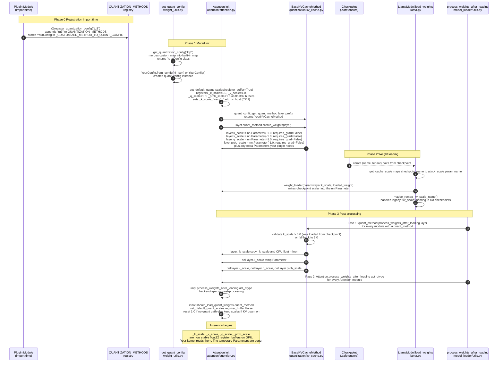

# Metadata and Quantization Injection: From Checkpoint to Kernel

> **Who this is for:** You want a clear **path from weights on disk to tensors your attention code can read** in **vLLM** (the **inference engine**—not a model file by itself). This part explains how **quantization metadata** (K/V scales, zero-points, codebooks, etc. in a **checkpoint** / `.safetensors`) is **registered**, **loaded** into the model, then **copied** into long-lived **buffers** your kernels use. **Ideally** you have read **Part 1** (how KV memory is laid out) and **Part 2** (store vs. compute / `do_kv_cache_update` + `impl.forward`). If not, the [Terminology](#terminology-plain-english) table below and Part 2’s [How to read](02-split-execution-the-read-write-barrier.md#how-to-read-this-document) still help. **Every** mechanism below is tied to real **files** in the vLLM source tree; code blocks name the file first so you can jump straight to the implementation.

---

## How to read this document

### Assumptions (what we expect you to know)

- **Comfortable with:** Python, **PyTorch** basics (`nn.Module`, `nn.Parameter`, moving a model to GPU), and the idea that a **checkpoint** is a big dict of **tensor names → tensors** loaded from disk.
- **Not required:** Having shipped a vLLM plugin before, or knowing `BaseKVCacheMethod` by name—this document defines it.
- **If you are new to vLLM:** Read [Terminology](#terminology-plain-english), then use the [§9 Source file map](#9-source-file-reference-map) as an index. **Line numbers** in prose drift as vLLM changes; the **file + function** name is what you should search for.

### Terminology: plain English

| Term | Plain meaning |
|---|---|
| **vLLM** | The **inference server / engine** that loads a Hugging Face–style model, runs forwards, and manages KV **GPU** memory. |
| **Checkpoint** | The saved **weights and extra tensors** (e.g. scales) for a model—often **Hugging Face** format or `.safetensors` files. |
| **`nn.Parameter`** | A tensor PyTorch treats as a **trainable weight**; it shows up in `model.parameters()` and is the usual **target** of `load_state_dict` for a named weight. |
| **`register_buffer(name, tensor)`** | A **non-trainable** tensor stored on the module, moved with `model.to(cuda)`, **saved** in `state_dict`, but **not** an “optimizer” parameter. Good for **runtime constants** (final scales) that should not be confused with learnable weights. |
| **`QuantizationConfig`** | A **settings object** in vLLM (subclass) that says **which** quant method to use and returns **handler objects** (e.g. a KV-cache method) per layer. |
| **`@register_quantization_config("name")`** | **Import-time** registration so `LLM(..., quantization="name")` is valid. Defined in `vllm/model_executor/layers/quantization/__init__.py`. |
| **`BaseKVCacheMethod`** | Base class in `vllm/model_executor/layers/quantization/kv_cache.py` for **KV-cache–related** quant: it **`create_weights`** (temporary `nn.Parameter`s for load) and **`process_weights_after_loading`** (copy into `register_buffer`, then `del` the parameters). |
| **`get_cache_scale(checkpoint_name)`** | On your `QuantizationConfig` (or mixin): maps a **tensor name in the file** to the **model attribute name** (e.g. `...k_proj.output_scale` → `...attn.k_scale`) so the loader can copy data into the right `Parameter`. |
| **`get_quant_method(layer, prefix)`** | Returns an instance of your **`BaseKVCacheMethod`** (or `None`) for a given `Attention` module. |
| **`process_weights_after_loading` (model-wide)** | After all tensors are loaded, vLLM walks modules and calls each **`quant_method.process_weights_after_loading`**, then each **`Attention.process_weights_after_loading`**. See `vllm/model_executor/model_loader/utils.py`. |
| **Parts 1–2 (reminder)** | **Part 1** = paged KV layout; **Part 2** = **store** then **read/compute** for attention, `slot_mapping`, etc. This **Part 3** is only about **getting scale metadata into the `Attention` module** before those forwards run. |

**Code in this doc:** Fenced blocks use:

```text
# <path under vllm/> — <function or concept> (~lines or “see file”)
```

so you can **open that file** in a checkout even when line numbers move.

---

## Table of Contents

0. [How to read this document](#how-to-read-this-document)
1. [The Fundamental Problem — Why Scales Can't Just Be Constants](#1-the-fundamental-problem)
2. [The Dual-State Pipeline — Full Lifecycle with Sequence Diagram](#2-the-dual-state-pipeline)
3. [Phase 0: Registration — Making vLLM Aware Your Method Exists](#3-phase-0-registration)
4. [Phase 1: Model Init — Permanent Buffers and Temporary Parameters](#4-phase-1-model-init)
5. [Phase 2: Weight Loading — The Checkpoint Key Mapping Contract](#5-phase-2-weight-loading)
6. [Phase 3: Post-Processing — The Handoff and the Deletion](#6-phase-3-post-processing)
7. [Implementation Checklist for a Custom BaseKVCacheMethod](#7-implementation-checklist)
8. [Pre-Attention Tensor Topography — Q, K, V at the Boundary](#8-pre-attention-tensor-topography)
9. [Complete Source File Reference Map](#9-source-file-reference-map)

---

## 1. The Fundamental Problem

When you train a model with a custom ~3-bit KV cache quantization scheme, you end up with per-layer metadata (scales, zero-points, codebook indices, rotation matrices, etc.) baked into the checkpoint. These might be stored in the `.safetensors` file as tensors with names like:

```
model.layers.0.self_attn.k_proj.output_scale   → a scalar float
model.layers.0.self_attn.v_proj.output_scale   → a scalar float
```

At inference time, your CUDA/Tile Lang kernel needs to read these values. But here is the design tension:

**During weight loading**, PyTorch's `load_state_dict` mechanism only knows how to populate `nn.Parameter` and `nn.Module`-registered attributes. It iterates a checkpoint dictionary and matches keys to named parameters. So your scale *must be an `nn.Parameter`* to be loaded.

**During inference**, `nn.Parameter`s carry overhead you don't want. They participate in `autograd` tracking. They are included in optimizer state when you call `.parameters()`. They are mutable, which means the compiler can't assume they're constant. What you actually want is a `register_buffer` — a tensor that:
- Lives inside the module's `state_dict` but is **not** treated as a learnable weight
- Gets moved to GPU automatically with `model.to(device)`
- Can be accessed as `self._k_scale` with no autograd overhead
- Is treated as a compile-time constant by `torch.compile`

vLLM resolves this tension with a deliberate **two-phase lifecycle**:

| Phase | Storage Type | Purpose | Lifetime |
|-------|-------------|---------|---------|
| Load time | `nn.Parameter` (scalar, `requires_grad=False`) | Catch incoming checkpoint values via `load_state_dict` | From `create_weights` until `process_weights_after_loading` |
| Runtime | `register_buffer` (float32 tensor) | Stable, device-resident tensor read by attention kernels | Permanent, for the duration of inference |

The handoff between these two states is precisely what `BaseKVCacheMethod` orchestrates.

---

## 2. The Dual-State Pipeline

Here is the complete end-to-end lifecycle of your quantization metadata, from Python decorator to GPU register:



**Mapping diagram → repo:** `QUANTIZATION_METHODS` and `register_quantization_config` live under `vllm/model_executor/layers/quantization/__init__.py`. `get_quant_config` / config loading: `vllm/model_executor/model_loader/weight_utils.py`. `Attention` / `_init_kv_cache_quant`: `vllm/model_executor/layers/attention/attention.py`. `BaseKVCacheMethod`: `vllm/model_executor/layers/quantization/kv_cache.py`. `LlamaModel.load_weights`: `vllm/model_executor/models/llama.py`. `process_weights_after_loading` (model-wide): `vllm/model_executor/model_loader/utils.py`. Exact snippets are in §§3–6 with **file-prefixed** code blocks.

---

## 3. Phase 0: Registration

### 3.1 The `@register_quantization_config` Decorator

Before you can type `LLM(model="...", quantization="tq3")`, vLLM must know what `"tq3"` means. This registration happens at **Python import time** via a class decorator defined in `vllm/model_executor/layers/quantization/__init__.py`.

```python
@register_quantization_config("tq3")
class TurboQuant3BitConfig(QuantizationConfig):
    ...
```

When Python executes that `@` line, the decorator runs immediately. It does three things:

**1. Appends your name to `QUANTIZATION_METHODS`** — the master list of valid quantization strings. If vLLM's `verify_quantization` later tries to validate the user-supplied `"tq3"` string, it will find it here.

**2. Registers a platform allowlist entry** — on platforms like ROCm that expose a `supported_quantization` list, your method name is appended to it automatically.

**3. Stores your class** in `_CUSTOMIZED_METHOD_TO_QUANT_CONFIG` — a private dictionary mapping the string `"tq3"` to your `TurboQuant3BitConfig` class.

When `get_quantization_config("tq3")` is later called during model loading, it merges this custom dictionary into the built-in `method_to_config` map and returns your class.

```python
# vllm/model_executor/layers/quantization/__init__.py — register_quantization_config (~lines 57–105)
def register_quantization_config(quantization: str):
    ...
    def _wrapper(quant_config_cls):
        if quantization in QUANTIZATION_METHODS:
            logger.warning(...)
        else:
            QUANTIZATION_METHODS.append(quantization)
            if sq := current_platform.supported_quantization:
                sq.append(quantization)
        if not issubclass(quant_config_cls, QuantizationConfig):
            raise ValueError(...)
        _CUSTOMIZED_METHOD_TO_QUANT_CONFIG[quantization] = quant_config_cls
        return quant_config_cls

    return _wrapper
```

**Critical timing requirement:** Your plugin module must be imported *before* you construct the `LLM` or `AsyncLLMEngine` object. If you import it after, the decorator has not run and `"tq3"` is not in the registry. vLLM will raise a `ValueError: Invalid quantization method: tq3`.

### 3.2 Config Instantiation

Once your class is registered, `get_quant_config()` in `vllm/model_executor/model_loader/weight_utils.py` is responsible for *instantiating* it. It tries several approaches in order:

1. If the HuggingFace model card's `config.json` contains a `quantization_config` dict, it calls `YourConfig.from_config(that_dict)`.
2. If `hf_overrides` provide a custom config JSON file, it falls back to that.
3. If `get_config_filenames()` returns filenames (e.g., `["tq3_config.json"]`), it loads those.
4. As a last resort: `YourConfig()` with no arguments (useful for testing).

**Implication:** You must implement `from_config(cls, config: dict)` if you expect users to store quantization metadata in the model card. For a minimal plugin, `get_config_filenames() -> []` and `from_config` is sufficient.

---

## 4. Phase 1: Model Init — Permanent Buffers and Temporary Parameters

### 4.1 Where This Happens

Every `Attention` layer in the model (one per transformer block) calls `_init_kv_cache_quant` during `__init__`. This is the function that sets up the entire scale infrastructure for that layer.

```python
# vllm/model_executor/layers/attention/attention.py — _init_kv_cache_quant (~lines 121–175)
def _init_kv_cache_quant(
    layer: nn.Module,
    quant_config: QuantizationConfig | None,
    prefix: str,
) -> None:
    ...
    set_default_quant_scales(layer, register_buffer=True)
    ...
    quant_method = (
        quant_config.get_quant_method(layer, prefix=prefix) if quant_config else None
    )
    if should_load_quant_weights(quant_method):
        assert isinstance(quant_method, BaseKVCacheMethod)
        layer.quant_method = quant_method
        layer.quant_method.create_weights(layer)
```

### 4.2 Step A: Permanent Buffers Are Created First

The very first call inside `_init_kv_cache_quant` is `set_default_quant_scales(layer, register_buffer=True)`. This creates **four permanent `register_buffer`s** on the `Attention` module:

```python
# vllm/model_executor/layers/attention/attention.py — set_default_quant_scales (~lines 94–118)
def set_default_quant_scales(layer: nn.Module, register_buffer: bool = False) -> None:
    if register_buffer:
        layer.register_buffer("_k_scale", torch.tensor(1.0, dtype=torch.float32))
        layer.register_buffer("_v_scale", torch.tensor(1.0, dtype=torch.float32))
        layer.register_buffer("_q_scale", torch.tensor(1.0, dtype=torch.float32))
        layer.register_buffer("_prob_scale", torch.tensor(1.0, dtype=torch.float32))
    else:
        layer._k_scale.fill_(1.0)
        ...
    layer._q_scale_float = 1.0
    layer._k_scale_float = 1.0
    layer._v_scale_float = 1.0
    layer._prob_scale_float = 1.0
    ...
```

What is a `register_buffer`? It is a tensor tied to the module's `state_dict` that:
- Gets moved automatically with `model.to("cuda")` — so `model.to(device)` before the memory profiler runs will move `_k_scale` to GPU even if the parameter registration hasn't happened yet
- Is **not** included in `model.parameters()`, so it won't be updated by an optimizer
- Shows up in `model.state_dict()` with a `None` as its `grad_fn`

There are also **four CPU-side Python float mirrors** (`_k_scale_float`, etc.). Some attention backends (notably FlashInfer) require the scale as a Python float on the CPU rather than a GPU tensor. Both are maintained in sync.

### 4.3 Step B: Temporary Parameters Are Injected by `create_weights`

After the permanent buffers exist, `_init_kv_cache_quant` calls your `quant_method.create_weights(layer)`. The base class implementation in `vllm/model_executor/layers/quantization/kv_cache.py` injects four **temporary** `nn.Parameter`s:

```python
# vllm/model_executor/layers/quantization/kv_cache.py — BaseKVCacheMethod.create_weights (~lines 32–44)
def create_weights(self, layer: torch.nn.Module):
    # Initialize the Q and KV cache scales to -1.0, an invalid value.
    layer.q_scale = torch.nn.Parameter(torch.tensor(-1.0), requires_grad=False)
    layer.k_scale = torch.nn.Parameter(torch.tensor(-1.0), requires_grad=False)
    layer.v_scale = torch.nn.Parameter(torch.tensor(-1.0), requires_grad=False)
    layer.prob_scale = torch.nn.Parameter(torch.tensor(-1.0), requires_grad=False)
```

Why `-1.0`? It is a **sentinel value**. The code in `process_weights_after_loading` explicitly checks `if layer.k_scale > 0.0` to determine whether the checkpoint actually provided a value. If both are negative after loading, it defaults to `1.0` (identity scale). This avoids silently using a garbage value if your checkpoint doesn't include scales for a particular layer.

**The key architectural insight:** At this moment, the `Attention` layer has *both* `_k_scale` (the permanent buffer, set to 1.0) and `k_scale` (the temporary parameter, set to -1.0) alive simultaneously. They are separate attributes. The parameter is about to receive the real value from the checkpoint. The buffer is waiting to receive that value after loading.

### 4.4 Why `nn.Parameter` and Not Just `register_buffer`?

An `nn.Parameter` appears in `model.named_parameters()`. When PyTorch's `load_state_dict` (or vLLM's weight loader loop) matches checkpoint tensor names to model attributes, it specifically looks for things in `named_parameters()` and `named_buffers()`. Using a `Parameter` makes the scale a first-class citizen of the module's parameter namespace, giving the weight loader a clean handle to write into.

If you tried to load directly into the `_k_scale` buffer from the checkpoint, you'd fight with name-mangling issues and the buffer's initial `1.0` would mask any failed loading silently. The Parameter's `-1.0` sentinel makes failures visible.

---

## 5. Phase 2: Weight Loading — The Checkpoint Key Mapping Contract

### 5.1 The Problem: Checkpoint Key ≠ Model Attribute Name

Your checkpoint might store scale tensors as:

```
model.layers.12.self_attn.k_proj.output_scale
model.layers.12.self_attn.v_proj.output_scale
```

But your `Attention` module's temporary parameter is registered as:

```
model.layers.12.self_attn.attn.k_scale
model.layers.12.self_attn.attn.v_scale
```

These names do not match. A naive `load_state_dict` call would skip them entirely. vLLM solves this with a **name mapping contract** implemented in `LlamaModel.load_weights()`.

### 5.2 The `get_cache_scale` Method

`LlamaModel.load_weights` iterates every `(name, tensor)` pair from the checkpoint and immediately checks:

```python
# vllm/model_executor/models/llama.py — load_weights, KV scale branch (~lines 459–470)
if self.quant_config is not None and (
    scale_name := self.quant_config.get_cache_scale(name)
):
    # Loading kv cache quantization scales
    param = params_dict[scale_name]
    weight_loader = getattr(param, "weight_loader", default_weight_loader)
    loaded_weight = (
        loaded_weight if loaded_weight.dim() == 0 else loaded_weight[0]
    )
    weight_loader(param, loaded_weight)
    loaded_params.add(scale_name)
    continue
```

`params_dict` is built from `self.named_parameters()`, so it contains your `...attn.k_scale` Parameter. If `get_cache_scale(name)` returns the mapped name, the loader writes the checkpoint tensor into that Parameter and moves to the next checkpoint entry via `continue` (skipping the rest of the loading logic for that tensor).

The built-in FP8 implementation shows what this mapping looks like:

```python
# vllm/model_executor/layers/quantization/fp8.py — Fp8Config.get_cache_scale (~lines 206+)
def get_cache_scale(self, name: str) -> str | None:
    if name.endswith(".output_scale") and ".k_proj" in name:
        return name.replace(".k_proj.output_scale", ".attn.k_scale")
    if name.endswith(".output_scale") and ".v_proj" in name:
        return name.replace(".v_proj.output_scale", ".attn.v_scale")
    if name.endswith(".output_scale") and ".q_proj" in name:
        return name.replace(".q_proj.output_scale", ".attn.q_scale")
    if name.endswith("self_attn.prob_output_scale"):
        return name.replace(".prob_output_scale", ".attn.prob_scale")
    return None
```

Your plugin must implement an analogous `get_cache_scale` that translates whatever naming convention your checkpoint uses into the `...attn.k_scale` and `...attn.v_scale` names. **This is a pure string-to-string mapping function.**

### 5.3 Scalar Enforcement

Notice the line:

```python
loaded_weight = (
    loaded_weight if loaded_weight.dim() == 0 else loaded_weight[0]
)
```

Some checkpoints store per-tensor scales as rank-1 tensors of shape `[1]` rather than rank-0 scalars. This line forces the loaded value into a scalar (rank-0 tensor) regardless. For a ~3-bit scheme that needs *per-channel* or *per-head* scales (non-scalar metadata), you will need to override `create_weights` to create Parameters of the correct shape and bypass this squeezing logic by not routing through `get_cache_scale` for those tensors — instead handling them in the general weight-loading loop.

### 5.4 Legacy Name Handling

For checkpoints using older conventions (e.g., a single combined `kv_scale` instead of separate `k_scale`/`v_scale`), the fallback:

```python
if "scale" in name or "zero_point" in name:
    name = maybe_remap_kv_scale_name(name, params_dict)
```

...renames the checkpoint key before loading. Your plugin may need to register similar remappings if you are loading older checkpoints with deprecated naming.

---

## 6. Phase 3: Post-Processing — The Handoff and the Deletion

### 6.1 The Two-Pass System

After all weights are loaded, `BaseModelLoader.load_model` calls:

```python
# vllm/model_executor/model_loader/utils.py — process_weights_after_loading (~lines 95–118)
def process_weights_after_loading(
    model: nn.Module, model_config: ModelConfig, target_device: torch.device
) -> None:
    for _, module in model.named_modules():
        quant_method = getattr(module, "quant_method", None)
        if isinstance(quant_method, QuantizeMethodBase):
            with device_loading_context(module, target_device):
                quant_method.process_weights_after_loading(module)

    for _, module in model.named_modules():
        if isinstance(module, (Attention, MLAAttention)) and hasattr(
            module, "process_weights_after_loading"
        ):
            with device_loading_context(module, target_device):
                module.process_weights_after_loading(model_config.dtype)
```

This runs two **sequential** passes over the entire model:

**Pass 1 (Quant Method Pass):** Every module that has a `quant_method` attribute gets `quant_method.process_weights_after_loading(module)` called. For every `Attention` layer where `_init_kv_cache_quant` installed a `BaseKVCacheMethod`, this is where your override runs.

**Pass 2 (Attention Pass):** Every `Attention`/`MLAAttention` module gets its own `process_weights_after_loading(dtype)` called. This delegates to the *backend implementation's* post-loading logic (e.g., FlashAttention's impl may do additional kernel-format preparation). It also resets scales to `1.0` for attention layers that have *no* quantization (the `not should_load_quant_weights` branch).

The passes must be sequential because Pass 2 relies on Pass 1 having finished to know the final scale values.

### 6.2 What `BaseKVCacheMethod.process_weights_after_loading` Does

The full logic lives in **`BaseKVCacheMethod.process_weights_after_loading`** in `vllm/model_executor/layers/quantization/kv_cache.py` (long function; **search the file** for the exact current body). The structure is:

```python
# vllm/model_executor/layers/quantization/kv_cache.py — BaseKVCacheMethod.process_weights_after_loading (~line 49+; structure only)
def process_weights_after_loading(self, layer: torch.nn.Module) -> None:
    if not hasattr(layer, "q_scale"):
        return  # e.g. already ran on reload

    if kv_cache_uses_per_token_head_scales(layer.kv_cache_dtype):
        layer._k_scale.copy_(1.0)
        layer._v_scale.copy_(1.0)
        ...
        del layer.k_scale, layer.v_scale, layer.q_scale, layer.prob_scale
        return

    if is_quantized_kv_cache(layer.kv_cache_dtype) and not layer.calculate_kv_scales:
        if layer.k_scale > 0.0 and layer.v_scale > 0.0:
            k_scale = layer.k_scale.to("cpu").tolist()
            v_scale = layer.v_scale.to("cpu").tolist()
            # ... FNUZ adjustment, q_scale / prob_scale branches ...
        elif layer.k_scale < 0.0 and layer.v_scale < 0.0:
            k_scale = v_scale = 1.0
        else:
            # single kv_scale duplicated, etc.
            ...
        layer._k_scale.copy_(k_scale)
        layer._v_scale.copy_(v_scale)
        layer._k_scale_float = k_scale
        layer._v_scale_float = v_scale
        # ... more q/prob handling ...

    del layer.k_scale
    del layer.v_scale
    del layer.q_scale
    del layer.prob_scale
```

Read the **source** for full branches (Q/prob scales, FNUZ, FP8 warnings).

Step by step:

1. **Early exit check** (`if not hasattr(layer, "q_scale")`): If this function is called again during weight reloading (hot-swap), the Parameters were already deleted the first time. The function detects this and returns immediately.

2. **Per-token-head path** (`kv_cache_uses_per_token_head_scales`): Some quantization modes compute scales *dynamically* per token per head at cache-write time (inside the kernel). In that case, no checkpoint-derived scales are used at all — buffers are set to 1.0 and the function returns.

3. **Static scale path** (`is_quantized_kv_cache and not calculate_kv_scales`): The normal case for a checkpoint-derived quantization. The function checks if the Parameter value is positive (was loaded successfully) and copies it into the buffer. The `to("cpu").tolist()` call extracts a pure Python float for the `_float` mirror.

4. **FNUZ platform adjustment** (`current_platform.is_fp8_fnuz()`): On AMD ROCm platforms using the FNUZ FP8 format (Float8 with No Zero), the numerical range is half that of standard FP8. Scales must be doubled to compensate. This is a platform-specific correction your plugin may not need.

5. **The deletion** (`del layer.k_scale` etc.): The temporary Parameters are explicitly removed from the module. After this point, `hasattr(layer, "k_scale")` returns `False`. Only `_k_scale` (the buffer) remains. This is intentional — it prevents accidentally reading the temporary value after the handoff, and frees GPU memory for the scalar tensor.

### 6.3 Why You Should Not Call `super()` Naively in a ~3-Bit Plugin

The base class `process_weights_after_loading` has two hard-coded assumptions:

1. The quantization dtype is FP8-like (it checks `is_quantized_kv_cache(layer.kv_cache_dtype)`, which is specifically true for `"fp8"`, `"fp8_e4m3"`, `"fp8_e5m2"`)
2. The scales are scalars (it uses `.tolist()` which fails on non-scalar tensors)

A ~3-bit scheme with per-channel scales or codebook metadata cannot call `super().process_weights_after_loading()` without breaking. You need a **full override**. The override:

- Handles your own dtype check (e.g., `layer.kv_cache_dtype.startswith("turboquant_")`)
- Copies your non-scalar metadata into correctly-shaped `register_buffer`s you pre-allocated in `create_weights`
- Still performs the `del layer.k_scale` cleanup at the end (to stay compatible with vLLM's reloading guards)
- Optionally populates `_k_scale` and `_k_scale_float` with appropriate per-tensor summary values so backends that expect those fields don't crash

---

## 7. Implementation Checklist for a Custom `BaseKVCacheMethod`

The following is a precise, ordered checklist for what a `BaseKVCacheMethod` subclass must implement to correctly inject custom ~3-bit scales and zero-points. If any symbol below is unclear, use [Terminology: plain English](#terminology-plain-english) and the code blocks in §§3–6 (each names the **vLLM file path** first).

### On `QuantizationConfig` (the parent config class)

- [ ] **`@register_quantization_config("your_method")`** decorates your class
  - The string must match exactly what users pass to `LLM(..., quantization="your_method")`
  - Import the module containing this class *before* constructing the engine

- [ ] **`from_config(cls, config: dict) -> "YourConfig"`** parses the `quantization_config` block from the HuggingFace `config.json`
  - If your checkpoint doesn't include HF-side config JSON, implement `get_config_filenames() -> []` to fall back to `YourConfig()` with no args

- [ ] **`get_quant_method(self, layer: nn.Module, prefix: str) -> QuantizeMethodBase | None`**
  - Must return `YourKVCacheMethod(self)` when `isinstance(layer, Attention)`
  - Must return `None` for all other layer types (linear layers, MoE, etc.) unless your scheme also quantizes those

- [ ] **`get_cache_scale(self, name: str) -> str | None`**
  - Pure string mapping function: translate checkpoint tensor names to model Parameter names
  - FP8 pattern to follow: `name.replace(".k_proj.output_scale", ".attn.k_scale")`
  - Return `None` for any name that doesn't match a scale tensor
  - For non-scalar metadata (per-channel zero-points, codebook indices), do *not* route through `get_cache_scale` — handle those in the general weight-loading loop with shape-preserving loading

### On `BaseKVCacheMethod` (your subclass)

- [ ] **`create_weights(self, layer: torch.nn.Module)`**
  - Call `super().create_weights(layer)` to install the base `k_scale`, `v_scale`, `q_scale`, `prob_scale` Parameters
  - Add any **additional** `nn.Parameter`s your plugin needs beyond scalar scales:
    ```python
    # Example: per-channel zero-points for H_kv channels
    layer.k_zero_point = nn.Parameter(
        torch.full((num_kv_heads,), -1.0), requires_grad=False
    )
    ```
  - Pre-allocate any `register_buffer`s your kernel reads at runtime:
    ```python
    layer.register_buffer(
        "_k_zero_point",
        torch.zeros(num_kv_heads, dtype=torch.float32)
    )
    ```
  - Pre-allocating buffers in `create_weights` (vs. in `process_weights_after_loading`) ensures that `model.to("cuda")` — called by the GPU memory profiler before weight loading — moves your buffers to GPU. If you allocate them only in `process_weights_after_loading`, the profiler runs before they exist and the first decode OOMs.

- [ ] **`process_weights_after_loading(self, layer: torch.nn.Module)`** — **do not call `super()` unmodified**
  - Early-exit guard:
    ```python
    if not hasattr(layer, "k_scale"):
        return  # already processed (reload path)
    ```
  - Validate your Parameters were loaded (check against sentinel value -1.0)
  - Copy scalar scales to the permanent buffers:
    ```python
    k_scale = layer.k_scale.item() if layer.k_scale > 0.0 else 1.0
    layer._k_scale.copy_(k_scale)
    layer._k_scale_float = k_scale
    ```
  - Copy non-scalar metadata to their permanent buffers:
    ```python
    if layer.k_zero_point.min() > -0.5:  # was loaded
        layer._k_zero_point.copy_(layer.k_zero_point)
    ```
  - Delete **all** temporary Parameters (both base-class ones and your additions):
    ```python
    del layer.k_scale
    del layer.v_scale
    del layer.q_scale
    del layer.prob_scale
    del layer.k_zero_point  # your extra Parameter
    ```
  - Do **not** call `del layer._k_scale` — the buffer is permanent

- [ ] **`apply(self, layer: torch.nn.Module) -> torch.Tensor`**
  - The base class raises `RuntimeError` here (this method path is for *linear layer* quantization, not KV cache quantization)
  - Leave it as-is unless your plugin somehow also quantizes activations through this path

### Validate the `cache_config.cache_dtype` Setting

- [ ] Your `kv_cache_dtype` string (e.g., `"turboquant_3bit"`) must be recognized by `is_quantized_kv_cache()` if you want the base class's `process_weights_after_loading` branch to trigger, OR you must fully override it so the dtype check is irrelevant
- [ ] If using a fully custom dtype, check `Attention.__init__` for `kv_cache_dtype.startswith("turboquant_")` branches — this is where vLLM already has hooks for TurboQuant-specific buffer initialization

---

## 8. Pre-Attention Tensor Topography — Q, K, V at the Boundary

Before your custom kernel in `do_kv_cache_update` ever sees a tensor, `q`, `k`, and `v` have been through a sequence of transformations. This section gives you the **shapes and semantics** at the `Attention.forward` boundary (same **reshape** story as [Part 2 — §4 Pre-flight](02-split-execution-the-read-write-barrier.md#4-pre-flight-the-reshape-before-everything-else), with extra **QKV + RoPE** detail). The **Llama** pattern below is implemented in `vllm/model_executor/models/llama.py` (`LlamaAttention.forward`); other model classes follow the same idea with different class names.

### 8.1 Notation

| Symbol | Meaning |
|--------|---------|
| `T` | Total token count in the batch (variable). In **prefill**: the sum of all prompt lengths across packed sequences. In **decode**: one new token per active sequence. |
| `H_total` | Total number of Q attention heads in the full model (across all TP ranks) |
| `H_kv_total` | Total number of KV heads in the full model |
| `P` | Tensor Parallel (TP) world size (`get_tensor_model_parallel_world_size()`) |
| `H_q` | Q heads on *this* TP rank = `H_total // P` |
| `H_kv` | KV heads on *this* TP rank = `max(1, H_kv_total // P)` |
| `D` | Head dimension (`head_dim` = `hidden_size // H_total`, or from config `head_dim`) |
| `q_size` | = `H_q * D` — the width of the Q projection output on this rank |
| `kv_size` | = `H_kv * D` — the width of each K or V projection output on this rank |

For Llama-3-8B as a concrete example: `H_total=32`, `H_kv_total=8`, `D=128`, `P=1` (single GPU) → `H_q=32`, `H_kv=8`, `D=128`, `q_size=4096`, `kv_size=1024`.

### 8.2 Step-by-Step Tensor Transformations

**Step 1: The fused QKV projection (`qkv_proj`)**

`hidden_states` arrives as `[T, hidden_size]`. `QKVParallelLinear` projects it to a fused output (see **`LlamaAttention.forward`** in `vllm/model_executor/models/llama.py`):

```python
# vllm/model_executor/models/llama.py — pattern inside LlamaAttention.forward
qkv, _ = self.qkv_proj(hidden_states)
# qkv: [T, q_size + kv_size + kv_size]  = [T, H_q*D + H_kv*D + H_kv*D]
```

The three projections (Q, K, V) are fused into a single matrix multiply for efficiency. The output is still contiguous along the last dimension.

**Step 2: Splitting into Q, K, V**

```python
# vllm/model_executor/models/llama.py (same forward)
q, k, v = qkv.split([self.q_size, self.kv_size, self.kv_size], dim=-1)
# q: [T, H_q * D]   k, v: [T, H_kv * D] each
```

These are **views** into the same underlying `qkv` memory — no copy occurs. They remain in the model's activation dtype (typically `bfloat16` or `float16`).

**Step 3: Rotary Positional Encoding (RoPE) — Asymmetric Application**

```python
# vllm/model_executor/models/llama.py
q, k = self.rotary_emb(positions, q, k)
# v is NOT in this call — it is intentionally excluded
```

RoPE is applied to `q` and `k`, but **not** to `v`. This asymmetry is fundamental to the design of transformer attention and is not a bug. Here is why:

- **Q and K** are used to compute attention *scores* (`softmax(QK^T / sqrt(D))`). These scores represent which tokens in the context should be attended to. Positional information must be encoded in Q and K so that the dot product is sensitive to relative positions.
- **V** is used to compute the *output* of attention (`softmax(...) * V`). The values represent the *content* of each position, not its location. Adding positional encoding to V would distort the content representation without providing any benefit.

Internally, `rotary_emb` temporarily reshapes `q` from `[T, H_q*D]` to `[T, H_q, D]`, applies complex-number rotation to the first `rotary_dim` elements (= `D` for full RoPE), and flattens back to `[T, H_q*D]`. The output shape is unchanged.

**The critical implication:** When `k` arrives at `Attention.forward`, it **already carries positional encoding**. Your store kernel in `do_kv_cache_update` receives a K tensor where each head's feature vector encodes both the token's semantic content and its absolute position in the sequence. Quantizing this post-RoPE K is correct — you are compressing the final, ready-to-use representation.

**Step 4: Entry into `Attention.forward`**

The shapes at the instant of the `self.attn(q, k, v)` call:

### 8.3 Pre-Attention Tensor Topography Table

| Tensor | Shape at `Attention.forward` Entry | RoPE Applied? | Data Type | Semantic State |
|--------|------------------------------------|---------------|-----------|----------------|
| `q` | `[T, q_size]` = `[T, H_q · D]` | **Yes** — full rotary encoding applied to all `D` dimensions per head | Model activation dtype (bf16/fp16) | Query vectors with baked-in absolute positional encoding, ready to compute attention scores against cached K |
| `k` | `[T, kv_size]` = `[T, H_kv · D]` | **Yes** — full rotary encoding applied | Model activation dtype | Key vectors with baked-in absolute positional encoding; the value your store kernel must compress and write to the KV cache |
| `v` | `[T, kv_size]` = `[T, H_kv · D]` | **No** — completely unrotated | Model activation dtype | Raw value vectors representing token content; positionally agnostic; the other value your store kernel must compress |

**Important for GQA (Grouped Query Attention):** In Llama models using GQA (e.g., Llama-3-8B has 32 Q heads and 8 KV heads), `q_size ≠ kv_size`. Specifically: `q_size = 32*128 = 4096` but `kv_size = 8*128 = 1024`. Your store kernel allocates space for `kv_size` vectors, not `q_size`.

**Step 5: The `view()` Call Inside `Attention.forward`**

Immediately after entry, `Attention.forward` performs a `.view()` reshape:

```python
# vllm/model_executor/layers/attention/attention.py — Attention.forward, reshape (~lines 503–508)
query = query.view(-1, self.num_heads, self.head_size)
output = output.view(-1, self.num_heads, self.head_size_v)
if key is not None:
    key = key.view(-1, self.num_kv_heads, self.head_size)
if value is not None:
    value = value.view(-1, self.num_kv_heads, self.head_size_v)
```

After this reshape, the tensors become 3D:

| Tensor | Shape After `view()` | Stride Note |
|--------|-----------------------|-------------|
| `query` | `[T, H_q, D]` | Memory-contiguous in last dim (each head's D features are adjacent) |
| `key` | `[T, H_kv, D]` | Memory-contiguous in last dim |
| `value` | `[T, H_kv, D_v]` | Memory-contiguous in last dim (`D_v = D` for standard Llama; different for MLA) |

These 3D tensors are what your `do_kv_cache_update` store kernel receives. The `-1` in `view(-1, ...)` is equivalent to `T` and means "infer this dimension from the total number of elements" — it keeps the function correct regardless of whether the input was strictly 2D `[T, H*D]` or a pre-shaped 3D `[T, H, D]` (the code comment mentions both paths exist).

**The `.view()` does not copy data.** It reinterprets the same memory with a different shape. Your kernel receives a tensor pointing to the same GPU memory, just with different stride metadata. If your kernel calls `.contiguous()` on this tensor, it will trigger a copy — generally something to avoid in the hot path.

### 8.4 Full Transformation Summary

```
hidden_states: [T, hidden_size]
      │
      ▼ qkv_proj (fused QKVParallelLinear)
qkv: [T, q_size + kv_size + kv_size]
      │
      ▼ .split([q_size, kv_size, kv_size], dim=-1)
q: [T, q_size]     k: [T, kv_size]     v: [T, kv_size]
      │                    │                    │
      ▼ rotary_emb()        ▼ rotary_emb()       │  ← v is NOT touched
q: [T, q_size]     k: [T, kv_size]             │
  (RoPE applied)    (RoPE applied)              │
      │                    │                    │
      ▼ Attention.forward entry ────────────────┘
      │
      ▼ .view(-1, num_heads, head_size)
q: [T, H_q, D]    k: [T, H_kv, D]    v: [T, H_kv, D_v]
      │                    │                    │
      └────────────────────┴────────────────────┘
                           │
                           ▼
              do_kv_cache_update(k, v, ...)   ← YOUR STORE KERNEL
                           │
                           ▼
              impl.forward(q, k, v, ...)      ← YOUR COMPUTE KERNEL
```

---

## 9. Source File Reference Map

Use this as a **search index** into a vLLM checkout. **Line numbers** are approximate and **change between releases**; prefer **function names**.

| Topic | File | What to open / search for |
|-------|------|---------------------------|
| Register `"tq3"`-style method names | `vllm/model_executor/layers/quantization/__init__.py` | `register_quantization_config`, `get_quantization_config` |
| Build config from CLI / HF JSON | `vllm/model_executor/model_loader/weight_utils.py` | `get_quant_config` (and related helpers) |
| Default `_k_scale` / `register_buffer` | `vllm/model_executor/layers/attention/attention.py` | `set_default_quant_scales`, `_init_kv_cache_quant` |
| Temporary `k_scale` `Parameter`s + handoff | `vllm/model_executor/layers/quantization/kv_cache.py` | `BaseKVCacheMethod.create_weights`, `BaseKVCacheMethod.process_weights_after_loading` |
| Map checkpoint name → `attn.k_scale` | `vllm/model_executor/models/llama.py` | `LlamaForCausalLM` / `LlamaModel.load_weights` + `get_cache_scale` call site |
| Example `get_cache_scale` | `vllm/model_executor/layers/quantization/fp8.py` | `Fp8Config.get_cache_scale` |
| Model-wide two-pass after load | `vllm/model_executor/model_loader/utils.py` | `process_weights_after_loading` |
| Per-layer after load (Attention) | `vllm/model_executor/layers/attention/attention.py` | `Attention.process_weights_after_loading` |
| QKV + RoPE in Llama (before `self.attn`) | `vllm/model_executor/models/llama.py` | `LlamaAttention.forward` (projections, `rotary_emb`, `self.attn`) |
| Reshape to `(T, heads, dim)` for backends | `vllm/model_executor/layers/attention/attention.py` | `Attention.forward` — the `.view(-1, num_heads, head_size)` block |

**Related series:** [Part 2 — `do_kv_cache_update` / `unified_kv_cache_update`](02-split-execution-the-read-write-barrier.md) explains when **inference** reads `_k_scale` / `kv_cache` (after weights are already in place from this part).
