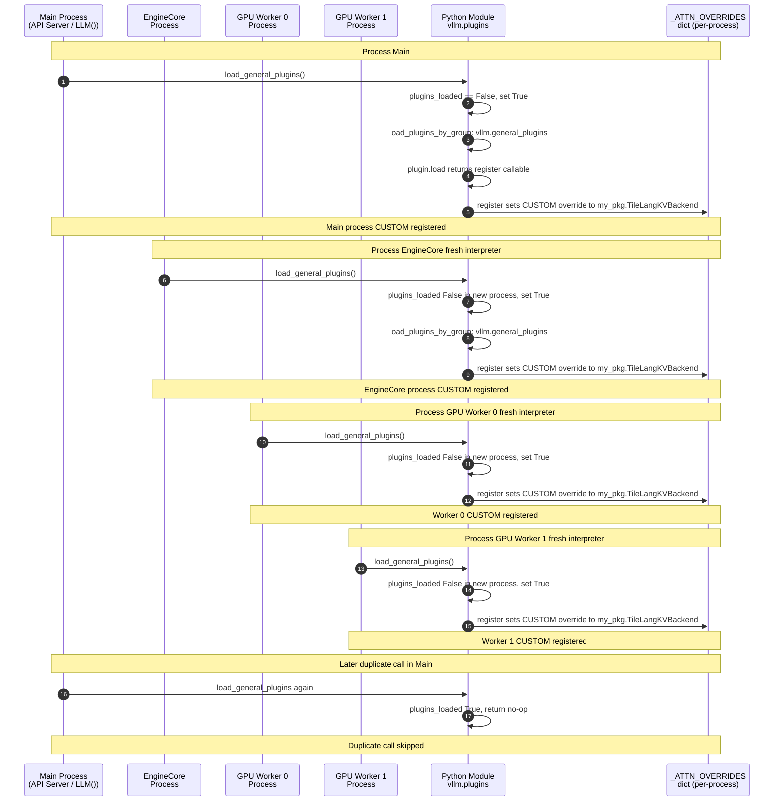

# The Plugin Heist: Hijacking vLLM's Attention Pipeline Without Touching Its Source

> **Who this is for:** You have read Parts 1–3 and understand how vLLM allocates paged KV blocks, how the store/compute phases are split, and how quantization scales travel from a checkpoint into GPU memory. Now you want to take the final step: make vLLM *route every byte of attention computation through your custom Tile Lang kernel*, without forking the vLLM repository. This document explains the exact plugin architecture that makes this possible, how it executes across multiple processes, the precise interface contract your code must satisfy, and the one validation function that stands between your backend and a `ValueError`. Every claim is tied to a specific file and function in the vLLM source tree. **Code blocks** name the file first (`# vllm/...`) so you can open the implementation in your checkout; **line numbers** in prose drift—search for the symbol name.

---

## How to read this document

### Assumptions (what we expect you to know)

- **Comfortable with:** Python entry points (`pyproject.toml`), `Enum`, and the idea that **each OS process** has its **own** Python interpreter and **imported modules** (no shared globals across processes).
- **Not required:** Knowing vLLM’s internal module layout by heart—use [§9](#9-source-file-reference-map) as an index and jump from there.
- **If you are new to vLLM:** Read [Terminology](#terminology-plain-english) first, then [Part 2](02-split-execution-the-read-write-barrier.md) (unified KV store vs attention `forward`) and [Part 3](03-metadata-and-quantization-injection.md) (how scales land on the `Attention` layer).

### Terminology: plain English

| Term | Plain meaning |
|---|---|
| **`vllm.general_plugins`** | The **entry-point group** string vLLM uses to find and run **one callable per installed plugin** at startup, **in each process** that loads vLLM. Constant: `DEFAULT_PLUGINS_GROUP` in `vllm/plugins/__init__.py`. |
| **`load_general_plugins()`** | Loads plugins for that group, then **executes** each callable **once per process** (guarded by `plugins_loaded`). Your plugin’s job is usually to **`register_backend(...)`**. |
| **`AttentionBackendEnum.CUSTOM`** | A **placeholder** enum member with **no default class path** (`None`). You **must** call `register_backend(CUSTOM, "module.Class")` so `get_path()` returns a real import path. |
| **`_ATTN_OVERRIDES`** | A **module-level** dict in `registry.py`: enum member → **fully qualified class name string**. **Per process**—must be populated in workers too. |
| **`register_backend`** | Writes into `_ATTN_OVERRIDES` (decorator or explicit string). **Idempotent** if you always set the same string. |
| **`get_attn_backend` / `_cached_get_attn_backend`** | Resolves which **`AttentionBackend` subclass** to use for a layer, then may call **`set_kv_cache_layout`** if your backend requires a global layout. See `vllm/v1/attention/selector.py`. |
| **`validate_configuration`** | **`@classmethod`** on `AttentionBackend` that returns a **list of human-readable failure reasons** (empty = OK). CUDA (and other platforms) call it before your backend is accepted. |
| **`forward_includes_kv_cache_update`** | If **`False`**, the **store** step is **not** inside `forward`; vLLM runs **`do_kv_cache_update`** (via `unified_kv_cache_update`) **before** attention reads the cache. See Part 2. |
| **`do_kv_cache_update`** | Writes **K/V** into **`kv_cache`** using **`slot_mapping`** (not `attn_metadata`) on the **split-store** path. **`forward`** still receives your backend’s **metadata** object. |

---

## Table of Contents

0. [How to read this document](#how-to-read-this-document)
1. [The Multi-Process Trap — Why Registering Once Is Never Enough](#1-the-multi-process-trap)
2. [The `vllm.general_plugins` Load Sequence — Exact Execution Order](#2-the-load-sequence)
3. [The Override Registry — How `CUSTOM` Gets Into the Map](#3-the-override-registry)
4. [The Full Resolution Chain — From CLI Flag to Your Class Object](#4-the-resolution-chain)
5. [The Complete `CUSTOM` Backend Contract — Every Method You Must Implement](#5-the-backend-contract)
6. [Surviving `validate_configuration` — The Gatekeeper Function](#6-surviving-validate-configuration)
7. [The KV Cache Layout Side Effect](#7-kv-cache-layout-side-effect)
8. [End-to-End Implementation Recipe](#8-end-to-end-recipe)
9. [Complete Source File Reference Map](#9-source-file-reference-map)

---

## 1. The Multi-Process Trap

### 1.1 The Wrong Mental Model

The most natural first instinct when integrating a custom backend is to write something like this somewhere in your script:

```python
from vllm.v1.attention.backends.registry import register_backend, AttentionBackendEnum
register_backend(AttentionBackendEnum.CUSTOM, "my_pkg.TileLangKVBackend")

engine = LLM(model="...", attention_backend="CUSTOM")
```

This approach is subtly, catastrophically wrong for production use, and understanding *why* it fails is the key to understanding the entire plugin architecture.

### 1.2 vLLM Is Not One Process

When you call `LLM(...)` or `AsyncLLMEngine(...)`, vLLM does not run as a single Python process. It spawns a topology of independent processes:

- **The API Server Process** (or the caller's process in embedded mode): handles HTTP, tokenization, request scheduling.
- **The EngineCore Process**: manages the scheduler, KV cache manager, and request lifecycle.
- **One GPU Worker Process per GPU**: runs the actual model forward pass. On a 4-GPU setup, there are 4 independent worker processes.

Each of these is a **separate Python interpreter**. They share no memory. A `register_backend(...)` call in the parent process writes into `_ATTN_OVERRIDES` in the parent's memory space. The worker processes start fresh—their `_ATTN_OVERRIDES` dictionary is empty. When a worker tries to resolve `AttentionBackendEnum.CUSTOM`, it calls `get_path()`, which returns `_ATTN_OVERRIDES.get(self, self.value)`. For `CUSTOM`, `self.value` is `None` (intentionally, as we'll see in §3). The result is a falsy value, and `get_path()` raises:

```
ValueError: Backend CUSTOM must be registered before use.
Use register_backend(Backend.CUSTOM, 'your.module.YourClass')
```

Your API server might be fine. Your GPU workers crash at startup. **This is the multi-process trap.**

### 1.3 The Solution: Python Entry Points

Python's `importlib.metadata` entry points system is a mechanism for one package to declare that another package should automatically discover and execute some of its code. It is the same system that lets pytest discover test plugins or Sphinx discover extensions.

vLLM uses entry points under the group name `"vllm.general_plugins"`. Any package that registers an entry point under this group gets its initialization callable executed **in every single process** that vLLM boots, as that process starts up. This is the mechanism that escapes the multi-process trap.

You declare this in your `pyproject.toml`:

```toml
[project.entry-points."vllm.general_plugins"]
my_tile_lang_backend = "my_pkg.plugin:register"
```

This tells pip: "When `my_pkg` is installed, register a plugin named `my_tile_lang_backend` under the `vllm.general_plugins` group, whose entry callable is `my_pkg.plugin.register`."

Your `my_pkg/plugin.py` then looks like:

```python
from vllm.v1.attention.backends.registry import register_backend, AttentionBackendEnum

def register():
    register_backend(
        AttentionBackendEnum.CUSTOM,
        "my_pkg.backend.TileLangKVBackend"
    )
```

When vLLM boots a worker process, one of its first actions is to call `load_general_plugins()`. This function discovers your entry point and calls `register()`. By the time the worker tries to resolve any attention backend, `_ATTN_OVERRIDES[AttentionBackendEnum.CUSTOM]` already contains `"my_pkg.backend.TileLangKVBackend"`, and the resolution succeeds.

---

## 2. The `vllm.general_plugins` Load Sequence

### 2.1 The Two-Function Architecture

The plugin system is implemented in `vllm/plugins/__init__.py` and consists of exactly two functions:

**`load_plugins_by_group(group: str) -> dict[str, Callable]`**

This is the discovery and import function. It:
1. Calls `importlib.metadata.entry_points(group=group)` to get all registered entry points under the given group name.
2. Optionally filters the discovered plugins by the `VLLM_PLUGINS` environment variable (a comma-separated allowlist of plugin names; `None` means load all).
3. For each selected entry point, calls `plugin.load()` — this imports the Python module and returns the callable object the entry point points to.
4. Stores the callables in a dict `{name: callable}` and returns it.
5. **Critically: does NOT execute the callables. Does NOT set `plugins_loaded`.**

If loading a plugin entry point **raises** (e.g. `ImportError` or any other `Exception` during `plugin.load()`), the failure is **logged** and that plugin is skipped. The rest of the group still loads. This fail-soft behavior means a broken plugin will not crash the entire engine. (See the `try` / `except Exception` around `plugin.load()` in `load_plugins_by_group`.)

**`load_general_plugins()`**

This is the thin wrapper that adds two critical behaviors:

```python
# vllm/plugins/__init__.py — load_general_plugins (pattern; see file for exact body)

plugins_loaded = False  # module-level global

def load_general_plugins():
    """WARNING: plugins can be loaded for multiple times in different
    processes. They should be designed in a way that they can be loaded
    multiple times without causing issues.
    """
    global plugins_loaded
    if plugins_loaded:
        return
    plugins_loaded = True

    plugins = load_plugins_by_group(group=DEFAULT_PLUGINS_GROUP)
    for func in plugins.values():
        func()
```

The two behaviors are:
1. **Per-process deduplication via `plugins_loaded`**: The `plugins_loaded` variable is a module-level global. In any given Python process, after the first call to `load_general_plugins()`, `plugins_loaded` is set to `True`. Every subsequent call is a no-op. Your plugin callable is guaranteed to run *exactly once per process*.
2. **Execution of the callables**: Only `load_general_plugins()` actually calls `func()`. `load_plugins_by_group` alone never executes your registration code.

### 2.2 `plugins_loaded` Is Per-Process

This is the subtlety that trips people up. `plugins_loaded` is a **module-level Python variable**. It lives in the memory space of a specific Python interpreter. Each OS process has its own interpreter, its own copy of the `vllm.plugins` module, and its own `plugins_loaded` variable initialized to `False`.

When a new GPU worker process boots, it imports `vllm.plugins` fresh. `plugins_loaded` starts as `False`. The first `load_general_plugins()` call in that process executes the plugin callables, sets `plugins_loaded = True`, and subsequent calls in that same process are no-ops.

This means your `register()` function runs **exactly once in every process that participates in inference**: the API server, the engine core, every GPU worker. This is the desired behavior — every process that will ever call `get_attn_backend` needs your backend registered before that call happens.

### 2.3 Call Sites — When Does Registration Actually Happen?

`load_general_plugins()` is invoked from several places during vLLM startup (exact list changes between releases). **Search the tree for** `load_general_plugins(` to see current call sites (often engine core, workers, and model/CLI init paths).

The exact order varies by launch mode (single-process embedded, multi-process API server, tensor-parallel distributed). **You do not need to rely on any specific ordering.** What matters is the invariant: in each process that will **resolve** an attention backend, your entry-point callable should run **before** the first `get_attn_backend` / `_cached_get_attn_backend` for that process—typically very early, because plugin load is part of process bootstrap.

### 2.4 The Multi-Process Load Sequence — Visualized



### 2.5 The Idempotency Requirement

The docstring on `load_general_plugins()` contains an explicit warning: plugins may be loaded multiple times across different processes and should be designed to tolerate multiple loads without corruption.

For your specific use case — `register_backend(AttentionBackendEnum.CUSTOM, "my_pkg.TileLangKVBackend")` — **this is naturally idempotent**. The function simply writes a string into a dictionary:

```python
# vllm/v1/attention/backends/registry.py — register_backend effect

_ATTN_OVERRIDES[backend] = class_path
```

Writing the same key-value pair twice is identical to writing it once. The second write is a no-op in terms of observable behavior, as long as the class path string is deterministic (the same string every time). **Never use conditional logic inside your `register()` function** that could cause different class paths to be registered on different calls or in different processes. If GPU Workers 0 and 1 register different classes for `CUSTOM`, you get undefined behavior across ranks.

The "last registration wins" semantics also means: if your plugin and some other plugin both try to register `CUSTOM`, whoever runs last wins. Keep your registration deterministic and document that your plugin owns `CUSTOM`.

---

## 3. The Override Registry — How `CUSTOM` Gets Into the Map

### 3.1 The `AttentionBackendEnum` — A Self-Describing Enum

`AttentionBackendEnum` lives in `vllm/v1/attention/backends/registry.py`. It is a Python `Enum` where each member's **value** is the fully-qualified class name (as a Python dotted path string) of the default implementation:

```python
# vllm/v1/attention/backends/registry.py — AttentionBackendEnum (excerpt)

class AttentionBackendEnum(Enum, metaclass=_AttentionBackendEnumMeta):
    FLASH_ATTN = "vllm.v1.attention.backends.flash_attn.FlashAttentionBackend"
    TRITON_ATTN = "vllm.v1.attention.backends.triton_attn.TritonAttentionBackend"
    FLASHINFER = "vllm.v1.attention.backends.flashinfer.FlashInferBackend"
    # ... more backends ...
    TURBOQUANT = "vllm.v1.attention.backends.turboquant_attn.TurboQuantAttentionBackend"
    # Placeholder for third-party/custom backends - must be registered before use
    # set to None to avoid alias with other backend, whose value is an empty string
    CUSTOM = None
```

Notice that `CUSTOM = None`. This is an intentional design choice. Every other backend has a real string as its value (the default class path). `CUSTOM` has `None` — it has **no default implementation**. The comment explains why it's `None` and not `""`: the `TORCH_SDPA` backend uses `""` as its value (it's only used for ViT, not the decoder stack), so using `None` for `CUSTOM` prevents any accidental aliasing.

### 3.2 The `_ATTN_OVERRIDES` Dictionary

At module level in `registry.py`, two dictionaries hold runtime overrides:

```python
# vllm/v1/attention/backends/registry.py — override dicts (module level)

_ATTN_OVERRIDES: dict[AttentionBackendEnum, str] = {}
_MAMBA_ATTN_OVERRIDES: dict[MambaAttentionBackendEnum, str] = {}
```

These start empty. `register_backend(...)` writes into them. `get_path()` reads from them.

### 3.3 `get_path()` — The Resolution Logic

The `get_path()` method on `AttentionBackendEnum` implements a simple override-or-default logic:

```python
# vllm/v1/attention/backends/registry.py — AttentionBackendEnum.get_path (pattern)

def get_path(self, include_classname: bool = True) -> str:
    path = _ATTN_OVERRIDES.get(self, self.value)
    if not path:
        raise ValueError(
            f"Backend {self.name} must be registered before use. "
            f"Use register_backend(Backend.{self.name}, 'your.module.YourClass')"
        )
    ...
    return path
```

The key line: `path = _ATTN_OVERRIDES.get(self, self.value)`.

- For `FLASH_ATTN`: if no override is registered, `self.value` is `"vllm.v1.attention.backends.flash_attn.FlashAttentionBackend"` — a valid truthy string. The `if not path` check passes and the default FQN is returned.
- For `CUSTOM`: if no override is registered, `self.value` is `None`. `_ATTN_OVERRIDES.get(CUSTOM, None)` returns `None`. `if not path` is `True`. **`ValueError` is raised.**
- For `CUSTOM` with override: `_ATTN_OVERRIDES.get(CUSTOM, None)` returns `"my_pkg.TileLangKVBackend"`. The path is returned successfully.

`get_class()` then calls `resolve_obj_by_qualname(self.get_path())`, which does a dynamic import: it splits `"my_pkg.TileLangKVBackend"` into `"my_pkg"` (module) and `"TileLangKVBackend"` (attribute), imports the module, and returns the class object.

### 3.4 The `register_backend` API — Two Forms

`register_backend` supports two calling styles:

**Form 1: Decorator**

```python
# vllm/v1/attention/backends/registry.py — register_backend as decorator (pattern)

from vllm.v1.attention.backends.registry import register_backend, AttentionBackendEnum

@register_backend(AttentionBackendEnum.CUSTOM)
class TileLangKVBackend(AttentionBackend):
    ...
```

When Python executes this decorator at class-definition time, it stores `f"{cls.__module__}.{cls.__qualname__}"` (e.g., `"my_pkg.backend.TileLangKVBackend"`) into `_ATTN_OVERRIDES[AttentionBackendEnum.CUSTOM]`.

**Form 2: Direct string registration**

```python
# vllm/v1/attention/backends/registry.py — register_backend(module, fqn) (pattern)

register_backend(
    AttentionBackendEnum.CUSTOM,
    "my_pkg.backend.TileLangKVBackend"
)
```

This writes the string directly into `_ATTN_OVERRIDES`. The function returns a no-op lambda for API symmetry (so code that patterns `cls = register_backend(...)` doesn't break).

For a plugin architecture, **Form 2 is preferred** because the class definition can live anywhere in your package (it doesn't need to be imported at registration time), and the string is explicit and greppable. The dynamic import only happens when the backend is first used, not at registration.

---

## 4. The Full Resolution Chain — From CLI Flag to Your Class Object

Understanding the full path from `--attention-backend CUSTOM` on the command line to your class being instantiated is essential for debugging. Here is the exact chain:

### 4.1 Step 1: Config Parsing — String to Enum

`AttentionConfig.backend` is the config field that holds which backend to use. In `vllm/config/attention.py`:

- If the user passes `--attention-backend auto` or doesn't pass the flag at all, `backend` is set to `None`. The auto-selection path runs.
- For any other string, the code runs `AttentionBackendEnum[value.upper()]`. So `--attention-backend CUSTOM` becomes `AttentionBackendEnum.CUSTOM`.

The `_AttentionBackendEnumMeta.__getitem__` method provides friendly error messages: if you pass an unknown backend name, instead of a generic `KeyError`, you get: `"Unknown attention backend: 'FOO'. Valid options are: FLASH_ATTN, TRITON_ATTN, FLASHINFER, ..., CUSTOM"`.

### 4.2 Step 2: `get_attn_backend` — Building the Selector Config

When an `Attention` layer initializes, it calls `get_attn_backend(...)` from `vllm/v1/attention/selector.py`. This function takes loose parameters (head_size, dtype, kv_cache_dtype, etc.) and packages them into an `AttentionSelectorConfig` — a `NamedTuple`:

```python
# vllm/v1/attention/selector.py — AttentionSelectorConfig (fields; see file)

class AttentionSelectorConfig(NamedTuple):
    head_size: int
    dtype: torch.dtype
    kv_cache_dtype: CacheDType | None
    block_size: int | None
    use_mla: bool = False
    has_sink: bool = False
    use_sparse: bool = False
    use_mm_prefix: bool = False
    use_per_head_quant_scales: bool = False
    attn_type: str = AttentionType.DECODER
    use_non_causal: bool = False
```

Every field here maps to a `supports_*` method on `AttentionBackend` that `validate_configuration` will check. We'll examine each one in detail in §6.

### 4.3 Step 3: `_cached_get_attn_backend` — The `@cache` Decorator

`get_attn_backend` immediately delegates to `_cached_get_attn_backend`, which is decorated with Python's `functools.cache`:

```python
# vllm/v1/attention/selector.py — _cached_get_attn_backend (pattern)

@cache
def _cached_get_attn_backend(
    backend,
    attn_selector_config: AttentionSelectorConfig,
    num_heads: int | None = None,
) -> type[AttentionBackend]:
    ...
```

`@cache` is a synonym for `@lru_cache(maxsize=None)`. The first time this function is called with a particular `(backend_enum, attn_selector_config, num_heads)` triple, it executes the full resolution chain and stores the result. Subsequent calls with the same arguments return the cached `type[AttentionBackend]` immediately.

**What this means for you:** The cache key includes all fields of `AttentionSelectorConfig`. If different attention layers in your model have different `head_size` or `kv_cache_dtype`, each unique combination produces a separate cache entry and triggers a separate call to `validate_configuration`. This is intentional — a backend might support 128-dim heads but not 64-dim heads.

### 4.4 Step 4: `get_attn_backend_cls` on the Platform — The Gatekeeper

`_cached_get_attn_backend` calls `current_platform.get_attn_backend_cls(backend, attn_selector_config, num_heads)`. On CUDA hardware, `current_platform` is an instance of `CudaPlatform` from `vllm/platforms/cuda.py`.

The logic inside `CudaPlatform.get_attn_backend_cls` for an explicitly selected backend (i.e., `selected_backend is not None`):

```python
# vllm/platforms/cuda.py — CudaPlatform.get_attn_backend_cls (excerpt, explicit backend)

if selected_backend is not None:
    try:
        backend_class = selected_backend.get_class()           # Step A
        invalid_reasons = backend_class.validate_configuration(  # Step B
            device_capability=device_capability,
            **attn_selector_config._asdict(),
        )
    except ImportError:
        invalid_reasons = ["ImportError"]
    if invalid_reasons:
        raise ValueError(                                         # Step C
            f"Selected backend {selected_backend} is not valid for "
            f"this configuration. Reason: {invalid_reasons}"
        )
    else:
        logger.info("Using %s backend.", selected_backend)
        return selected_backend.get_path()                       # Step D
```

- **Step A:** `selected_backend.get_class()` calls `resolve_obj_by_qualname(get_path())`. For `CUSTOM`, this does a dynamic import of your registered class. If the import fails (e.g., `my_pkg` is not installed in this environment), you get `ImportError` which is caught and treated as a validation failure.
- **Step B:** `validate_configuration(...)` runs every capability check on your class. It returns a list of strings describing what's wrong. An empty list means "all good".
- **Step C:** If `invalid_reasons` is non-empty, a `ValueError` is raised immediately. **There is no fallback to a different backend when you explicitly select `CUSTOM`.** The engine crashes with a clear error message.
- **Step D:** If validation passes, `CudaPlatform.get_attn_backend_cls` returns `selected_backend.get_path()` — the **FQN string**, not the type object. **`_cached_get_attn_backend`** in `selector.py` then calls `resolve_obj_by_qualname(attention_cls)` on that string to obtain the **`type[AttentionBackend]`** (the local variable is confusingly named `attention_cls` but it is still a string at that point).

**Auto-selection note:** If `backend is None` (auto mode), `CudaPlatform` iterates a priority-ordered list of backends and picks the highest-priority one that passes validation. `CUSTOM` is not in this priority list. **Out-of-tree backends will never be auto-selected.** You must always pass `--attention-backend CUSTOM` (or set `AttentionConfig.backend = AttentionBackendEnum.CUSTOM`) explicitly.

---

## 5. The Complete `CUSTOM` Backend Contract — Every Method You Must Implement

A custom backend requires three classes working together:

1. **`AttentionBackend`** — The factory/descriptor class. vLLM never instantiates this; it only calls static and class methods on it.
2. **`AttentionImpl`** — The execution class. One instance is created per attention layer, per process. Its `forward` and `do_kv_cache_update` methods are the hot path.
3. **`AttentionMetadataBuilder`** — The per-batch metadata assembler. One instance per attention layer. Its `build()` method runs every forward pass to produce the metadata your `forward` method reads.

### 5.1 `AttentionBackend` — The Factory

Subclass `AttentionBackend` from `vllm/v1/attention/backend.py`.

#### 5.1.1 Abstract Methods (Hard Requirements)

These four are decorated with `@abstractmethod`. Failing to implement them makes your class uninstantiable and raises `TypeError` at import time.

| Method Signature | Return Type | Purpose |
|---|---|---|
| `@staticmethod get_name() -> str` | `str` | A human-readable name used in log messages. E.g., `"tile-lang-3bit-kv"`. Not used for routing. |
| `@staticmethod get_impl_cls() -> type[AttentionImplBase]` | `type` | Returns your `AttentionImpl` subclass. The framework calls this to instantiate the execution object per layer. |
| `@staticmethod get_builder_cls()` | `type` | Returns your `AttentionMetadataBuilder` subclass. The framework calls this to instantiate the metadata builder per layer. |
| `@staticmethod get_kv_cache_shape(num_blocks, block_size, num_kv_heads, head_size, cache_dtype_str="auto") -> tuple[int, ...]` | `tuple[int, ...]` | **Critical for memory allocation.** Returns the logical shape of the KV cache tensor for a given number of blocks. The allocator uses this to `.view()` the raw `int8` blob into a usable tensor. (Covered in depth in Part 1.) |

#### 5.1.2 Class Variables You Must Declare

These are not abstract — the base class provides defaults — but the defaults are wrong for a custom quantized backend.

| Class Variable | Type | Default | What to Set |
|---|---|---|---|
| `supported_dtypes` | `ClassVar[list[torch.dtype]]` | `[torch.float16, torch.bfloat16]` | The activation dtypes your kernel accepts. Usually `[torch.float16, torch.bfloat16]` unless you only support one. |
| `supported_kv_cache_dtypes` | `ClassVar[list[CacheDType]]` | `["auto", "float16", "bfloat16"]` | **Must include** every `CacheDType` you pass to `--kv-cache-dtype`, e.g. `["auto", "turboquant_3bit_nc"]` (see `vllm/config/cache.py`). If your dtype is not in this list, `validate_configuration` will reject you. |
| `forward_includes_kv_cache_update` | `bool` | `True` | Set to `False` for a split store/compute backend (which is what you want — see Part 2). When `False`, vLLM calls `do_kv_cache_update` before `forward`. |

#### 5.1.3 Override-When-Needed Methods

These have working defaults but are wrong for exotic layouts or features.

| Method Signature | Default Behavior | When to Override |
|---|---|---|
| `@staticmethod get_kv_cache_stride_order(include_num_layers_dimension=False) -> tuple[int, ...]` | Raises `NotImplementedError`; framework assumes logical = physical layout. | Override when your kernel requires a physical memory layout that differs from the logical shape returned by `get_kv_cache_shape`. Used for backends that want, e.g., heads interleaved with layers for better coalescing. |
| `@classmethod get_required_kv_cache_layout() -> KVCacheLayoutType \| None` | Returns `None` (no global layout change). | Override to return `KVCacheLayoutType.NHD` or similar if your kernel requires a specific global layout. When non-`None`, `_cached_get_attn_backend` calls `set_kv_cache_layout()` after resolving your backend. |
| `@classmethod get_supported_kernel_block_sizes() -> list[int \| MultipleOf]` | `[MultipleOf(1)]` (any block size). | Override if your kernel only works with specific block sizes (e.g., FlashAttention requires multiples of 16). |
| `@classmethod get_supported_head_sizes() -> list[int]` | `[]` (all head sizes). | Override if your kernel only supports specific head dimensions (e.g., only `[64, 128]`). |

#### 5.1.4 Capability Flags (Used by `validate_configuration`)

These are `@classmethod`s that return `bool`. They have sensible defaults. Override any that your backend actually supports (or explicitly doesn't).

| Method | Default | Meaning |
|---|---|---|
| `is_mla() -> bool` | `False` | Whether this backend implements Multi-head Latent Attention (DeepSeek-style). For a standard GQA/MHA backend, this must be `False`. If the model uses MLA and you return `False`, validation fails. |
| `supports_sink() -> bool` | `False` | Whether you support "attention sinks" (keeping the first token in the cache as a permanent anchor, used by StreamingLLM-style models). |
| `supports_mm_prefix() -> bool` | `False` | Whether you support partial multimodal token full attention (used in multimodal models). |
| `is_sparse() -> bool` | `False` | Whether this backend implements sparse attention. Must match the model config. |
| `supports_per_head_quant_scales() -> bool` | `False` | Whether you support per-head KV quantization scales (a finer granularity than per-tensor). |
| `supports_non_causal() -> bool` | `False` | Whether you support bidirectional (non-causal) attention within the decoder path. |
| `supports_attn_type(attn_type: str) -> bool` | `True` only for `AttentionType.DECODER` | Which attention types (DECODER, ENCODER, ENCODER_DECODER) you support. |
| `supports_compute_capability(capability: DeviceCapability) -> bool` | `True` (all capabilities) | Whether you support the current GPU's CUDA compute capability. Override if your kernel requires SM 8.0+ (Ampere) or SM 9.0+ (Hopper). |
| `supports_combination(...) -> str \| None` | `None` (no restriction) | A catch-all for combinations of attributes that are individually valid but invalid together. Return a reason string if invalid, `None` if valid. |

### 5.2 `AttentionImpl` — The Execution Workhorse

Subclass `AttentionImpl[T]` from `vllm/v1/attention/backend.py`, where `T` is your metadata type (explained in §5.4).

#### 5.2.1 Abstract Methods (Hard Requirements)

Both of these are `@abstractmethod`:

| Method Signature | Purpose |
|---|---|
| `__init__(self, num_heads, head_size, scale, num_kv_heads=None, alibi_slopes=None, sliding_window=None, kv_cache_dtype="auto", logits_soft_cap=None, attn_type=AttentionType.DECODER, kv_sharing_target_layer_name=None) -> None` | Constructor. Store all parameters as instance attributes. `scale` = `1 / sqrt(head_size)`, the attention temperature. `kv_cache_dtype` is the string you passed via `--kv-cache-dtype` (a `CacheDType` literal, e.g. `"turboquant_3bit_nc"`). |
| `forward(self, layer, query, key, value, kv_cache, attn_metadata: T, output, output_scale=None, output_block_scale=None) -> torch.Tensor` | The main compute function. `layer` is the `Attention` module (use it to access `layer._k_scale`, `layer._v_scale` etc.). Must write the attention output into `output` in-place and also return it. |

#### 5.2.2 Required Instance Attributes (Set in `__init__`)

The base class `AttentionImplBase` declares these as class-level annotations. You must set them as instance attributes in your `__init__`:

| Attribute | Type | Description |
|---|---|---|
| `num_heads` | `int` | Q head count on this TP rank. |
| `head_size` | `int` | Dimension per head (`D`). |
| `scale` | `float` | Attention temperature, `1 / sqrt(head_size)`. |
| `kv_cache_dtype` | `str` | Cache dtype string from `--kv-cache-dtype`. |

The base class's `__new__` method (not `__init__`) automatically sets distributed context attributes:

| Attribute | Set by | Description |
|---|---|---|
| `dcp_world_size`, `dcp_rank` | `AttentionImplBase.__new__` | Decode Context Parallelism group size and this rank's index. |
| `pcp_world_size`, `pcp_rank` | `AttentionImplBase.__new__` | Prefill Context Parallelism group size and rank. |
| `total_cp_world_size`, `total_cp_rank` | `AttentionImplBase.__new__` | Combined CP world size = `dcp_world_size * pcp_world_size`. |

You do not need to set these — they are set before your `__init__` runs.

#### 5.2.3 The `do_kv_cache_update` Convention (For Split-Phase Backends)

When `forward_includes_kv_cache_update = False` on your `AttentionBackend`, vLLM performs the **KV store** in a **separate** custom op, **`unified_kv_cache_update`**, which then calls your implementation’s `do_kv_cache_update`. The **per-layer `slot_mapping` tensor** (already sliced to the number of real tokens for that call) is passed in as an argument; **`attn_metadata` is *not* an argument to `do_kv_cache_update`**—your **`forward`** still receives the full metadata object for **read / attention** (see e.g. `FlashAttention` and `TurboQuant` in `vllm/v1/attention/backends/`).

```python
# vllm/model_executor/layers/attention/attention.py — unified_kv_cache_update (core call)

def unified_kv_cache_update(
    key: torch.Tensor,
    value: torch.Tensor,
    layer_name: LayerNameType,
) -> torch.Tensor:
    ...
    _, attn_layer, kv_cache, layer_slot_mapping = get_attention_context(layer_name)
    if layer_slot_mapping is not None:
        assert hasattr(attn_layer.impl, "do_kv_cache_update")
        attn_layer.impl.do_kv_cache_update(
            attn_layer,
            key,
            value,
            kv_cache,
            layer_slot_mapping,
        )
    ...
```

**Contract you implement** on your `AttentionImpl` (match existing backends; names may vary slightly for MLA):

```python
# vllm/v1/attention/backends/flash_attn.py / turboquant_attn.py — pattern

def do_kv_cache_update(
    self,
    layer: torch.nn.Module,
    key: torch.Tensor,
    value: torch.Tensor,
    kv_cache: torch.Tensor,
    slot_mapping: torch.Tensor,
) -> None:
    """Write K/V into kv_cache for positions described by slot_mapping."""
    ...
```

(Part 2 of this series covers tensor shapes, padding, and `slot_mapping` in depth.)

#### 5.2.4 Optional Hooks

| Method | Default | When to Override |
|---|---|---|
| `process_weights_after_loading(self, act_dtype: torch.dtype)` | No-op (in base class). | If your backend needs to do any kernel-format post-processing after weights are loaded (e.g., pre-transposing weight matrices for your kernel). Called by `Attention.process_weights_after_loading` during the Pass 2 post-load sweep. |
| `fused_output_quant_supported(self, quant_key)` | `False` | If your impl supports fusing output quantization into the attention op. Used by `AttnFusionPass`. |
| `fused_rope_kvcache_supported(self)` | `False` | If your impl supports fusing RoPE application with the KV cache write. Used by `RopeKVCacheFusionPass`. |
| `do_rope_and_kv_cache_update(...)` | Raises `NotImplementedError`. | Only implement if `fused_rope_kvcache_supported` returns `True`. |

### 5.3 `AttentionMetadataBuilder` — The Per-Batch Metadata Assembler

Subclass `AttentionMetadataBuilder[M]` from `vllm/v1/attention/backend.py`, where `M` is your metadata type.

#### 5.3.1 Abstract Methods (Hard Requirements)

| Method Signature | Purpose |
|---|---|
| `__init__(self, kv_cache_spec: AttentionSpec, layer_names: list[str], vllm_config: VllmConfig, device: torch.device)` | Constructor. The base class body assigns `self.kv_cache_spec = kv_cache_spec`, `self.layer_names = layer_names`, `self.vllm_config = vllm_config`, `self.device = device`. **You must call `super().__init__(...)` or replicate these assignments**, as downstream code accesses `self.kv_cache_spec` directly. |
| `build(self, common_prefix_len: int, common_attn_metadata: CommonAttentionMetadata, fast_build: bool = False) -> M` | **Called on every forward pass.** Receives the batch's shared metadata (`CommonAttentionMetadata`, which includes the `block_table_tensor`, `slot_mapping`, `query_start_loc`, `seq_lens`, etc.) and must produce the backend-specific metadata object your `forward` method expects. |

#### 5.3.2 Class Variables You May Want to Override

| Class Variable | Default | Meaning |
|---|---|---|
| `_cudagraph_support: ClassVar[AttentionCGSupport]` | `AttentionCGSupport.NEVER` | Whether your builder supports CUDA Graph capture. Options: `NEVER`, `UNIFORM_SINGLE_TOKEN_DECODE` (CG for decode-only batches), `FULL` (CG for any batch). Start with `NEVER`; upgrade when your kernel is CUDA-Graph-compatible. |
| `reorder_batch_threshold: int \| None` | `None` | If non-`None`, your builder can reorder the batch so that requests with `query_len <= threshold` come first. Set via `_init_reorder_batch_threshold()` in your `__init__`. |
| `supports_update_block_table: bool` | `False` | Whether you support the `update_block_table` method (an optimization that avoids full metadata rebuilds when block tables change between layers in a multi-group KV cache). |

#### 5.3.3 Optional Hook Methods

| Method | Default | When to Override |
|---|---|---|
| `build_for_cudagraph_capture(self, common_attn_metadata) -> M` | Calls `self.build(common_prefix_len=0, ...)`. | Override if CUDA graph capture requires different metadata (e.g., placeholder tensors of maximum size). |
| `build_for_drafting(self, common_attn_metadata, draft_index) -> M` | Calls `self.build(..., fast_build=True)`. | Override for speculative decoding support. |
| `update_block_table(self, metadata, blk_table, slot_mapping) -> M` | Raises `NotImplementedError`. | Implement if `supports_update_block_table = True`. |

### 5.4 `AttentionMetadata` — Your Custom Metadata Type

`AttentionMetadata` in `vllm/v1/attention/backend.py` is an intentionally empty stub:

```python
# vllm/v1/attention/backend.py — AttentionMetadata

class AttentionMetadata:
    pass
```

Your `AttentionMetadataBuilder[M]` produces instances of `M`, and your `AttentionImpl[T]` consumes them in `forward(...)`. The `T` and `M` type parameters must be the same type — this is enforced only by Python's type checker (mypy/pyright), not at runtime.

A typical implementation is a `@dataclass`:

```python
@dataclass
class TileLangKVMetadata(AttentionMetadata):
    # From slot_mapping: where to write new K/V in the cache
    slot_mapping: torch.Tensor          # shape: [num_tokens]
    # From block_table: where to find historical K/V
    block_tables: torch.Tensor          # shape: [batch_size, max_blocks]
    # Sequence lengths for causal masking
    seq_lens: torch.Tensor              # shape: [batch_size]
    query_start_loc: torch.Tensor       # shape: [batch_size + 1]
    # ... any other fields your kernel needs
```

**Important:** `CommonAttentionMetadata` (which your `build()` receives) already contains `block_table_tensor`, `slot_mapping`, `query_start_loc`, and `seq_lens`. Your `build()` typically just selects and reformats the fields you need.

---

## 6. Surviving `validate_configuration` — The Gatekeeper Function

`validate_configuration` is a `@classmethod` on `AttentionBackend` that is called by `CudaPlatform.get_attn_backend_cls` **before** your backend is used. It aggregates all the capability checks into a list of failure reasons. If the list is non-empty, the backend is rejected. Understanding exactly what it checks — and how to make every check pass — is the difference between a working plugin and a `ValueError`.

### 6.1 The Full Check-by-Check Breakdown

Here is the complete logic of `validate_configuration` from `vllm/v1/attention/backend.py`, annotated with what your class must declare to pass each check:

```python
# vllm/v1/attention/backend.py — AttentionBackend.validate_configuration (signature; see file)

@classmethod
def validate_configuration(
    cls,
    head_size: int,
    dtype: torch.dtype,
    kv_cache_dtype: CacheDType | None,
    block_size: int | None,
    use_mla: bool,
    has_sink: bool,
    use_sparse: bool,
    use_mm_prefix: bool,
    use_per_head_quant_scales: bool,
    device_capability: DeviceCapability,
    attn_type: str,
    use_non_causal: bool = False,
) -> list[str]:
```

| Check # | What It Tests | Condition for Failure | How to Pass |
|---|---|---|---|
| 1 | **Head size** | `not cls.supports_head_size(head_size)` | Override `get_supported_head_sizes()` to return `[128]` (or any list including your model's head dim). Or leave it as `[]` (empty list = all sizes accepted). |
| 2 | **Activation dtype** | `dtype not in cls.supported_dtypes` | Declare `supported_dtypes: ClassVar = [torch.float16, torch.bfloat16]`. The `dtype` here is the model's weight/activation dtype, e.g., `torch.bfloat16` for Llama-3. |
| 3 | **KV cache dtype** | `kv_cache_dtype not in cls.supported_kv_cache_dtypes` | **The critical one for custom KV.** Declare `supported_kv_cache_dtypes` with **literals from** `CacheDType` in `vllm/config/cache.py` (e.g. `"auto"`, `"turboquant_3bit_nc"`). The string must exactly match what you pass to `--kv-cache-dtype`. If omitted, vLLM defaults `kv_cache_dtype` to `"auto"`, which standard backends accept but your custom dtype does not unless listed. |
| 4 | **Block size** | `not cls.supports_block_size(block_size)` | Override `get_supported_kernel_block_sizes()` if your kernel has alignment requirements. If you return `[MultipleOf(1)]` (the default), any block size passes. |
| 5 | **MLA flag agreement** | `use_mla != cls.is_mla()` | If model config says "use MLA" and your `is_mla()` returns `False`, failure. If model says "no MLA" and you return `True`, failure. For a standard GQA backend: declare `is_mla = False` (override the classmethod to return `False`), and only use this backend with non-MLA models. |
| 6 | **Attention sinks** | `has_sink and not cls.supports_sink()` | Only relevant for StreamingLLM-style models. If you're running standard Llama, `has_sink = False` and this check always passes. |
| 7 | **Sparse flag agreement** | `use_sparse != cls.is_sparse()` | Similar to MLA: if the model requires sparse attention and you don't support it, failure. For a dense backend: `is_sparse()` returns `False` (default). |
| 8 | **Multimodal prefix** | `use_mm_prefix and not cls.supports_mm_prefix()` | Only relevant for multimodal models. For text-only models, `use_mm_prefix = False` and this always passes. |
| 9 | **Per-head quant scales** | `use_per_head_quant_scales and not cls.supports_per_head_quant_scales()` | Only relevant if you're using per-head KV quantization scales. If you use a simpler per-tensor scheme, `use_per_head_quant_scales = False`. |
| 10 | **Compute capability** | `not cls.supports_compute_capability(device_capability)` | Override `supports_compute_capability` to return `False` for old hardware if your Tile Lang kernel requires Ampere+ features. The default returns `True` for all capabilities. |
| 11 | **Attention type** | `not cls.supports_attn_type(attn_type)` | The default only accepts `AttentionType.DECODER`. For a decoder-only model (Llama), the system passes `AttentionType.DECODER`, so the default is fine. |
| 12 | **Non-causal** | `use_non_causal and not cls.supports_non_causal()` | Non-causal attention is used by some speculative decoding methods (e.g., `dflash`). If you're not supporting that, the default `False` is correct. |
| 13 | **Combination check** | `cls.supports_combination(...) is not None` | A catch-all for interaction effects. The default returns `None` (always valid). Override if, e.g., your kernel supports FP16 and supports 3-bit KV, but not the combination of FP16 + 3-bit KV + head_size=64. |

### 6.2 Minimum Declaration for a Typical Custom 3-bit KV Backend

For a standard text-only Llama model running with your ~3-bit KV dtype:

```python
# Example sketch — add imports and full methods in your module.

from typing import ClassVar
import torch
from vllm.config.cache import CacheDType
from vllm.v1.attention.backend import AttentionBackend, AttentionImplBase

class TileLangKVBackend(AttentionBackend):
    # ── REQUIRED class variables ──────────────────────────────────────────
    supported_dtypes: ClassVar[list[torch.dtype]] = [
        torch.float16,
        torch.bfloat16,
    ]
    # Must list CacheDType literals you support (see vllm/config/cache.py)
    supported_kv_cache_dtypes: ClassVar[list[CacheDType]] = [
        "auto",
        "turboquant_3bit_nc",  # example: match your --kv-cache-dtype string
    ]
    # Split-phase execution: vLLM calls do_kv_cache_update before forward
    forward_includes_kv_cache_update: bool = False
    # ── validate_configuration passes because: ───────────────────────────
    # is_mla() = False  (default) → passes check 5 for non-MLA models
    # is_sparse() = False (default) → passes check 7 for dense models
    # supports_compute_capability → True (default) → passes check 10
    # supports_attn_type(DECODER) → True (default) → passes check 11
    # ─────────────────────────────────────────────────────────────────────

    @staticmethod
    def get_name() -> str:
        return "tile-lang-3bit-kv"

    @staticmethod
    def get_impl_cls() -> type[AttentionImplBase]:
        return TileLangKVImpl

    @staticmethod
    def get_builder_cls():
        return TileLangKVMetadataBuilder

    @staticmethod
    def get_kv_cache_shape(
        num_blocks: int,
        block_size: int,
        num_kv_heads: int,
        head_size: int,
        cache_dtype_str: str = "auto",
    ) -> tuple[int, ...]:
        # For a 3-bit interleaved layout:
        # [2, num_blocks, num_kv_heads, block_size, head_size] packed as int8
        # The exact shape depends on your bit-packing scheme.
        # See Part 1 for the allocation mechanics.
        bits_per_element = 3
        elements_per_byte = 8 // bits_per_element  # floor(8/3) = 2 with overhead
        # ... your bit-pack calculation ...
        return (2, num_blocks, num_kv_heads, block_size, packed_head_size)
```

### 6.3 The Failure Mode — What the Error Actually Looks Like

When `validate_configuration` returns a non-empty list, `CudaPlatform.get_attn_backend_cls` raises:

```
ValueError: Selected backend AttentionBackendEnum.CUSTOM is not valid for this
configuration. Reason: ['kv_cache_dtype not supported', 'MLA not supported']
```

The reasons are a plain English list. Read them left to right — each one maps to a specific check in the table above. `'kv_cache_dtype not supported'` means check 3 failed: your custom dtype string is not in `supported_kv_cache_dtypes`. `'MLA not supported'` means check 5 failed: the model uses MLA but your `is_mla()` returns `False`.

---

## 7. The KV Cache Layout Side Effect

After `validate_configuration` passes and `get_path()` returns your FQN, the selector calls one more method on your class:

```python
# vllm/v1/attention/selector.py — after resolve_obj_by_qualname (pattern)

required_layout = backend.get_required_kv_cache_layout()
if required_layout is not None:
    from vllm.v1.attention.backends.utils import set_kv_cache_layout

    set_kv_cache_layout(required_layout)
    logger.info(
        "Using %s KV cache layout for %s backend.",
        required_layout,
        backend.get_name(),
    )
```

`get_required_kv_cache_layout()` returns `None` by default. This default is correct for most backends.

**When to override:** If your Tile Lang kernel requires a specific global memory layout for the KV cache (e.g., heads-first layout `NHD` instead of the default `HND`), return the appropriate `KVCacheLayoutType` enum value. This will call `set_kv_cache_layout(...)`, which updates a module-global variable that the allocator reads when shaping the KV tensor.

Because `_cached_get_attn_backend` is called once per unique `(backend, attn_selector_config, num_heads)` combination, and because `set_kv_cache_layout` is a global side-effect, **all layers in the model will use the same layout** once this is set. You cannot have different layouts for different attention layers (this would be architecturally inconsistent anyway).

---

## 8. End-to-End Implementation Recipe

### 8.1 Package Structure

```
my_tile_lang_pkg/
├── pyproject.toml          ← declares the entry point
├── my_tile_lang_pkg/
│   ├── __init__.py
│   ├── plugin.py           ← the entry callable; calls register_backend
│   ├── backend.py          ← AttentionBackend subclass
│   ├── impl.py             ← AttentionImpl subclass + do_kv_cache_update
│   ├── builder.py          ← AttentionMetadataBuilder subclass
│   ├── metadata.py         ← @dataclass AttentionMetadata subclass
│   └── kernels/
│       ├── store.py        ← Tile Lang kernel for do_kv_cache_update
│       └── compute.py      ← Tile Lang kernel for forward
```

### 8.2 `pyproject.toml` Entry Point Declaration

```toml
[project.entry-points."vllm.general_plugins"]
tile_lang_kv = "my_tile_lang_pkg.plugin:register"
```

The string after `=` is a Python entry point reference: `"module.path:callable_name"`. After `pip install -e .` (editable install) or `pip install .`, this entry point is registered in the package metadata and discoverable by `importlib.metadata.entry_points(group="vllm.general_plugins")`.

### 8.3 `plugin.py` — The Entry Callable

```python
# my_tile_lang_pkg/plugin.py

def register():
    """
    Entry callable for the vllm.general_plugins entry point.
    Called once per process by vLLM's load_general_plugins().
    Must be idempotent: register_backend is safe to call repeatedly
    because it simply overwrites the same dict key with the same value.
    """
    from vllm.v1.attention.backends.registry import (
        register_backend,
        AttentionBackendEnum,
    )
    register_backend(
        AttentionBackendEnum.CUSTOM,
        "my_tile_lang_pkg.backend.TileLangKVBackend",
    )
```

**Why is `register_backend` imported inside the function rather than at module level?** Two reasons:
1. It avoids importing vLLM at the time `my_tile_lang_pkg.plugin` is first imported. This prevents circular import issues and speeds up package discovery.
2. It mirrors vLLM's own convention for plugin entry callables.

### 8.4 Launching with Your Backend

```bash
vllm serve meta-llama/Llama-3-8B \
    --attention-backend CUSTOM \
    --kv-cache-dtype turboquant_3bit_nc
```

Or programmatically:

```python
from vllm import LLM

# my_tile_lang_pkg must be installed before this line.
# Its entry point will be discovered by load_general_plugins()
# when EngineCore and WorkerBase initialize.
llm = LLM(
    model="meta-llama/Llama-3-8B",
    attention_backend="CUSTOM",      # maps to AttentionBackendEnum.CUSTOM
    kv_cache_dtype="turboquant_3bit_nc",
)
```

### 8.5 Ordered Implementation Checklist

- [ ] **Declare the entry point** in `pyproject.toml` under `[project.entry-points."vllm.general_plugins"]`
- [ ] **Write `plugin.py`**: a `register()` function that calls `register_backend(AttentionBackendEnum.CUSTOM, "...")`
- [ ] **Make `register()` idempotent**: register the same class path string unconditionally every time; no conditional logic
- [ ] **Implement `AttentionBackend`**:
  - [ ] `get_name()` → a string label
  - [ ] `get_impl_cls()` → your `AttentionImpl` subclass
  - [ ] `get_builder_cls()` → your `AttentionMetadataBuilder` subclass
  - [ ] `get_kv_cache_shape(...)` → the correct shape tuple for your bit-packed layout
  - [ ] `supported_dtypes` class var → `[torch.float16, torch.bfloat16]`
  - [ ] `supported_kv_cache_dtypes` class var → includes every `CacheDType` you use (see `vllm/config/cache.py`)
  - [ ] `forward_includes_kv_cache_update = False` (for split-phase execution)
  - [ ] `is_mla()` → `False` (for GQA/MHA models)
- [ ] **Implement `AttentionImpl`**:
  - [ ] `__init__(self, num_heads, head_size, scale, num_kv_heads, ..., kv_cache_dtype, ...)` stores all params
  - [ ] `forward(self, layer, query, key, value, kv_cache, attn_metadata, output, ...)` runs your compute kernel
  - [ ] `do_kv_cache_update(self, layer, key, value, kv_cache, slot_mapping)` runs your store kernel (see `unified_kv_cache_update` in `attention.py`)
- [ ] **Implement `AttentionMetadataBuilder`**:
  - [ ] `__init__(self, kv_cache_spec, layer_names, vllm_config, device)` calls `super().__init__(...)`
  - [ ] `build(self, common_prefix_len, common_attn_metadata, fast_build=False)` returns your metadata dataclass
- [ ] **Implement `AttentionMetadata`**: a `@dataclass` with the fields your **`forward`** needs (`do_kv_cache_update` takes **`slot_mapping`**, not this object—see `unified_kv_cache_update` above)
- [ ] **Install the package** (`pip install -e .`) so the entry point is registered in the environment's package metadata
- [ ] **Verify registration** by running `python -c "from importlib.metadata import entry_points; print(entry_points(group='vllm.general_plugins'))"` — your plugin should appear

---

## 9. Source File Reference Map

Use this as a **search index** in your vLLM checkout: open the file, then find the **symbol** (line numbers change often).

| Search for | File path | Why it matters for plugins |
|-------------|-----------|----------------------------|
| `DEFAULT_PLUGINS_GROUP`, `load_general_plugins` | `vllm/plugins/__init__.py` | Entry-point group name, per-process `plugins_loaded`, and where callables are **executed** |
| `load_plugins_by_group` | `vllm/plugins/__init__.py` | `entry_points`, `VLLM_PLUGINS` filtering, `plugin.load()` (does not run the callable) |
| `AttentionBackendEnum`, `CUSTOM`, `register_backend`, `_ATTN_OVERRIDES`, `get_path` | `vllm/v1/attention/backends/registry.py` | How your **FQN string** is stored and resolved |
| `AttentionConfig`, `validate_backend_before` | `vllm/config/attention.py` | `"auto"` → `None` for `backend`, else `AttentionBackendEnum[name.upper()]` |
| `CacheDType` | `vllm/config/cache.py` | **Literal union** of allowed `--kv-cache-dtype` strings; must match `supported_kv_cache_dtypes` on your backend |
| `get_attn_backend`, `AttentionSelectorConfig`, `_cached_get_attn_backend` | `vllm/v1/attention/selector.py` | Builds selector config, `@cache` resolution, **`resolve_obj_by_qualname`**, **`set_kv_cache_layout`** |
| `AttentionBackend`, `validate_configuration`, `AttentionImpl`, `AttentionMetadataBuilder` | `vllm/v1/attention/backend.py` | Base contracts and the **gatekeeper** `validate_configuration` |
| `get_attn_backend_cls` | `vllm/platforms/cuda.py` (and other `Platform` subclasses) | **Explicit** backend: `get_class` → `validate_configuration` → return **`get_path()`** (string) |
| `unified_kv_cache_update`, `unified_attention` | `vllm/model_executor/layers/attention/attention.py` | **Split store**: `do_kv_cache_update(..., slot_mapping=...)` vs **`forward`(..., `attn_metadata`)** |
| `FlashAttention` / `TurboQuantAttention` `do_kv_cache_update` | `vllm/v1/attention/backends/flash_attn.py`, `.../turboquant_attn.py` | Reference **signatures** for store vs compute |

**Related deep dives:** [Part 2 — store vs `forward`](02-split-execution-the-read-write-barrier.md) · [Part 3 — scales into `Attention`](03-metadata-and-quantization-injection.md) · [Part 1 — KV allocation](01-the-memory-illusion-kv-allocation.md)

---

*Re-verify `validate_configuration` checks, `AttentionSelectorConfig` fields, and `CacheDType` literals when upgrading vLLM; these surfaces change frequently.*
